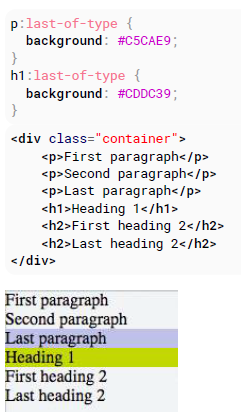

# 100 days of code front end - Day 09

## 前言

昨天主要學習 CSS 的撰寫位置，主要有三種外部匯入，內部 style 撰寫以及直接寫在 html 元素上面，其中比較建議的是使用外部匯入的方式，因為這樣可以使得 CSS 的寫法比較可以用模組化的方式進行管理，再來 css 檔案的載入順序也很重要，如果順序沒有考慮好，原本應該要有的樣式可能就會被後面載入的檔案給覆蓋掉，需特別注意；另外 CSS 的樣式也可透過 JavaScript 與 jQuery 進行 style 的添加與刪除，不過要注意的是 id 是要以 # 字號開頭，class 是以 . 作為開頭；list 主要有三個 css 樣式可以設定 list-style-type, list-style-image, list-style-position。

昨天比較懶，只有讀一個章節，今天不能再這樣下去了，第十天，繼續給他努力地衝下去!!!

## 筆記

### 2. Structure and Formatting of a CSS Rule

#### 2.1 Property List

有一些 css 屬性可以設置多個屬性值，這些值統稱為`屬性列表`

```css
/*Two values, in the property list*/
span {
  text-shadow: yellow 0 0 3px, green 4px 4px 10px;
}
```

#### 2.2 Multiple Selectors

當有兩個以上的 selector 使用相同的 style 而不想要再重複定義 css 樣式，可用 ',' 的方式宣告這些 selector 使用同樣的 css 樣式。

```css
div,
p {
  color: blue;
}
```

還有以下這種寫法

```css
p,
.blue,
#first,
div span {
  color: blue;
}
```

css 樣式會應用到

- p 元素
- 具有 blue 類別名稱的元素
- 具有 first ID 名稱的原素
- 每一個 div 裡面的 span 元素

#### 2.3 Rules, Selectors, and Declaration Blocks

一個 css 的規則由選擇器與宣告區塊組成

```css
h1 {
}
```

### 3. Comments

#### 3.1 Single Line

```css
div {
  color: red; /* This si a CSS comment */
}
```

#### 3.2 Multiple Line

```css
/*
  This
  is 
  a 
  CSS
   comment
*/
div {
  color: red;
}
```

### 4. Selectors

CSS 選擇器將識別指定的 HTML 元素作為 CSS 的樣式目標。

#### 4.1 Basic selectors

- \*: 萬用選擇器 (所有元素)
- div: 標籤選擇器 (所有 div 元素)
- .blue: 類別選擇器 (所有具有 blue 類別名稱的元素)
- .blue.red: 所有同時具有 blue 與 red 類別名稱的元素 (一種複合選擇器)
- #headline: ID 選擇器 (具有 headline ID 名稱的元素)
- :pseudo-class: 偽類別
- ::pseudo-element: 匹配偽元素的元素
- :lang(en): 匹配 :lang 宣告的原素 ex \<span lang='en'>
- div > p: 子選擇器

#### 4.2 Attribute Selectors

屬性選擇器可以與各種類型的運算符一起使用，從而相應的改變選擇標準。他使用存在給定的屬性或是屬性值來選擇元素。

- [attr] => \<div attr> 具有 attr 屬性的元素
- [attr='val'] => \<div attr='val'> 具有 attr 屬性且屬性值是 val 的元素
- [attr~='val'] => \<div attr="val val2 val3"> attr 的 val 屬性值出現在使用空白分開的列表中
- [attr^='val'] => \<div attr="val1 val2"> attr 的屬性值開頭為 val
- [attr$='val'] => \<div attr="sth aval"> attr 的屬性值最後的結尾是 val
- [attr*='val'] => \<div attr="somevalhere"> attr 其中包含 val
- [attr|='val'] => \<div attr="val-sth etc"> attr 屬性值剛好是 val ，或是以 val 開頭，然後緊跟著 -
- [attr='val'|i] => \<div|attr='val'> attr 具有 val 的值並且忽略大小寫

`Details`  
[attribute]  
選擇具有指定屬性的元素

```css
div[data-color] {
    color: red
}

<div data-color="red">This will be red</div>
<div data-color="green">This will be red</div>
<div data-background="red">This will NOT be red</div>
```

[attribute='value']  
選擇具有指定屬性與屬性值的元素

```html
div[data-color='red'] { color: red; }

<div data-color="red">This will be red</div>
<div data-color="green">This will NOT be red</div>
<div data-color="blue">This will NOT be red</div>
```

[attribute*='value']  
選擇具有指定屬性與屬性值的元素，其屬性值裡面只要有包含 value 就會被選擇

```html
[class*="foo"] { color: red; }

<div class="foo-123">This will be red</div>
<div class="foo123">This will be red</div>
<div class="bar123foo">This will be red</div>
<div class="barfooo123">This will be red</div>
<div class="barfo0">This will NOT be red</div>
```

[attribute~='value']  
選擇具有指定的屬性與屬性值的元素，並且屬性值必須出現在用空白分隔的屬性列表中

```html
[class~="color-red"] { color: red; }
<div class="color-red foo-bar the-div">This will be red</div>
<div class="color-blue foo-bar the-div">This will NOT be red</div>
```

[attribute^="value"]  
選擇具有指定屬性與屬性值的元素，並且屬性值的開頭必須是 value

```html
[class^="foo-"] { color: red; }
<div class="foo-123">This will be red</div>
<div class="foo-234">This will be red</div>
<div class="bar-123">This will NOT be red</div>
```

[attribute$="value"]  
選擇具有指定屬性與屬性值的元素，並且屬性值的結尾必須是 value

```html
[class$="file"] { color: red; }
<div class="foobar-file">This will be red</div>
<div class="foobar-file">This will be red</div>
<div class="foobar-input">This will NOT be red</div>
```

[attribute|="value"]  
選擇具有指定屬性與屬性值的元素，並且屬性值的是指定的值或是指定的值然後後面跟著-

```html
[class|="file"] { color: red; }
<div class="foobar-file">This will be red</div>
<div class="foobar-file">This will be red</div>
<div class="foobar-input">This will NOT be red</div>
```

[attribute="value" i]  
選擇具有指定屬性與屬性值的元素，並且屬性值的是指定的值，不過這個值可以是任意大小寫的

```html
[class="EN" i] { color: red; }
<div lang="EN">This will be red</div>
<div lang="en">This will be red</div>
<div lang="PT">This will NOT be red</div>
```

#### 4.3 Combinators

- div span: 後代選擇器 (所有 div 元素裡面的子元素 span)
- div > span: div 底下一層的 span (只有一層)
- a ~ span: a 的同一層有 span (同一層級)
- a + span: a 同一層級且立馬跟哲 span

`Descendant Combinator: selector selector`  
後裔選擇器，由至少一個空白當作後裔選擇器。父元素地下所有包含指定的子元素。

組合器選擇所有後代指定的元素

```html
div p { color: red; }

<div>
  <p>My text is red</p>
  <section>
    <p>My text is red</p>
  </section>
</div>
<p>My text is not red</p>
```

上面的範例中，頭兩個 p 元素會被選擇，因為他們都是 div 的後裔元素。

`Child Combinator: selector > selector`  
子組合器被使用在選擇被指定的第一代的後代元素

```html
div > p { color: red; }

<div>
  <p>My text is red</p>
  <p>My text is red</p>
  <section>
    <p>My text is not red</p>
  </section>
</div>
```

上面的範例只有 div 第一代的 p 元素會變成紅色字體

‵Adjacent Sibling Combinator: selector + selector`
相鄰同代組合器選擇相鄰的同代元素

```html
p + p { color: red; }

<p>My text is not red</p>
<p>My text is red</p>
<p>My text is red</p>
<hr />
<p>My text is not red</p>
```

上面的示例僅選擇直接在另一個 p 元素之後的那些 p 元素。

`General Sibling Combinator: selector ~ selector`  
一般同級組合器，選擇所有同級的元素

```html
p ~ p { color: red; }

<p>My text is not red</p>
<p>My text is red</p>
<hr />
<h1>And now a title</h1>
<p>My text is red</p>
```

上面的範例就算不是同級直接相鄰的元素還是會被選擇

#### 4.4 Pseudo-classes

偽類別是一個簡單的選擇器，它允許基於文件樹之外的訊息進行選擇，或是其他簡單的選擇器無法表達的訊息。

這些訊息可以被關連到特定的狀態 (狀態和動態偽類別)、位置 (結構與目標偽類別)、前者否定 (否定偽類別)或語言 (lang 偽類別)。

ex. 連結是否有被點過 (:visited), 滑鼠是否在元素的上方 (:hover) 或是 checkbox 有沒有被選擇 (:checked) 等等

`Syntax`

```css
selector:pseudo-class {
  property: VALUE;
}
```

#### 4.5 Child Pseudo Class

nth:child(an+b) CSS 偽類別匹配元素為 an+b-1 同層的元素


#### 4.6 Class Name Selectors

class name 選擇器會選取所有具有目標名稱的元素。

```css
.important {
  color: orange;
}
.warning {
  color: blue;
}
.warning.important {
  color: red;
}
```

```html
<div class="warning">
  <p>This would be some warning copy.</p>
</div>

<div class="important warning">
  <p class="important">This is some really important warning copy.</p>
</div>
```

在上面的範例中，所有具有 .warning 的類別名稱會顯示 blue 的顏色，所有具有 .warning 的類別名稱會顯示 orange 的顏色，同時具有 .important 以及 .warning 類別名稱的會顯示 red 的顏色。

#### 4.7 Select element using its ID without the high specificity of ID selector

此技巧可幫助您使用 ID 作為屬性選擇器的值來選擇元素，從而避免 ID 選擇器的高特異性。

```html
<div id="element">...</div>
```

```css
#element {
  ...;
} // high specificity will override many selectors

[id='element'] {
  ...;
} // low specificity, can be override easily
```

#### 4.8 The :last-of-type selector

:last-of-type 選擇最後一個指定類型的元素


#### 4.9 CSS3: in-range selector example

:in-range CSS 偽類別當 range 的元素有在指定的範圍內會套用指定樣式

其他比較少用的我就沒有再寫下去了
