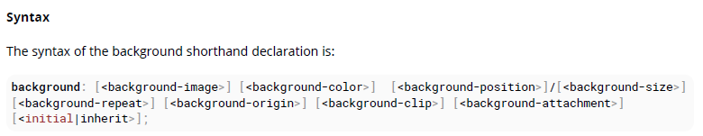
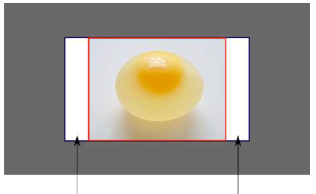
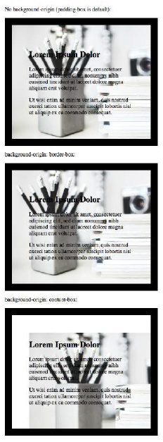

# 100 days of code front end - Day 11

## 前言

終於把第四章讀完，第四章有很多東西都是第一次接觸，真的對於這些用法需要好好地了解一下，因此也多延了一天，之後應該會比較順利。

## 筆記

### 5. Background

透過 CSS 你可以幫元素的背景設定顏色、漸層與圖片。這些元素可以指定各種圖像、顏色與漸層，並停整齊大小、位置和重複等組合。

#### 5.1 Background Color

background-color 屬性可以設定元素的背景顏色透過指定色碼或是透過關鍵字 (transparent, inherit 或是 initial)

- transparent: 指定背景顏色應該是透明的。(這是預設值)
- inherit: 從父元素繼承屬性
- initial: 使用此屬性原本的預設值

背景顏色可以應用在所有的元素以及::first-letter/::first-line 偽元素

`Color names`

```html
div { background-color: red; }

<div>This will have a red background</div>
```

`Hex color coeds`
Hex code 用來表示 RGB 的色彩編碼 (16 進位)，如果三元色 RGB 中每一個值得 RGB 對都是一樣的可以簡寫 ex: #ff0000 可以縮寫成 #f00

`RGB/ RGBa`
RGB 是標準的紅綠藍三色組成

RGBa 允許你加入額外的 alpha 參數 (0~1) 來定義 opacity

```html
header { background-color: rgb(0, 0, 0); } footer { background-color: rgba(0, 0,
0, 0.5) // black with 50% opacity }
```

`HSL / HSLa`
HSL 使用色相 (Hue)、飽和度(saturation)與亮度(lightness)

- Hue: 在色像環上面的角度 (0~360)
- Saturation: 百分比 (0%~100%)
- Lightness: 百分比 (0%~100%)

HSLa 允許你加入額外的 alpha 參數 (0~1) opacity

```html
li a { background-color: hsl(120, 100%, 50%); // green } #p1 { background-color:
hsla(120, 100%, 50%, .3); // green with 30% opacity }
```

`interaction with background-image`
以下寫法結果都是一樣的

```css
body {
  background: red;
  background-image: url(partiallytransparentimage.png);
}

body {
  background-color: red;
  background-image: url(partiallytransparentimage.png);
}

body {
  background-image: url(partiallytransparentimage.png);
  background-color: red;
}

body {
  background: red url(partiallytransparentimage.png);
}
```

上面的結果都是紅色會在圖片的下方

但是下面的結果就是不一樣的

```css
body {
  background-image: url(partiallytransparentimage.png);
  background: red;
}
```

background 的值會覆蓋 background-image

#### 5.2 Background Gradients

漸層是 CSS3 新的圖片類型。漸層是透過 background-image 屬性或是 background 進行設定的。

共有兩種漸層函式，線性或是放射狀的。每種類型共有不重複變數或是重複變數

- linear-gradient()
- repeating-linear-gradient()
- radial-gradient()
- repeating-radial-gradient()

`linear-gradient()`  
線性漸層語法
background: linear-gradient(\<direction>?, \<color-stop-1>, \<color-stop-2>, ...)

- direction: 可以是參數 top, bottom, right, left; 或是角度 0~90deg，(角度是以從上開始順時針), 0deg, 90deg, 或是 deg, grad, rad, turn
- color-stop-list: 顏色列表 （可選）在每個顏色後面跟著百分比，以顯示該百分比或長度。 ex.yellow 10%, rgba(0,0,0,.5) 40px, #fff 100%...

```css
.linear-gradient {
  background: linear-gradient(to left, red, blue); /* you can also use 270deg */
}

.diagonal-linear-gradient {
  background: linear-gradient(to left top, red, yellow 10%);
}
```

你可以指定多個 color stop 並使用逗號將他們分隔開

```css
.linear-gradient-rainbow {
  background: linear-gradient(
    to left,
    red,
    orange,
    yellow,
    green,
    blue,
    indigo,
    violet
  );
}
```

`radian-gradient()`

```css
.radial-gradient-simple {
  background: radial-gradient(red, blue);
}
.radial-gradient {
  background: radial-gradient(circle farthest-corner at top left, red, blue);
}
```

- circle: gradient 的形狀。可以是 circle 或是 ellipse 預設是 ellipse
- farthest-corner: 描述結束形狀必須多大的關鍵字。 值是最接近的一面，最遠的一面，最近的一角，最遠的一角
- top left: 設置漸變中心的位置，方法與背景位置相同

`Repeating gradient`

```css
.bullseye {
  background: repeating-radial-gradient(red, red 10%, white 10%, white 20%);
}
.warning {
  background: repeating-linear-gradient(
    -45deg,
    yellow,
    yellow 10%,
    black 10%,
    black 20%
  );
}
```

#### 5.3 Background image

background-image 屬性是使用指定的圖片。預設此圖片會完整覆蓋元素除了 margin

#### 5.4 Background shorthand

background 屬性具有多個相關的屬性

- background-image
- background-color
- background-position
- background-size
- background-repeat
- background-origin
- background-clip
- background-attachment
- initial
- inherit



#### 5.5 Background Size

使用 background-size 屬性可以控制背景圖像的縮放比例。它最多包含兩個值，這些值確定垂直和水平方向上生成的圖像的比例/大小。

auto 會保持圖像的寬高比

```css
background-size: 50px;
background-size: 50px auto; /* same as above */
background-size: auto 50px;
background-size: 50px 50px;
```

上面的圖片尺寸都會是 50 x 50

我們同樣可以使用百分比來縮放圖片的比例

```css
#withbackground {
  background-image: url(to/some/background.png);
  background-size: 100% 66%;
  width: 200px;
  height: 200px;
  padding: 0;
  margin: 0;
}
```

`cover and contain`
contain: 會將圖片縮放至最大尺寸，同時保留其原本的寬高比，以最大尺寸進行縮放，以使其寬度和高度都可適合背景定位區域。

這樣可以確保圖片確實會完整包含在背景定位的區域，但是這樣做可能會留下一些空白的區域。


cover: 在保留圖片原有的尺寸下，將圖片縮放到滿足畫面的尺寸，這樣可以完全覆蓋背景區域。

這樣可以確保圖片完全覆蓋，但是這樣有可能有一些圖片會被切掉


#### 5.6 Background Position

background-position 屬性被使用來指定背景圖片或是漸層的開始位置

位置是使用 X 與 Y 座標進行設定的

```css
.myClass {
  background-image: url('path/to/image.jpg');
  background-position: 50% 50%;
}
```

另外，上面的是屬於簡短寫法，還是可以用完整寫法
background-position-x, background-position-y

#### 5.7 The background-origin property

background-origin 屬性指定背景圖片的位置

- padding-box: 相對於 padding box 的位置
- border-box: 相對於 border box 的位置
- content-box: 相對於 content-box 的位置
- initial: 使用預設值
- inherit: 繼承父類別



#### 5.8 Multiple Background Image

CSS3 讓我們可以堆疊多個背景圖片在同一個元素中

```css
#mydiv {
  background-image: url(img_1.png), /* top image */ url(img_2.png), /* middle image */
      url(img_3.png); /* bottom image */
  background-position: right bottom, left top, right top;
  background-repeat: no-repeat, repeat, no-repeat;
}
```

#### 5.9 Background Attachment

background-attachment 屬性設定背景圖片是否是固定的獲釋可以用滾輪瀏覽剩下的區域

- scroll: 背景圖片滾輪跟著元素 (預設)
- fixed: 圖片固定在指定的 viewport 上
- local: 背景圖片跟著元素內容滾動
- initial: 使用元素原本的預設屬性
- inherit: 繼承父類別

#### 5.10 Background Clip

background-clip 屬性指定背景的繪圖區域 (預設值: border-box)

- border-box: 可以讓背景一直延伸到元素邊框的外部邊緣
- padding-box: 在元素的填充的外部邊緣剪切背景，並且不讓其延伸到邊框中；
- inherit: 將父級的設置應用於所選元素。

#### 5.11 Background Repeat

background-repeat 屬性設定背景圖片是否要重複顯示
預設是會重複顯示的 (水平與垂直都會)
repeat-y, repeat-x

#### 5.12 background-blend-mode Property

CSS Syntax: background-blend-mode: normal | multiply | screen | overlay | darken | lighten | color-dodge |
saturation | color | luminosity;
