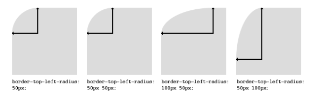
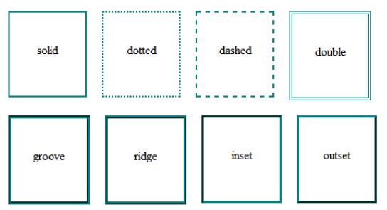
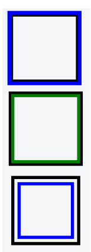
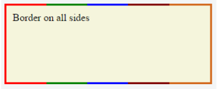

### 10. Border

#### 10.1 border-radius

border-radius 屬性允許你改變 box model 基本的形狀。

元素的每一個角落可以有兩個值，用來決定角落垂直與水平的半徑 (最多八個值)



設定的值當中第一個值是水平半徑。第二個值是可選的 (以 / 開頭) 定義垂直半徑。如果只有提供一個值，那這個值會被使用來當作垂直與水平的半徑。

> border-radius: 10px 5% / 20px 25em 30px 35em

10px 是左上角與右下角的水平半徑。 5% 是右上角與左下角的水平半徑。在斜線後面的四個值為左上角、右上角、右下角與左下角用來決定垂直的半徑。

與許多 CSS 屬性一樣，縮寫可以用於任何或所有可能的值。

因此，您可以指定 1 到 8 個值中的任何一個。 以下縮寫允許您將每個角的水平和垂直半徑設置為相同的值

```html
<div class="box"></div>
```

```css
.box {
  width: 250px;
  height: 250px;
  background-color: black;
  border-radius: 10px;
}
```

border-radius 是最常被使用來將盒形元素轉成圓形。藉由設定 border-radius 為方形元素的一半長度。

```css
.circle {
  width: 200px;
  height: 200px;
  border-radius: 100px;
}
```

因為 border-radius 允許使用百分比，通常使用 50% 來避免手動計算 border-radius 的值

```css
.circle {
  width: 150px;
  height: 150px;
  border-radius: 50%;
}
```

如果 width 和 height 屬性不相等，則生成的形狀將是橢圓形而不是圓形

#### 10.2 border-style

border-style 屬性設定元素邊界的樣式。這個屬性可以一次有 1 ~ 4 種設定值

- border-style: dotted;
- border-style: dotted solid double dashed;



border-style 可以是 none 或是 hidden。 它們具有相同的效果，除了 hidden \<table> 元素的邊界衝突的隱藏作品。 在具有多個邊框的 \<table> 中，沒有一個優先級最低（意味著在衝突中，邊框將顯示），而隱藏的優先級最高（意味著在衝突中，邊框將不顯示）。

#### 10.3 Multiple Borders

`using outline`

```css
.div1 {
  border: 3px solid black;
  outline: 6px solid blue;
  width: 100px;
  height: 100px;
  margin: 20px;
}
```

`using box-shadow`

```css
.div2 {
  border: 5px solid green;
  box-shadow: 0px 0px 0px 4px #000;
  width: 100px;
  height: 100px;
  margin: 20px;
}
```

`using a pseudo element`

```css
.div3 {
  position: relative;
  border: 5px solid #000;
  width: 100px;
  height: 100px;
  margin: 20px;
}
.div3:before {
  content: ' ';
  position: absolute;
  border: 5px solid blue;
  z-index: -1;
  top: 5px;
  left: 5px;
  right: 5px;
  bottom: 5px;
}
```



#### 10.4 border (shorthands)

在許多案例中你想要定義為一個元素的所有邊際許多許多 border

ex.
border-width: 1px;
border-style: solid;
border-color: #000;

你也可以寫成這樣

> border: 1px solid #000;

上面的 shorthand 也可針對元素的每一邊進行設定

> border-top: 2px double #aaaaaa;

#### 10.5 border-collapse

order-collapse 屬性僅適用於表（以及顯示為 display：table 或 inlinetable 的元素），並設置表邊框是折疊成單個邊框還是像標準 HTML 一樣分離。

```css
table {
  border-collapse: separate;
  border-spacing: 2px;
}
```

#### 10.6 border-image

你可以將圖片設置在 border 上面

border-image 基本由以下組成

- border-image-source: 圖片的來源
- border-image-slice: 指定用於將圖像分為九個區域（四個角，四個邊緣和一個中間）的偏移量
- border-image-repeat: 指定如何縮放邊框圖像的側面和中間的圖像

> border-image: url('border.png') 30 stretch;

圖像將被分成 9 個 30x30 像素的區域。 邊緣將用作邊框的拐角，而側面將用作邊界。 如果元素高於/寬於 30 像素，則該部分圖像將被拉伸。 圖像的中間部分默認為透明。

#### 10.7 Creating a multi-colored border using border-image

```css
.bordered {
  border-image: linear-gradient(
    to right,
    red 20%,
    green 20%,
    green 40%,
    blue 40%,
    blue 60%,
    maroon 60%,
    maroon 80%,
    chocolate 80%
  ); /* gradient with required colors */
  border-image-slice: 1;
}
```

```html
<div class="bordered">Border on all sides</div>
```


