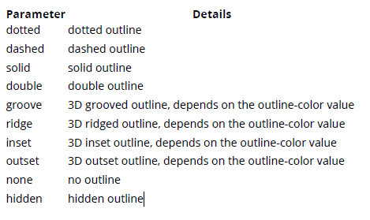
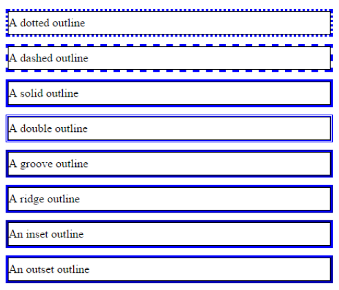

### 11. Outlines



#### 11.1 Overview

Outline 是圍繞在元素的線條，是在 border 之外。

與 border 不一樣得是 outlines 並沒有任何的 box model。因此加入 outline 並不會影響元素的位置

outline 基本的部分包含:

- outline-color
- outline-style
- outline-width

#### 11.2 outline-style

```css
p {
  border: 1px solid black;
  outline-color: blue;
  line-height: 30px;
}
.p1 {
  outline-style: dotted;
}
.p2 {
  outline-style: dashed;
}
.p3 {
  outline-style: solid;
}
.p4 {
  outline-style: double;
}
.p5 {
  outline-style: groove;
}
.p6 {
  outline-style: ridge;
}
.p7 {
  outline-style: inset;
}
.p8 {
  outline-style: outset;
}
```

```html
<p class="p1">A dotted outline</p>
<p class="p2">A dashed outline</p>
<p class="p3">A solid outline</p>
<p class="p4">A double outline</p>
<p class="p5">A groove outline</p>
<p class="p6">A ridge outline</p>
<p class="p7">An inset outline</p>
<p class="p8">An outset outline</p>
```


