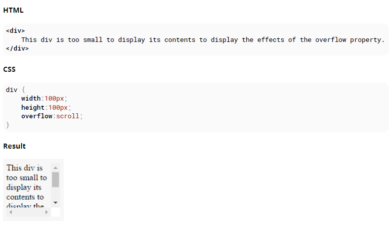
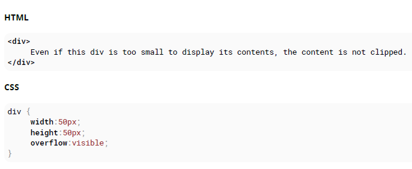
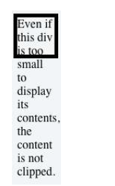
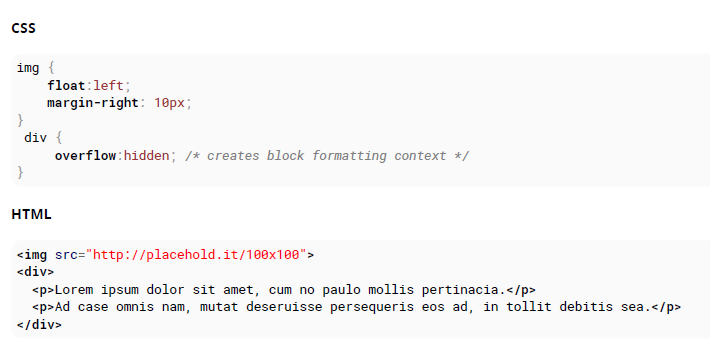
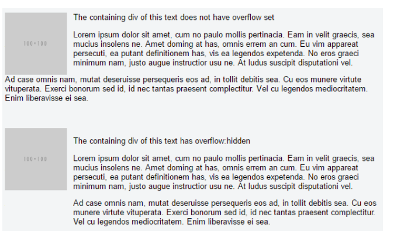

### 12. Overflow

- visible: 顯示元素外部所有超出的內容
- scroll: 隱藏超出的元素並且加入一個滾輪
- hidden: 隱藏超出的元素，並且垂直與水平的滾輪消失並且頁面變成固定的
- auto: 與 scroll 一樣，但是當內容是剛好的大小滾輪就不會出現
- inherit: 繼承父元素的屬性

#### 12.1 overflow-wrap

overflow-wrap 告訴瀏覽器，它可以將目標元素內的一行文字拆分為多行。有助於防止一長串文字由於超出容器而導致布局問題。

```css
div {
  width: 100px;
  outline: 1px dashed #bbb;
}

#div1 {
  overflow-wrap: normal;
}

#div2 {
  overflow-wrap: break-word;
}
```

```html
<div id="div1">
  <strong>#div1</strong>: Small words are displayed normally, but a long word
  like <span style="red;">supercalifragilisticexpialidocious</span> is too long
  so it will overflow past the edge of the line-break
</div>
<div id="div2">
  <strong>#div2</strong>: Small words are displayed normally, but a long word
  like <span style="red;">supercalifragilisticexpialidocious</span> will be
  split at the line break and continue on the next line.
</div>
```

overflow-wrap

- normal: 讓文字 overflow
- break-word: 會將文字分成多航
- inherit: 從父類別繼承此屬性

#### 12.2 overflow-x and overflow-y

這兩個屬性的工作方式與溢出屬性相似，並且接受相同的值。 參數 overflow-x 僅在 x 軸或從左到右的軸上有效。 y 溢出在 y 或自上而下
軸。

```html
<div id="div-x">
  If this div is too small to display its contents, the content to the left and
  right will be clipped.
</div>
<div id="div-y">
  If this div is too small to display its contents, the content to the top and
  bottom will be clipped.
</div>
```

```css
div {
  width: 200px;
  height: 200px;
}
#div-x {
  overflow-x: hidden;
}
#div-y {
  overflow-y: hidden;
}
```

#### 12.3 overflow: scroll



#### 12.4 overflow: visible




#### 12.5 Block Formatting Context Created with Overflow

將溢出屬性的值使用與 visible 不同的值將創建新的塊格式化上下文。 這對於在浮動元素旁邊對齊塊元素很有用。





此示例顯示了設置了溢出屬性的 div 中的段落如何與浮動圖像交互。
