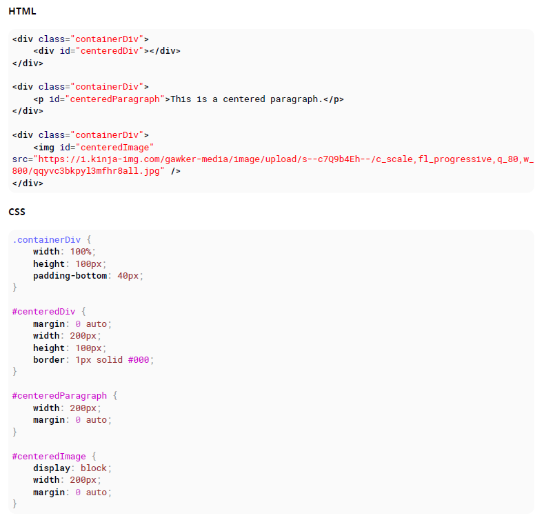
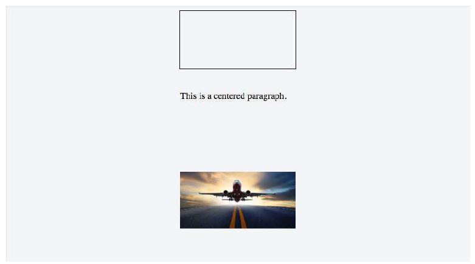

# 100 days of code front end - Day 12

## 前言

最近發現有點心不在焉的，在學習 CSS 的路上總是一天拖過一天，真的是很糟糕，應該要重新注意一下自己的注意力是否集中了。

## 筆記

### 6. Centering

#### 6.1 Using Flexbox

`Browser Support`
Flexbox 支援所有主要的瀏覽器 (除了 ie10 之前的版本)
一些最近的連覽器版本像是 Safari 8 或是 IE10 需要 vendor prefixes ，一個快速產生 Prefix 的方法是使用 `Autoprefixer` 第三方工具

```html
<div class="container">
  
</div>
```

```css
html,
body,
.container {
  height: 100%;
}
.container {
  display: flex;
  justify-content: center; /* horizontal center */
}
img {
  align-self: center; /* vertical center */
}
```

```html

```

```css
html,
body {
  height: 100%;
}
body {
  display: flex;
  justify-content: center; /* horizontal center */
  align-items: center; /* vertical center */
}
```

#### 6.2 Using CSS transform

CSS transforms 是`基於元素的大小`，因此如果你不知道你的元素的寬與高，你可以定位元素絕對位置距離頂端 50% 以及左邊 50。然後 transform 左邊與上面 50% 將物件移動到水平與垂直中央。

```html
<div class="container">
  <div class="element"></div>
</div>
```

```css
.container {
  position: relative;
}

.element {
  position: absolute;
  top: 50%;
  left: 50%;
  transform: translate(-50%, -50%); // 基於元素的尺寸
}
```

`CROSS BROWSER COMPATIBILITY`
transform 屬性需要前綴才能支援舊的瀏覽器。

- CSS transform 並不支援 IE8 (含) 以前的版本

```css
-webkit-transform: translate(-50%, -50%); /* Chrome, Safari, Opera, Android */
-ms-transform: translate(-50%, -50%); /* IE 9 */
transform: translate(-50%, -50%);
```

`More Information`

- 元素的定位是基於第一個非靜態的父類(position: relative, absolute, fixed)
- 範例中如果只想要水平置中，使用 left: 50% 以及 transform: tranlateX(-50%);同樣如果想要垂直置中，使用 top: 50% 以及 transform: translateY(-50%)
- 在此定心方法中使用非靜態的寬度/高度元素會導致居中的元素看上去變形。 這主要發生在包含文本的元素上，可以通過添加以下內容來解決：margin-right：-50％; margin-bottom：-50％;。

#### 6.3 Using margin: 0 auto;

`物件如果是 block 元素並且有定義寬度`可以透過 margin: 0 auto; 來讓置中



#### 6.4 Using text-align

最常見和最簡單的置中類型是元素中的文本行。

- text-align: center

```html
<p>Lorem ipsum</p>
```

```css
p {
  text-align: center;
}
```

這不適用於置中整個塊元素的情況。 text-align 僅控制內聯內容（如其父塊元素中的文本）的對齊方式。

#### 6.5 Using position: absoulte

自動邊距與左，右或上，下偏移量的零值配對，將絕對定位的元素置於其父元素的中心。

```html
<div class="parent">
  
</div>
```

```css
.parent {
  position: relative;
  height: 500px;
}

.center {
  position: absolute;
  margin: auto;
  top: 0;
  right: 0;
  bottom: 0;
  left: 0;
}
```

元素並沒有像圖像那樣具有自己的隱藏寬度和高度，因此需要定義這些值。

#### 6.6 Using calc()

CSS3 新的語法 calc()，你可以計算元素佔據的空間尺寸與位置透過不同的單位去計算

```css
.center {
  position: absoulte;
  height: 50px;
  width: 50px;
  background: red;
  top: calc(50% - 50px / 2); /* height divided by 2*/
  left: calc(50% - 50px / 2); /* width divided by 2*/
}
```

```html
<div class="center"></div>
```

#### 6.7 Using line-height

你可以使用 line-height 將單一行文字依據容器中心垂直置中

```css
div {
  height: 200px;
  line-height: 200px;
}
```

#### 6.8 Vertical align anything with 3 lines of code

以下是另一種垂直置中的方法

```css
div.vertical {
  position: relative;
  top: 50%;
  transform: translateY(-50%);
}
```

```html
<div class="vertical">Vertical aligned text!</div>
```

#### 6.9 Centering in relation to another item

我們將會看到如何根據鄰近的元素高度來使內容置中

```css
.content * {
  box-sizing: border-box;
}
.content .position-container {
  display: table;
}
.content .details {
  display: table-cell;
  vertical-align: middle;
  width: 33.333333%;
  padding: 30px;
  font-size: 17px;
  text-align: center;
}
.content .thumb {
  width: 100%;
}
.content .thumb img {
  width: 100%;
}
```

```html
<div class="content">
  <div class="position-container">
    <div class="thumb">
      
    </div>
    <div class="details">
      <p class="banner-title">text 1</p>
      <p class="banner-text">
        content content content content content content content content content
        content content content content content
      </p>
      <button class="btn">button</button>
    </div>
  </div>
</div>
```

- .position-container 必須 diplay: table

#### 6.10 Ghost element technique

在要置中的容器內設置 100％的高“ ghost”元素，然後在該容器和要居中的元素上使用 vertical-align：middle。

```css
/* This parent can be any width and height */
.block {
  text-align: center;
  /* May want to do this if there is risk the container may be narrower than the element inside */
  white-space: nowrap;
}
/* The ghost element */
.block:before {
  content: '';
  display: inline-block;
  height: 100%;
  vertical-align: middle;
  /* There is a gap between ghost element and .centered,
caused by space character rendered. Could be eliminated by
nudging .centered (nudge distance depends on font family),
or by zeroing font-size in .parent and resetting it back
(probably to 1rem) in .centered. */
  margin-right: -0.25em;
}
/* The element to be centered, can also be of any width and height */
.centered {
  display: inline-block;
  vertical-align: middle;
  width: 300px;
  white-space: normal; /* Resetting inherited nowrap behavior */
}
```

```html
<div class="block">
  <div class="centered"></div>
</div>
```

#### 6.11 Centering vertically and horizontally without worrying about height or width

通過以下技術，你可以將內容添加到 HTML 元素並將其水平和垂直置中放置，而不必擔心其高度或寬度。

`The outer container`

- display: table;

`The inner container`

- display: table-cell
- vertical-align: middle;
- text-align: center;

`The content box`

- display: inline-block

```html
<div class="outer-container">
  <div class="inner-container">
    <div class="centered-content">
      You can put anything here!
    </div>
  </div>
</div>
```

```css
body {
  margin: 0;
}
.outer-container {
  position: absolute;
  display: table;
  width: 100%; /* This could be ANY width */
  height: 100%; /* This could be ANY height */
  background: #ccc;
}
.inner-container {
  display: table-cell;
  vertical-align: middle;
  text-align: center;
}
.centered-content {
  display: inline-block;
  text-align: left;
  background: #fff;
  padding: 20px;
  border: 1px solid #000;
}
```

#### 6.12 Vertically align an image inside div

```html
<div class="wrap">
  
</div>
```

```css
.wrap {
  height: 50px; /* max image height */
  width: 100px;
  border: 1px solid blue;
  text-align: center;
}
.wrap:before {
  content: '';
  display: inline-block;
  height: 100%;
  vertical-align: middle;
  width: 1px;
}
img {
  vertical-align: middle;
}
```

#### 6.13 Centering with fixed size

如果你的內容尺寸是固定的，你可以使用絕對位置 50% 的 margin 來減少你內容寬與高的一半

```html
<div class="center">
  Center vertically and horizontally
</div>
```

```css
.center {
  position: absolute;
  background: #ccc;
  left: 50%;
  width: 150px;
  margin-left: -75px; /* width * -0.5 */
  top: 50%;
  height: 200px;
  margin-top: -100px; /* height * -0.5 */
}
```

`Horizontal centering with only fixed width` 即使您不知道內容的高度，也可以將元素水平居中：

```html
<div class="center">
  Center only horizontally
</div>
```

```css
.center {
  position: absolute;
  background: #ccc;
  left: 50%;
  width: 150px;
  margin-left: -75px; /* width * -0.5 */
}
```

`Vertical centering with fixed height`
如果知道元素的高度，則可以將元素垂直居中：

```html
<div class="center">
  Center only vertically
</div>
```

```css
.center {
  position: absolute;
  background: #ccc;
  top: 50%;
  height: 200px;
  margin-top: -100px; /* width * -0.5 */
}
```

#### 6.14 Vertically align dynamic height element

直覺的應用 css 不會產生預期的結果因為:

- vertical-align: middle: 不可以應用在 block 級的元素
- margin-top: auto and margin-bottom: auto 使用的值將計算為 0
- margin-top: -50% 基於百分比的邊距值是相對於包含塊的寬度來計算的

```html
<div class="vcenter--container">
  <div class="vcenter--helper">
    <div class="vcenter--content">
      <!--stuff-->
    </div>
  </div>
</div>
```

```css
.vcenter--container {
  display: table;
  height: 100%;
  position: absolute;
  overflow: hidden;
  width: 100%;
}
.vcenter--helper {
  display: table-cell;
  vertical-align: middle;
}
.vcenter--content {
  margin: 0 auto;
  width: 200px;
}
```

#### 6.15 Horizontal and Vertical centering using table layout

一個可以簡單置中子元素的方式是使用 display: table

```html
<div class="wrapper">
  <div class="parent">
    <div class="child"></div>
  </div>
</div>
```

```css
.wrapper {
  display: table;
  vertical-align: center;
  width: 200px;
  height: 200px;
  background-color: #9e9e9e;
}
.parent {
  display: table-cell;
  vertical-align: middle;
  text-align: center;
}
.child {
  display: inline-block;
  vertical-align: middle;
  text-align: center;
  width: 100px;
  height: 100px;
  background-color: teal;
}
```
