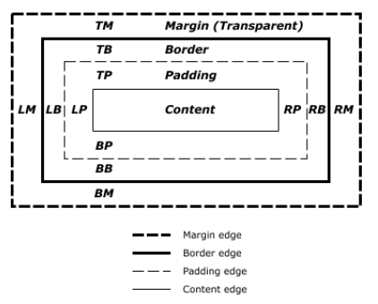
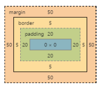
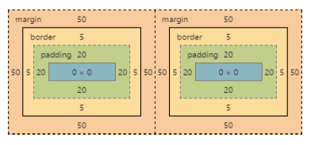
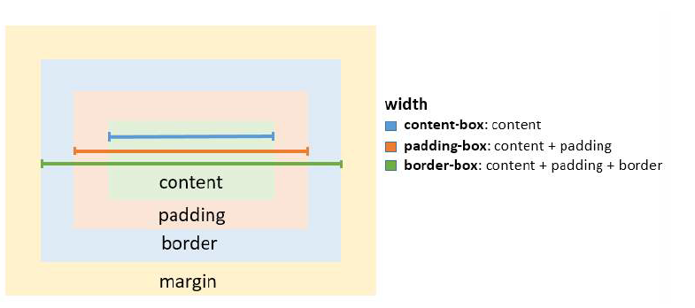

### 7. The Box Model

- content-box: 元素的寬度與高度只包含內容區塊
- padding-box: 元素的寬度與高度包含內容與 padding
- border-box: 元素的寬度與高度包含內容、padding 與 border
- initial: 使用元素的預設值
- inherit: 繼承至父類別的 box model

#### 7.1 What is the Box Model?

`The Edges`
瀏覽器在 HTML 文件中為每個元素建立長方形的區塊。Box Model 描述 padding, border 以及 margin 如何加到內容中以創建此矩形。



四個區域中每個區域的周常被稱為邊緣。 每個邊都定義為一個 box

- content box: 元素的寬度與高度取決於呈現的內容。(文字、圖片以及任何子元素)
- padding box: 與內容之間的距離
- border box: 包含 padding 與 content 的外框
- margin box: 距離其他元素之間的距離

`Example`

```css
div {
  border: 5px solid red;
  margin: 50px;
  padding: 20px;
}
```



套用同樣參數的同級元素


#### 7.2 box-sizing

預設的盒模型 (content-box) ，可能會覺得違反直覺，因為當元素透用 padding 與 border 的樣式時，元素的寬度與高度並沒有呈現真實的寬度與高度在螢幕上。

下面的範例說明 content-box 潛在的問題

```css
textarea {
  width: 100%;
  padding: 3px;
  box-sizing: content-box; /* default value */
}
```

因為 padding 會增加 textarea 的寬度，這個元素的結果是 textarea 的寬度會比 100% 還要寬

幸運的是， CSS 允許我們改變盒模型，透過給定元素 box-sizing 的屬性

- content-box
- padding-box
- border-box



為了解決上述的問題，你可以改變 box-sizing 屬性成 padding-box 或是 border-box 是一般普遍的用法。
