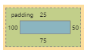
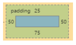
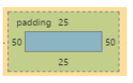
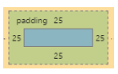

### 9. Padding

#### 9.1 Padding Shorthand

padding 屬性設定元素所有邊界與 content 的距離。padding 介於元素的 content 與 border 之間。負值是不允許的

為了節省需要個別去寫每一邊的 padding (padding-top, padding-left, etc)你可以用縮寫

`Four Value`

```html
<style>
  .myDiv {
    padding: 25px 50px 75px 100px; /* top right bottom left; */
  }
</style>
<div class="myDiv"></div>
```


``Three Value`

```html
<style>
  .myDiv {
    padding: 25px 50px 75px; /* top left/right bottom */
  }
</style>
<div class="myDiv"></div>
```



`Two Value`

```html
<style>
  .myDiv {
    padding: 25px 50px; /* top/bottom left/right */
  }
</style>
<div class="myDiv"></div>
```



`One Value`

```html
<style>
  .myDiv {
    padding: 25px; /* top/right/bottom/left */
  }
</style>
<div class="myDiv"></div>
```



#### 9.2 Padding on a given side

- padding-top
- padding-right
- padding-bottom
- padding-left

```html
<style>
  .myClass {
    padding-top: 5px;
  }
</style>
<div class="myClass"></div>
```
