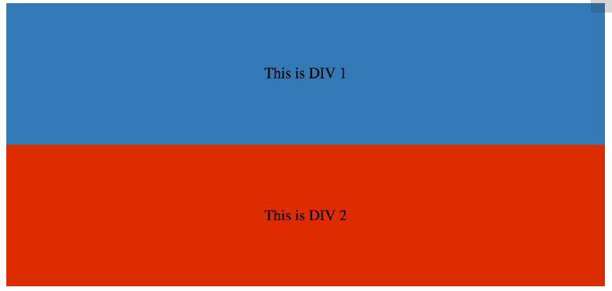

### 14. Floats

#### 14.1 Float an image within text

最基本使用 float 的用途是讓文字環繞在圖像上 (文繞圖)。

使用 float 的話，基本上它的元素就會是浮起來的，然後下面的元素就會往上排，但是往上排的文字還是會被擠壓，因此有了文繞圖的效果。

下面的程式碼會產生兩個文字段落與圖片，第二個文字段落將會圍繞著圖片。注意，內容總是會在浮動元素的後面，就是在浮動元素周圍流動。

```html
<p>
  Lorem ipsum dolor sit amet, consectetur adipiscing elit. Integer nec odio.
  Praesent libero. Sed cursus ante dapibus diam. Sed nisi. Nulla quis sem at
  nibh elementum imperdiet. Duis sagittis ipsum. Praesent mauris. Fusce nec
  tellus sed augue semper porta. Mauris massa. Vestibulum lacinia arcu eget
  nulla.
</p>

<p>
  Class aptent taciti sociosqu ad litora torquent per conubia nostra, per
  inceptos himenaeos. Curabitur sodales ligula in libero. Sed dignissim lacinia
  nunc. Curabitur tortor. Pellentesque nibh. Aenean quam. In scelerisque sem at
  dolor. Maecenas mattis. Sed convallis tristique sem. Proin ut ligula vel nunc
  egestas porttitor. Morbi lectus risus, iaculis vel, suscipit quis, luctus non,
  massa. Fusce ac turpis quis ligula lacinia aliquet.
</p>
```

```css
img {
  float: left;
}
```


#### 14.2 clear property

clear 屬性是與 float 直接相關的

- none: 預設值。允許兩邊都可以有浮動區塊
- left: 消除左邊的浮動
- right: 消除右邊的浮動
- both: 消除左右兩邊的浮動
- inherit: 從父類別繼承

```html
<html>
  <head>
    <style>
      img {
        float: left;
      }
      p.clear {
        clear: both;
      }
    </style>
  </head>
  <body>
    
    <p>
      Lorem ipsoum Lorem ipsoum Lorem ipsoum Lorem ipsoum Lorem ipsoum Lorem
      ipsoum Lorem ipsoum Lorem ipsoum Lorem ipsoum Lorem ipsoum Lorem ipsoum
      Lorem ipsoum
    </p>
    <p class="clear">
      Lorem ipsoum Lorem ipsoum Lorem ipsoum Lorem ipsoum Lorem ipsoum Lorem
      ipsoum Lorem ipsoum Lorem ipsoum Lorem ipsoum Lorem ipsoum Lorem ipsoum
      Lorem ipsoum
    </p>
  </body>
</html>
```

#### 14.3: Clearfix

不要與 clear 屬性混淆。clearfix 是一個概念 (也與 float 有關，因此可能會引起混淆)

為了要包含 float，你必須在容器(父級)上加上 .cf 或是 .clearfix class 並且套用一些 css 樣式在這些 class 上面。

`Clearfix (with top margin collapsing of contained floats still occurring)`

```css
.cf:after {
  content="",display: table;
}

.cf:after {
  clear: both;
}
```

`Clearfix also preventing top margin collapsing of contained floats`

```css
/**
* For modern browsers
* 1. The space content is one way to avoid an Opera bug when the
* contenteditable attribute is included anywhere else in the document.
* Otherwise it causes space to appear at the top and bottom of elements
* that are clearfixed.
* 2. The use of `table` rather than `block` is only necessary if using
* `:before` to contain the top-margins of child elements.
*/
.cf:before,
.cf:after {
  content: ' '; /* 1 */
  display: table; /* 2 */
}
.cf:after {
  clear: both;
}
```

`Clearfix with support of outdated browser IE6 and IE7`

```css
.cf:before,
.cf:after {
  content: ' ';
  display: table;
}
.cf:after {
  clear: both;
}
/**
* For IE 6/7 only
* Include this rule to trigger hasLayout and contain floats.
*/
.cf {
  *zoom: 1;
}
```

#### 14.4 In-line Div using float

div 是 block 等級的元素，例如他會佔據網頁的整個寬度並且與他同級的元素會放置在他的下方

```html
<div>
  <p>This is DIV 1</p>
</div>
<div>
  <p>This is DIV 2</p>
</div>
```



我們可以透過在 div 加上 float 屬性讓他可以顯再在同一行

```html
<div class="outer-div">
  <div class="inner-div1">
    <p>This is DIV 1</p>
  </div>
  <div class="inner-div2">
    <p>This is DIV 2</p>
  </div>
</div>
```

```css
.inner-div1 {
  width: 50%;
  margin-right: 0px;
  float: left;
  background: #337ab7;
  padding: 50px 0px;
}
.inner-div2 {
  width: 50%;
  margin-right: 0px;
  float: left;
  background: #dd2c00;
  padding: 50px 0px;
}
p {
  text-align: center;
}
```


#### 14.5 Use of overflow property to clear floats

將元素設定 overflow 的值為 hidden, auto 或是 scroll，會清除所有在該元素中的 float 。

#### 14.6 Simple two fixed-width column layout

一個簡單的兩欄布置由兩個固定寬度的浮動元素組成。注意，sidebar 與內容區域並不是相同高的。這是使用 float 在多欄布置上的其中一個棘手的部分，且需要變通方法已使得多個欄看起來具有相同的高度。

```html
<div class="wrapper">
  <div class="sidebar">
    <h2>Sidebar</h2>
    <p>
      Lorem ipsum dolor sit amet, consectetur adipiscing elit. Integer nec odio.
    </p>
  </div>
  <div class="content">
    <h1>Content</h1>
    <p>
      Class aptent taciti sociosqu ad litora torquent per conubia nostra, per
      inceptos himenaeos. Curabitur sodales ligula in libero. Sed dignissim
      lacinia nunc. Curabitur tortor. Pellentesque nibh. Aenean quam. In
      scelerisque sem at dolor. Maecenas mattis. Sed convallis tristique sem.
      Proin ut ligula vel nunc egestas porttitor. Morbi lectus risus, iaculis
      vel, suscipit quis, luctus non, massa. Fusce ac turpis quis ligula lacinia
      aliquet.
    </p>
  </div>
</div>
```

```css
.wrapper {
  width: 600px;
  padding: 20px;
  background-color: pink;
  /* Floated elements don't use any height. Adding "overflow:hidden;" forces the
parent element to expand to contain its floated children. */
  overflow: hidden;
}
.sidebar {
  width: 150px;
  float: left;
  background-color: blue;
}
.content {
  width: 450px;
  float: right;
  background-color: yellow;
}
```

#### 14.7 Simple Three Fixed-Width Column Layout

```html
<div class="wrapper">
  <div class="left-sidebar">
    <h1>Left Sidebar</h1>
    <p>Lorem ipsum dolor sit amet, consectetur adipiscing elit.</p>
  </div>
  <div class="content">
    <h1>Content</h1>
    <p>
      Class aptent taciti sociosqu ad litora torquent per conubia nostra, per
      inceptos himenaeos. Curabitur sodales ligula in libero. Sed dignissim
      lacinia nunc. Curabitur tortor. Pellentesque nibh. Aenean quam. In
      scelerisque sem at dolor. Maecenas mattis. Sed convallis tristique sem.
      Proin ut ligula vel nunc egestas porttitor. Morbi lectus risus, iaculis
      vel, suscipit quis, luctus non, massa.
    </p>
  </div>
  <div class="right-sidebar">
    <h1>Right Sidebar</h1>
    <p>Fusce ac turpis quis ligula lacinia aliquet.</p>
  </div>
</div>
```

```css
.wrapper {
  width: 600px;
  background-color: pink;
  padding: 20px;
  /* Floated elements don't use any height. Adding "overflow:hidden;" forces the
parent element to expand to contain its floated children. */
  overflow: hidden;
}
.left-sidebar {
  width: 150px;
  background-color: blue;
  float: left;
}
.content {
  width: 300px;
  background-color: yellow;
  float: left;
}
.right-sidebar {
  width: 150px;
  background-color: green;
  float: right;
}
```

#### 14.8 Two-column lazy/Greedy Layout

這一個布局沒有定義寬度使用一個浮動的欄來建立一個兩欄布局。
在下面的範例中，左邊的 sidebar 是 'lazy' 他只會用到它所需要的空間。另外一個說法是，左邊的 sidebar 是 "shrink-wrapped'。然後右邊的欄位叫做 'greedy'，他會充滿剩下的空間。

```html
<div class="sidebar">
  <h1>Sidebar</h1>
  
</div>
<div class="content">
  <h1>Content</h1>
  <p>
    Lorem ipsum dolor sit amet, consectetur adipiscing elit. Integer nec odio.
    Praesent libero. Sed cursus ante dapibus diam. Sed nisi. Nulla quis sem at
    nibh elementum imperdiet. Duis sagittis ipsum. Praesent mauris. Fusce nec
    tellus sed augue semper porta. Mauris massa. Vestibulum lacinia arcu eget
    nulla.
  </p>
  <p>
    Class aptent taciti sociosqu ad litora torquent per conubia nostra, per
    inceptos himenaeos. Curabitur sodales ligula in libero. Sed dignissim
    lacinia nunc. Curabitur tortor. Pellentesque nibh. Aenean quam. In
    scelerisque sem at dolor. Maecenas mattis. Sed convallis tristique sem.
    Proin ut ligula vel nunc egestas porttitor. Morbi lectus risus, iaculis vel,
    suscipit quis, luctus non, massa. Fusce ac turpis quis ligula lacinia
    aliquet. Mauris ipsum. Nulla metus metus, ullamcorper vel, tincidunt sed,
    euismod in, nibh.
  </p>
</div>
```

```css
.sidebar {
  /* `display:table;` shrink-wraps the column */
  display: table;
  float: left;
  background-color: blue;
}
.content {
  /* `overflow:hidden;` prevents `.content` from flowing under `.sidebar` */
  overflow: hidden;
  background-color: yellow;
}
```
