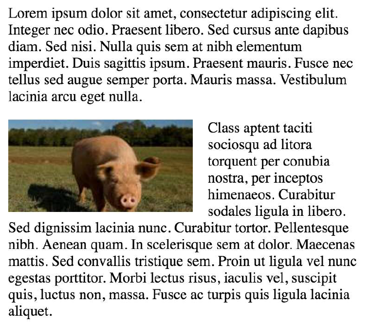

### 14. Floats

#### 14.1 Float an image within text

大部分使用 float 是為了要可以文繞圖。

下面的程式碼會產生兩個文字段落與圖片，第二個文字段落將會圍繞著圖片。注意，內容總是會在浮動元素的後面，在浮動元素周圍流動。

```html
<p>
  Lorem ipsum dolor sit amet, consectetur adipiscing elit. Integer nec odio.
  Praesent libero. Sed cursus ante dapibus diam. Sed nisi. Nulla quis sem at
  nibh elementum imperdiet. Duis sagittis ipsum. Praesent mauris. Fusce nec
  tellus sed augue semper porta. Mauris massa. Vestibulum lacinia arcu eget
  nulla.
</p>

<p>
  Class aptent taciti sociosqu ad litora torquent per conubia nostra, per
  inceptos himenaeos. Curabitur sodales ligula in libero. Sed dignissim lacinia
  nunc. Curabitur tortor. Pellentesque nibh. Aenean quam. In scelerisque sem at
  dolor. Maecenas mattis. Sed convallis tristique sem. Proin ut ligula vel nunc
  egestas porttitor. Morbi lectus risus, iaculis vel, suscipit quis, luctus non,
  massa. Fusce ac turpis quis ligula lacinia aliquet.
</p>
```

```css
img {
  float: left;
}
```



#### 14.2 clear property

clear 屬性是與 float 直接相關的

- none: 預設值。允許兩邊都可以有浮動區塊
- left: 消除左邊的浮動
- right: 消除右邊的浮動
- both: 消除左右兩邊的浮動
- inherit: 從父類別繼承

```html
<html>
  <head>
    <style>
      img {
        float: left;
      }
      p.clear {
        clear: both;
      }
    </style>
  </head>
  <body>
    
    <p>
      Lorem ipsoum Lorem ipsoum Lorem ipsoum Lorem ipsoum Lorem ipsoum Lorem
      ipsoum Lorem ipsoum Lorem ipsoum Lorem ipsoum Lorem ipsoum Lorem ipsoum
      Lorem ipsoum
    </p>
    <p class="clear">
      Lorem ipsoum Lorem ipsoum Lorem ipsoum Lorem ipsoum Lorem ipsoum Lorem
      ipsoum Lorem ipsoum Lorem ipsoum Lorem ipsoum Lorem ipsoum Lorem ipsoum
      Lorem ipsoum
    </p>
  </body>
</html>
```

#### 14.3: Clearfix
