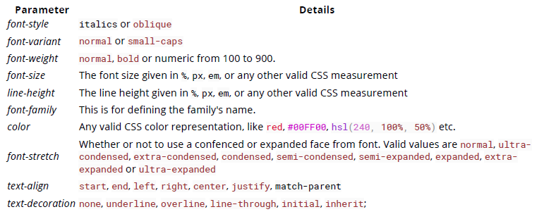
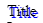
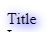
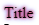
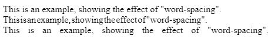
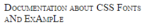

## 15. Typography



### 15.1 The Font Shorthand

`Syntax`

```css
element {
  font: [font-style] [font-variant] [font-weight] [font-size/line-high]
    [font-family];
}
```

你可以將所有 font 相關的樣式透過一個 font 宣告完成，你只需要使用 font 屬性，然後按照正確的順序放置值即可。

舉例來說，一般你會這樣寫

```css
p {
  font-weight: bold;
  font-size: 20px;
  font-family: Arial, sans-serif;
}
```

但是你可以使用簡短的寫法

```css
p {
  font: bold 20px Arial, sans-serif;
}
```

注意，使用縮寫的方式會重置為提供的其他屬性。

必須注意，font 縮寫的方式，如果沒有同時包含 font-size 與 font-family 的話，這個縮寫的樣式是無效的。

其他屬性的預設值

- font-style: normal;
- font-variant: normal;
- font-weight: normal;
- font-stretch: normal;
- font-size: medium;
- line-height: normal;
- font-family: 取決於瀏覽器

### 15.2 Quotes

quotes 屬性是用來客製化 p 標籤的開放與關閉引用標記

```css
q {
  quotes: '<' '>';
}
```

### 15.3 Font Size

```html
<div id="element-one">Hello I am some text.</div>
<div id="element-two">Hello I am some smaller text.</div>
```

```css
#element-one {
  font-size: 30px;
}

#element-two {
  font-size: 10px;
}
```

### 15.4 Text Direction

```css
div {
  direction: ltr; /* Default, text read read from left-to-right*/
}

.ex {
  direction: rtl; /* text read from right-to-left */
}

.horizontal-tb {
  writing-mode: horizontal-tb; /* Default, text read from left-to-right and top-to-bottom*/
}

.vertical-rtl {
  writing-mode: vertical-rl; /* text read from right-to-left and top-to-bottom */
}
.vertical-ltr {
  writing-mode: vertical-lr; /* text read from left-to-right and top to bottom */
}
```

direction 屬性是使用於改變元素水平文字的方向

`syntax: direction: ltr | rtl | initial | inherit`

writing-mode 屬性是用來改變文字的對齊方式，因此可以根據語言從上到下或從左到右閱讀  
`syntax: horizontal-tb | vertical-rl | vertical-lr`

### 15.5 Font Stack

> font-family: 'Segoe UI', Tahoma, sans-serif;

瀏覽器會嘗試將字體 "Segoe UI" 用在指定的元素上。但是如果這個字型無法取得或是字體並不包含所需字符的字型，則瀏覽器會退回到 Tahoma，並且在必要時會使用使用者電腦上的 'sans-serif' 字型。

注意，任何字體名稱超過一個字的例如 'Segoe UI' 需要使用單引號或是雙引號將他們框住。

### 15.6 Text Overflow

text-overflow 屬性處理超出的文字內容應該要如何告知使用者。
以下的範例，ellopsis 省略符號

```css
.text {
  overflow: hidden;
  text-overflow: ellopsis;
}
```

不幸的是，文本溢出：省略號僅適用於一行文本。 無法在標準 CSS 的最後一行支持省略號，但是可以通過非標準的僅基於 Webkit 的 flexbox 實現來實現。

```css
.giveMeEllipsis {
  overflow: hidden;
  text-overflow: ellipsis;
  display: -webkit-box;
  -webkit-box-orient: vertical;
  -webkit-line-clamp: N; /* number of lines to show */
  line-height: X; /* fallback */
  max-height: X * N; /* fallback */
}
```

### 15.7 Text Shadow

文字加上陰影，使用 text-shadow 屬性

> text-shadow: horizontal-offset vertical-offset blur color;

`Shadow without blur radius`

```css
h1 {
  text-shadow: 2px 2px #0000ff;
}
```

建立藍色陰影的效果在標題 (h1)


`Shadow with blur radius`  
加入模糊特效

```html
h1 { text-shadow: 2px 2px 10px #0000FF; }
```



`Multiple Shadows`  
為了建立元素多重陰影，可用逗號分開他們

```html
h1 { text-shadow: 0 0 3px #FF0000; 0 0 5px #0000FF; }
```



### 15.8 Text Transform

text-transform 允許你改變文字的大小寫。

- uppercase
- capitalize
- lowercase
- initial
- inherit
- none

```css
.example1 {
  text-transform: uppercase;
}
.example2 {
  text-transform: capitalize;
}
.example3 {
  text-transform: lowercase;
}
```

```html
<p class="example1">
  all letters in uppercase
  <!-- "ALL LETTERS IN UPPERCASE" -->
</p>
<p class="example2">
  all letters in capitalize
  <!-- "All Letters In Capitalize (Sentence Case)" -->
</p>
<p class="example3">
  all letters in lowercase
  <!-- "all letters in lowercase" -->
</p>
```

### 15.9 Letter Spacing

letter-spacing 屬性用來指定字元之間的距離，可以為負值

```css
h2 {
  /* adds a 1px space horizontally between each letter;
also known as tracking */
  letter-spacing: 1px;
}

p {
  letter-spacing: -1px;
}
```

### 15.10 Text Indent

```css
p {
  text-indent: 50px;
}
```

text-indent 屬性指定在元素的文本內容的第一行的開頭之前應移動多少水平空間文本。

### 15.11 Text Decoration

text-decoration 屬性被使用在加入或移除文字的裝飾

```css
h1 {
  text-decoration: none;
}
h2 {
  text-decoration: overline;
}
h3 {
  text-decoration: line-through;
}
h4 {
  text-decoration: underline;
}
```

text-decoration 可以使用 text-decoration-style 與 text-decoration-color 的縮寫

```css
.title {
  text-decoration: underline dotted blue;
}
```

```css
.title {
  text-decoration-style: dotted;
  text-decoration-line: underline;
  text-decoration-color: blue;
}
```

以下的屬性只有在 firefox 支援

- text-decoration-color
- text-decoration-line
- text-decoration-style
- text-decoration-skip

### 15.12 Word Spacing

word-spacing 指定單字之間的距離
`Possible Values`

- 正負值 長度(em, px, vh, cm) 或是 百分比 (%)
- normal: 作為 font 的預設單字的距離
- inherit 從父類別繼承

```css
.normal {
  word-spacing: normal;
}
.narrow {
  word-spacing: -3px;
}
.extensive {
  word-spacing: 10px;
}
```

```html
<p>
  <span class="normal"
    >This is an example, showing the effect of "word-spacing".</span
  ><br />
  <span class="narrow"
    >This is an example, showing the effect of "word-spacing".</span
  ><br />
  <span class="extensive"
    >This is an example, showing the effect of "word-spacing".</span
  ><br />
</p>
```



### 15.13 Font Variant

- normal: 一般字
- small-caps: 將每個字母設為大寫，但讓小寫字母 (原始文字) 的大小小於原本的大寫字

```css
.smallcaps {
  font-variant: small-caps;
}
```

```html
<p class="smallcaps">
  Documentation about CSS Fonts
  <br />
  aNd ExAmpLe
</p>
```



font-variant 屬性是以下屬性的簡寫形式：

- font-variant-caps
- font-variant-numeric
- font-variant-alternates
- font-variant-ligatures
- font-variant-east-asian。
