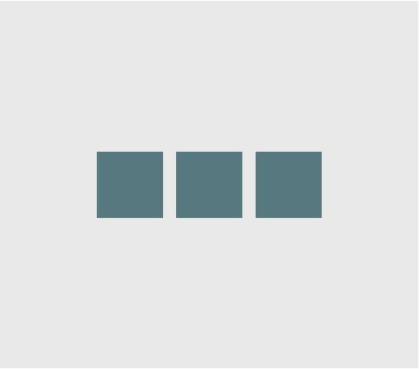
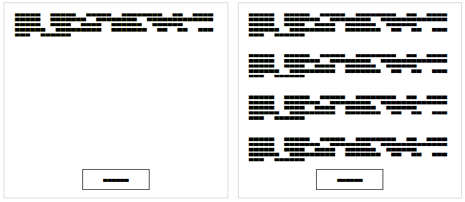

## 16. Flexible Box Layout (Flexbox)

Flexible Box 模型，或簡稱 flexbox，是一種為使用者介面設計的盒模型，他允許使用者對齊與分配在容器中的項目空間，以便當頁面 Layout 必須容納不同的未知元素時，元素的行為可以預測螢幕大小。

flex 容器會擴展項目來填滿可用的空間，並且收縮他們以防溢出。

### 16.1 Dynamic Vertical and Horizontal Centering (align-items, justify-content)

`Simple Example (centering a single element)`

```html
<div class="aligner">
  <div class="aligner-item">...</div>
</div>
```

```css
.aligner {
  display: flex;
  align-items: center;
  justify-content: center;
}
.aligner-item {
  max-width: 50%; /*for demo. Use actual width instead.*/
}
```


- align-items: center => 元素沿著軸向置中其他沿著 flex-direction 軸置中 (ex. 水平 flexbox 垂直置中以及 垂直 flexbox 水平置中)
- justify-content: center => 置中元素沿著 flex-direction 指定的軸向 (ex. 水平 flexbox 水平置中以及垂直 flexbox 垂直置中)

`Individual Property Examples`

```html
<div id="container">
  <div></div>
  <div></div>
  <div></div>
</div>
```

```css
div#container {
  display: flex;
  flex-direction: row;
  justify-content: center;
}
```


`Example: justify-content: center on a vertical flexbox`

```css
div#container {
  display: flex;
  flex-direction: column;
  justify-content: center;
}
```


`Example: align-content: center on a horizontal flexbox`

```css
div#container {
  display: flex;
  flex-direction: row;
  align-item: center;
}
```


`Example: align-content: center on a vertical flexbox`

```css
div#container {
  display: flex;
  flex-direction: column;
  align-items: center;
}
```


`Example: Combination for centering both on horizontal flexbox`

```css
div#container {
  display: flex;
  flex-direction: row;
  justify-content: center;
  align-items: center;
}
```



`Example: Combination for centering both on vertical flexbox`

```css
div#container {
  display: flex;
  flex-direction: column;
  justify-content: center;
  align-items: center;
}
```


### 16.2 Sticky Variable-Height Footer

以下程式碼會建立一個黏住的頁尾。當內容並沒有到達 viewport 的最後面，footer 會黏在 viewport 的最底端。當內容超出 viewport 的底部時，頁尾也會被推出 viewport。

```html
<div class="header">
  <h2>Header</h2>
</div>
<div class="content">
  <h1>Content</h1>
  <p>
    Lorem ipsum dolor sit amet, consectetur adipiscing elit. Integer nec odio.
    Praesent libero. Sed cursus ante dapibus diam. Sed nisi. Nulla quis sem at
    nibh elementum imperdiet. Duis sagittis ipsum. Praesent mauris. Fusce nec
    tellus sed augue semper porta. Mauris massa. Vestibulum lacinia arcu eget
    nulla. Class aptent taciti sociosqu ad litora torquent per conubia nostra,
    per inceptos himenaeos. Curabitur sodales ligula in libero.
  </p>
</div>
<div class="footer"></div>
  <h4>Footer</h4>
</div>
```

```css
html,
body {
  height: 100%;
}
body {
  display: flex;
  flex-direction: column;
}
.content {
  /* Include `0 auto` for best browser compatibility. */
  flex: 1 0 auto;
}
.header,
.footer {
  background-color: grey;
  color: white;
  flex: none;
}
```

### 16.3 Optimally fit elements to their container

flexbox 最好的功能之一是允許容器以最佳方式填滿其父元素。

```html
<div class="flex-container">
  <div class="flex-item">1</div>
  <div class="flex-item">2</div>
  <div class="flex-item">3</div>
  <div class="flex-item">4</div>
  <div class="flex-item">5</div>
</div>
```

```css
.flex-container {
  background-color: #000;
  height: 100%;
  display: flex;
  flex-direction: row;
  flex-wrap: wrap;
  justify-content: flex-start;
  align-content: stretch;
  align-items: stretch;
}
.flex-item {
  background-color: #ccf;
  margin: 0.1em;
  flex-grow: 1;
  flex-shrink: 0;
  flex-basis: 200px; /* or % could be used to ensure a specific layout */
}
```


### 16.4 Holy Grail Layout using Flexbox

聖杯布局是使用固定高度的 header 與 footer，並且中間有三欄。3 欄包含了固定寬度的 sidenav, 流動的中間，以及一個用於其他內容的欄位 (例如廣告) (流動中心標記在最前面)

```html
<div class="container">
  <header class="header">Header</header>
  <div class="content-body">
    <main class="content">Content</main>
    <nav class="sidenav">Nav</nav>
    <aside class="ads">Ads</aside>
  </div>
  <footer class="footer">Footer</footer>
</div>
```

```css
body {
  margin: 0;
  padding: 0;
}
.container {
  display: flex;
  flex-direction: column;
  height: 100vh;
}
.header {
  flex: 0 0 50px;
}
.content-body {
  flex: 1 1 auto;
  display: flex;
  flex-direction: row;
}
.content-body .content {
  flex: 1 1 auto;
  overflow: auto;
}
.content-body .sidenav {
  order: -1;
  flex: 0 0 100px;
  overflow: auto;
}
.content-body .ads {
  flex: 0 0 100px;
  overflow: auto;
}
.footer {
  flex: 0 0 50px;
}
```


### 16.5 Perfectly aligned buttons inside cards with flexbox

如今，這是設計中的常規模式，它可以將包含其內容的卡片中的操作的調用垂直對齊，如下所示：


```html
<div class="cards">
  <div class="card">
    <p>
      Lorem ipsum Magna proident ex anim dolor ullamco pariatur reprehenderit
      culpa esse enim mollit labore dolore voluptate ullamco et ut sed qui
      minim.
    </p>
    <p><button>Action</button></p>
  </div>
  <div class="card">
    <p>
      Lorem ipsum Magna proident ex anim dolor ullamco pariatur reprehenderit
      culpa esse enim mollit labore dolore voluptate ullamco et ut sed qui
      minim.
    </p>
    <p>
      Lorem ipsum Magna proident ex anim dolor ullamco pariatur reprehenderit
      culpa esse enim mollit labore dolore voluptate ullamco et ut sed qui
      minim.
    </p>
    <p>
      Lorem ipsum Magna proident ex anim dolor ullamco pariatur reprehenderit
      culpa esse enim mollit labore dolore voluptate ullamco et ut sed qui
      minim.
    </p>
    <p>
      Lorem ipsum Magna proident ex anim dolor ullamco pariatur reprehenderit
      culpa esse enim mollit labore dolore voluptate ullamco et ut sed qui
      minim.
    </p>
    <p><button>Action</button></p>
  </div>
</div>
```

```css
.cards {
  display: flex;
}
.card {
  border: 1px solid #ccc;
  margin: 10px 10px;
  padding: 0 20px;
}
button {
  height: 40px;
  background: #fff;
  padding: 0 40px;
  border: 1px solid #000;
}
p:last-child {
  text-align: center;
}
```

### 16.6 Same height on nested containers

下面的程式碼可以確保所有巢狀容器會有同樣的高度。這是通過確保所有嵌套元素與包含其父級 div 的高度相同來完成的。

```html
<div class="container">
  <div style="background-color: red">
    Some <br />
    data <br />
    to make<br />
    a height <br />
  </div>
  <div style="background-color: blue">
    Fewer <br />
    lines <br />
  </div>
</div>
```

```css
.container {
  display: flex;
  align-items: stretch; // Default value
}
```
