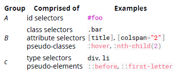
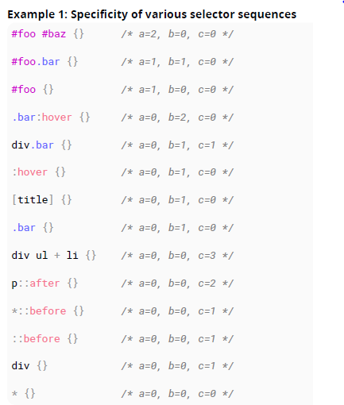
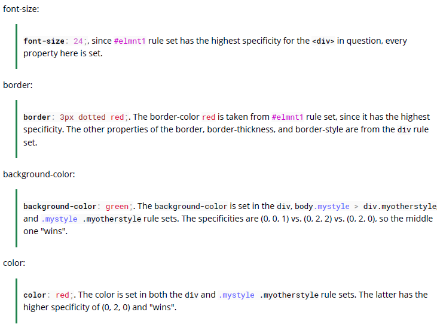

## 17. Cascading and Specificity

### 17.1 Calculating Selector Specificity

每一個 CSS 選擇器都有它自己的權重值。序列中的每個選擇器都會增加序列的整體權重。選擇器屬於三個不同的權重群組之一：A, B, C。當多重選擇器循序選擇給定的元素，瀏覽器會使用序列中整體最高權重的樣式套用。

A: id 選擇器 ex. #foo  
B: 類別選擇器、屬性選擇器、偽類別 ex. .bar [title], :hover  
C: 類別選擇器、偽元素 ex. ::before, ::first-letter  


群組 A 是最高權重然後是 B 與 C

萬用選擇器 \* 與組合器 (>, ~) 是沒有權重的

`Example 1: Specificity of various selector sequences`  


`Example 2: How specificity is used by the browser`  
試想以下 CSS 實作

```css
#foo {
  color: blue;
}
.bar {
  color: red;
  background: black;
}
```

在此我們有 ID 選擇器宣告字體顏色為藍色，以及類別選擇器字體顏色為紅色以及背景顏色為黑色。

一個元素同時具有 #foo 的 ID 以及 .bar 的類別這兩個宣告都會被選擇。 ID 選擇器具有群組 A 的權重以及類別選擇器具有群組 B 的權重。ID 選擇器勝過任何數量的類別選擇器。因為這樣， #foo 的 color: blue 以及 .bar 的 background: black 會被應用在元素上面。ID 選擇器的較高的權重將會使瀏覽器忽略 .bar 類別選擇器的 color 宣告。

現在考慮不同的 CSS 實作情況

```css
.bar {
  color: red;
  background: black;
}

.baz {
  background: white;
}
```

我們有兩個類別選擇器，其中一個宣告 color 為紅色以及 background 為黑色，然後另一個宣告 background 為白色。

同時擁有這兩個類別 .bar 與 .baz 將會被這兩個宣告影響，然而這邊有一個問題，我們現在兩個類別具有相同的群組 B 權重。CSS 的聯集性質為我們解決了這個問題；由於 .baz 是在 .bar 之後才定義的，因此我們的元素最終會使用 color:red 以及 background: white。

`Example 3: How to manipulate specificity`  
在範例 2 最後的程式碼片段可以被操作為確保我們的 .bar 類別選擇器 color 宣告被使用而不是使用 .baz 類別選擇器。

```css
.bar {
} /* a = 0, b = 1, c = 0 */
.baz {
} /* a = 0, b= 1, c= 0 */
```

實現此目的最常見的作法式找出可以將其他選擇器應用於 .bar 選擇器序列。
舉例來說，如果 .bar 類別只會被使用在 span 元素，我們可以修改 .bar 選擇器成 span.bar 。這將會多加一個新的群組 C 權重，這將會覆蓋 .baz 選擇器所欠缺的；

```css
span.bar {
} /* a=0, b=1, c=1 */
.baz {
} /* a=0, b=1, c= 0 */
```

但是，並非總是能夠找到在使用.bar 類的任何元素之間共享的另一個公共選擇器。然而並非每次都可以找到另一個一般的選擇器。因為這樣， CSS 允許我們重複選擇器來增加權重。我們可以使用 .bar.bar 。

```css
.bar.bar {
} /* a=0, b=2, c=0 */
.baz {
} /* a=0, b=1, c=0 */
```

`!important and inline style declarations`  
在樣式宣告使用 !important 標籤以及在 HTML 上使用 style 屬性宣告的樣式被認為比其他選擇器有更高的權重。如果存在這些宣告，則他們影響的樣式宣告將否決其他宣告，無論其他的權重如何。也就是說，除非你有多個宣告包含用於同一元素的同一屬性 !important 標籤。

CSS 撰寫上比較不建議使用這種方式，因為長期來看會影響 CSS 的可維護姓。

### 17.2 The !important declaration

!important 宣告會給定較高的規則權重，使其複寫樣式表中一般權重。

> property: value !important;

```css
#mydiv {
  font-weight: bold !important; /* The property won't be overriden by the rule below */
}

#outerdiv #mydiv {
  font-weight: normal; /* #mydiv font-weight won't be set to normal even if it has a higher specificity because of the !important declaration above */
}
```

強烈推薦不要使用 !important(除非很必要)，因為他將會干擾一般 css 規則會讓你的樣式表帶來不確定性。

同樣重要的是要注意，當對某個元素的同一規則應用多個！important 聲明時，具有較高特異性的聲明將被應用。

### 17.3 Cascading

級聯和權重再一起被使用決定 CSS 樣式屬性的最終值。他們同樣定義解決 CSS 規則集的衝突機制。

`CSS Loading order`  
樣式從以下來源按以下順序讀取樣式：

1. 使用者代理樣式表 (瀏覽器供應商提供的樣式)
2. 使用者樣式表 (使用者在瀏覽器上面設定的其他樣式)
3. 作者樣式表 (作者在這裡代表網頁建立的人)
   - 可能一個或多個 .css 檔
   - 在 HTML 檔案中定義 style 元素
4. 內嵌樣式 (定義樣式直接在 HTML 元素上面)

呈現元素時，瀏覽器將查找對應的樣式。

`How are conflicts resolved?`  
當只有一個 CSS rule set 嘗試套用樣式到元素上，這是不會有衝突的，並且 rule set 是會被使用的。
當多個 rule set 被發現有衝突配置，第一個權重值規則以及級聯規則會被使用來決定要用哪個樣式。

`Example 1 - Specificity rules`

```css
.mystyle {
  color: blue;
} /* specificity: 0, 0, 1, 0 */
div {
  color: red;
} /* specificity: 0, 0, 0, 1 */
```

```html
<div class="mystyle">Hello word</div>
```

第一個權重的規則會被使用，因為有較高的權重值。

`Example2 - Cascade rules with identical selectors`  
External css file

```css
.class {
  background: #fff;
}
```

`Internal css (in HTML file)`

```html
<style>
  .class {
    background: #000;
  }
</style>
```

在這個例子中，你有相同的選擇器，級聯開始決定最後一個被載入的會獲勝

`Example 3 - Cascade rules after Specificity rules`

```css
body > .mystyle {
  background-color: blue;
} /* specificity: 0, 0, 1, 1 */

.otherstyle > div {
  background-color: red;
} /* specificity: 0, 0, 1, 1 */
```

```html
<body class="otherstyle">
  <div class="mystyle">Hello World</div>
</body>
```

當應用權重規則後，他們同樣在背景顏色上有衝突，因此級聯規則被使用上了。級聯根據規則載入的順序，無論是否在同一個 .css 檔案或是在樣式資源的集合。最後一個載入會覆蓋最先載入的。因此在上面的案例 .otherstyle > div 獲勝。

`A final note`

- 選擇器權重優先考量
- 樣式表順序打破關係
- 內部樣式勝過一切

### 17.4 More complex specificity example

```css
div {
  font-size: 7px;
  border: 3px dotted pink;
  background-color: yellow;
  color: purple;
}
body.mystyle > div.myotherstyle {
  font-size: 11px;
  background-color: green;
}
#elmnt1 {
  font-size: 24px;
  border-color: red;
}
.mystyle .myotherstyle {
  font-size: 16px;
  background-color: black;
  color: red;
}
```

```html
<body class="mystyle">
  <div id="elmnt1" class="myotherstyle">
    Hello, world!
  </div>
</body>
```


