## 18. Colors

### 18.1 currentColor

currentColor 回傳當前元素計算過的顏色值。

`Use in same element`  
在此 currentColor 評估為紅色因為 color 屬性是紅色

```css
div {
  color: red;
  border: 5px solid currentColor;
  box-shadow: 0 0 5px currentColor;
}
```

在這邊，指定 border 為 currentColor 看起來是多餘的，因為省略他還是會有相同的結果。只在同一元素的 border 屬性使用 currentColor，否則會由其他指定的選擇器覆蓋。

因為計算顏色，下面的範例 border 會是綠色的因為第二個規則會覆蓋掉第一個的：

```css
div {
  color: blue;
  border: 3px solid currentColor;
  color: green;
}
```

`Inherited from parent element`  
父類的顏色被繼承，在這邊 currentColor 被評估為藍色，使得子元素的 border-color 為藍色。

```css
.parent-class {
  color: blue;
}

.parent-class .child-class {
  border-color: currentColor;
}
```

currentColor 同樣可以使用其他規則，由通常不會從 color 屬性繼承的其他規則使用，例如 background-color。

```css
.parent-class {
  color: blue;
}

.parent-class .child-class {
  background-color: currentColor;
}
```

### 18.2 Color Keywords

大部分的瀏覽器支援使用顏色的關鍵字指定顏色。

```css
.some-class {
  color: blue;
}
```

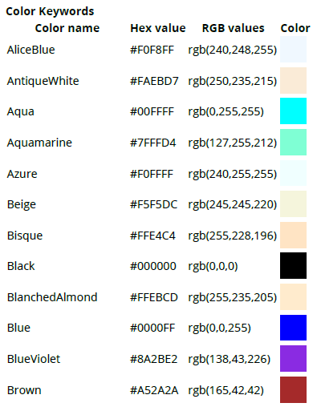
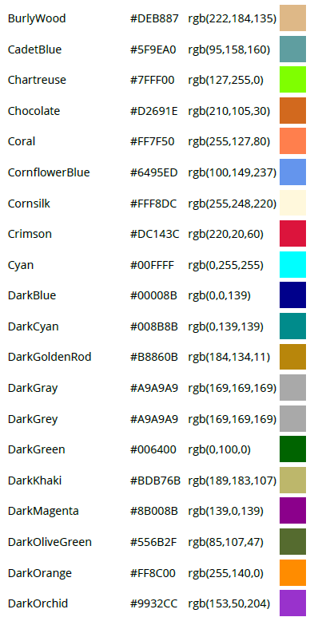
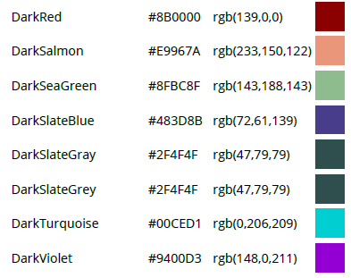
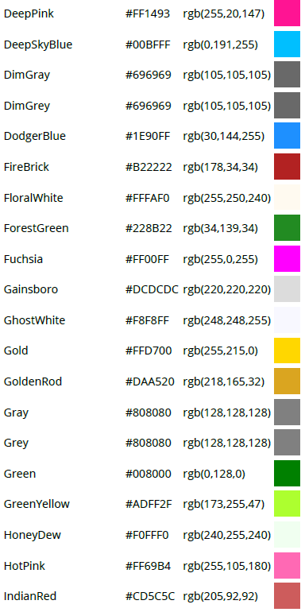
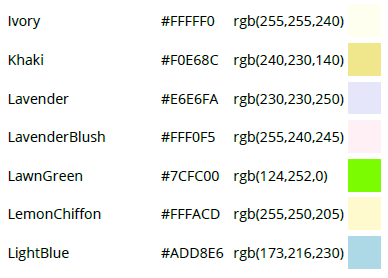
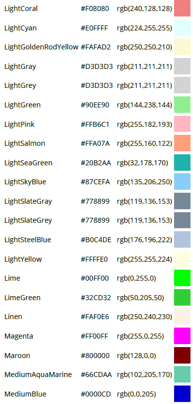
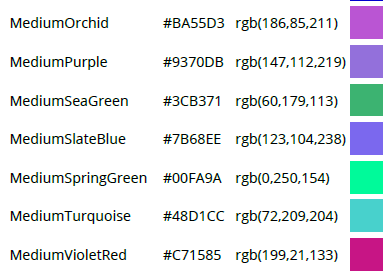
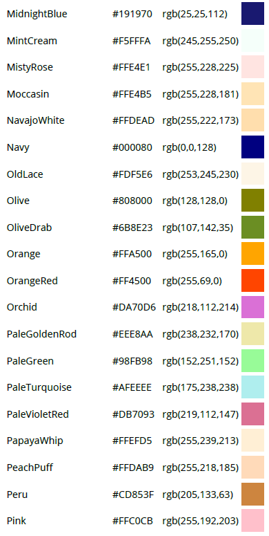
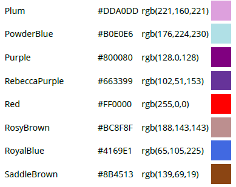
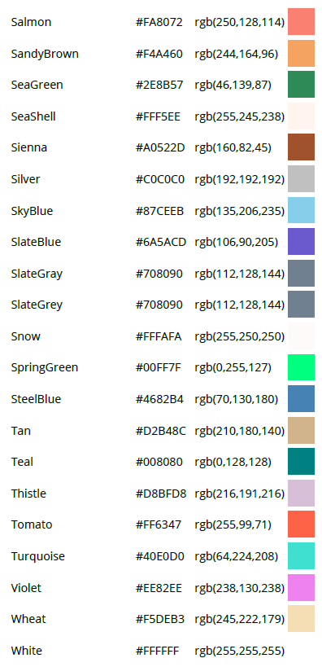
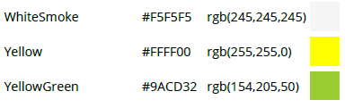

### 18.3 Hexadecimal Value

CSS color 一樣可以表示成 hex 三原色，其分別代表 R、G、B。裡面每個值都是從 00 到 FF，或是 0 到 255 的十進制表示。大小寫的十六進位可以被使用。如果每個位置的值兩個是重複的可以簡寫 ex #336699 -> #369

`Syntax`  
color: #rrggbb
color: #rgb

`Value`  
rr 00 - FF -> red
gg 00 - FF -> green
bb 00 - FF -> blue

```css
.some-class {
  /* This is equivalent to using the color keyword 'blue' */
  color: #0000ff;
}
.also-blue {
  /* If you want to specify each range value with a single number, you can!
This is equivalent to '#0000FF' (and 'blue') */
  color: #00f;
}
```

### 18.4 rgb() 表示

RGB 是一種加法顏色模型，他將顏色表示為紅色、綠色和藍色的混和。本質上，RGB 表示法式十六進制表示形式的十進制等效形式。
在十六進制中，數字範圍從 00-FF 等於 0-255 也等於 0%-100%

```css
.some-class {
  /* Scalar RGB, equivalent to 'blue'*/
  color: rgb(0, 0, 255);
}
.also-blue {
  /* Percentile RGB values*/
  color: rgb(0%, 0%, 100%);
}
```

### 18.5 rgba() Notation

與 rgb() 表示相同，但是多了一個 alpha (opacity)

```css
.red {
  /* Opaque red */
  color: rgba(255, 0, 0, 1);
}
.red-50p {
  /* Half-translucent red. */
  color: rgba(255, 0, 0, 0.5);
}
```

### 18.6 hsl() Notation

HSL -> hue (which color), saturation (how much color), lightness ('how much white')

Hue 是以度數表示 0 ~ 360 度，saturation 與 lightness 是使用百分比表示

```css
p {
  color: hsl(240, 100%, 50%); /* Blue */
}
```

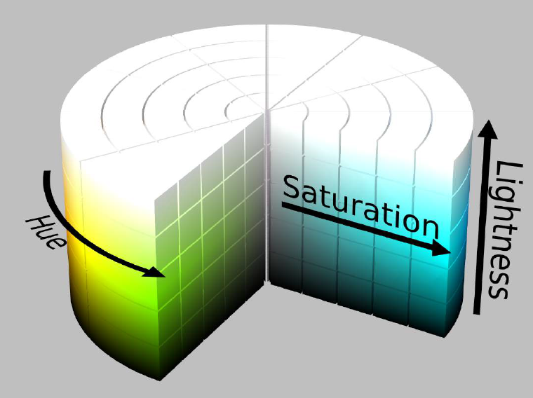
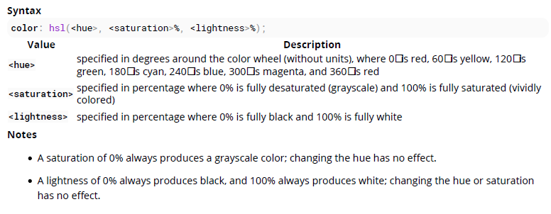

### 18.7 hsla() Notation

與 hsl() 表示一樣，但是多了一個 alpha (opacity)

> hsla(240, 100%, 50%, 0)
