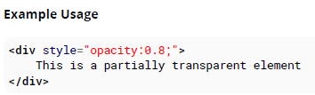

## 19. Opacity

### 19.1 Opacity Property

元素的透明度可以透過 opacity 屬性設定。設定的值可以從 0.0 (透明) 到 1.0 (不透明) 之間。

`Example Usage`

```html
<div style="opacity:0.8;">
  This is a partially transparent element
</div>
```



### 19.2 IE Compatibility for `opacity`

opacity 支援所有 IE

```css
.transparent-element {
  /* for IE 8 & 9 */
  -ms-filter: 'progid:DXImageTransform.Microsoft.Alpha(Opacity=60)'; // IE8
  /* works in IE 8 & 9 too, but also 5, 6, 7 */
  filter: alpha(opacity=60); // IE 5-7
  /* Modern Browsers */
  opacity: 0.6;
}
```
