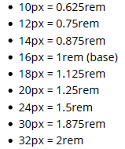
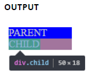

## 20. Length Units

> %: 根據父物件或是當前物件依賴的屬性定義大小。  
> em: 相對於元素的字型大小 (2em 代表當前字型的兩倍大)  
> rem: 相對於根元素的文字大小  
> vw: 相對於 viewport 寬度的 1%  
> vh: 相對於 viewport 高度的 1%  
> vmin: 相對於 viewport 最小尺寸的 1%  
> vmax: 相對於 viewport 最大尺寸的 1%  
> cm: 公分  
> mm: 公厘  
> in: inches (1in = 96px = 2.54cm)  
> px: pixel (1px = 1/96th of 1 in)  
> pt: points (1pt = 1/72 of 1 in)  
> pc: picas (1pc = 12pt)  
> s: seconds (用於動畫或是轉場)  
> ms: milliseconds (用於動畫或是轉場)  
> ex: 相對於當前字型的 x-高  
> ch: 基於 0 字元的寬度  
> fr: 分數單位 (用於 CSS Grid Layout)

### 20.1 Creating scalable elements using rems and ems

你可以使用 html 標籤的 font-size 定義的 rem 來設定元素的 font-size 樣式，並且使用 em 來建立內部元素使其可以透過全域的 font-size 調整。

```html
<input type="button" value="Button" />
<input type="range" />
<input type="text" value="Text" />
```

```css
html {
  font-size: 16px;
}

input[type='button'] {
  font-size: 1rem;
  padding: 0.5em 2em;
}

input[type='range'] {
  font-size: 1rem;
  width: 10em;
}

input[type='text'] {
  font-size: 1rem;
  padding: 0.5em;
}
```

### 20.2 Font size with rem

rem: stands for "root em"  
來看看 em 與 rem 之間的不同

- em: 相對於父類別的字體大小。這可能導致複利問題
- rem: 相對於 root 或 \<html> 元素的字體大小。這意味著可以為 html 元素聲明單個字體大小，並將所有 rem 單位定義為該百分比。

使用 rem 進行字體大小調整的主要問題是使用這些值有些困難。 這是一些以 rem 為單位表示的常見字體大小的示例，假設基本大小為 16px：


```css
html {
  font-size: 16px;
}

h1 {
  font-size: 2rem; /* 32px */
}
p {
  font-size: 1rem; /* 16px */
}
li {
  font-size: 1.5em; /* 24px */
}
```

### 20.3 vmin and vmax

- vmin：相對於視口較小尺寸的 1％
- vmax：相對於視口較大尺寸的 1％

換句話說，1 vmin 等於 1 vh 和 1 vw 中的較小者

### 20.4 vh and vw

- vh: 代表 viewport 高度是相對於 viewport 高度的 1％
- vw: 代表 viewport 寬度是相對於 viewport 寬度的 1％

```css
div {
  width: 20vw;
  height: 20vh;
}
```

上方，div 的大小占視口寬度和高度的 20％

### 20.5 using percent %

其中一個建立響應式應用的單位

尺寸大小是根據父容器

> (父容器寬度) \* (百分比) = 輸出

`For Example`  
父類別有 100px 的寬度，子類別設定寬度為 50%
因此輸出就是，子類別為 50px

```html
<div class="parent">
  PARENT
  <div class="child">
    CHILD
  </div>
</div>
```

```css
<style>
*{
color: #CCC;
}
.parent{
background-color: blue;
width: 100px;
}
.child{
background-color: green;
width: 50%;
}
</style>
```


