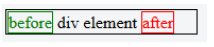
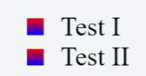

## 21. Pseudo-Elements

> ::after: 將內容插入到元素內容的後面  
> ::before 將內容插入到元素內容的前面  
> ::first-letter: 選擇每個元素的第一個字  
> ::first-line: 選擇每個元素的第一行  
> ::selection: 匹配使用者選擇元素的部分  
> ::backdrop: 用來建立背景，以隱藏等曾堆棧中每個元素的基本文件  
> ::placeholder: 允許你定義佔位符的樣式 (form text)  
> ::marker: 用於將列表樣式屬性應用於給定元素  
> ::spelling-error: 表示瀏覽器將其標記為拼寫錯誤的文本段
> :grammar-error: 表示瀏覽器標記為語法錯誤的文本段

偽元素就像偽類一樣，被添加到 CSS 選擇器中，但是它們沒有描述特殊的狀態，而是允許您對 html 元素的某些部分進行範圍設置和样式設置。

例如，:: first-letter 偽元素僅針對選擇器指定的塊元素的第一個字母。

### 21.1 Pseudo-Elements

偽元素已添加到選擇器，但它們沒有描述特殊的狀態，而是使您可以為文檔的某些部分設置樣式。

content 屬性被使用於偽元素的呈現，然而，這個屬性可以是空值

```css
div::after {
  content: 'after';
  color: red;
  border: 1px solid red;
}
div {
  color: black;
  border: 1px solid black;
  padding: 1px;
}
div::before {
  content: 'before';
  color: green;
  border: 1px solid green;
}
```



### 21.2 Pseudo-Elements in Lists

偽元素通常用於更改列表的外觀（主要用於無序列表 ul）。

第一步移除預設的圓形標頭

```css
ul {
  list-style-type: none;
}
```

然後你就可以開始客制化樣式

```css
li:before {
  content: '';
  display: inline-block;
  margin-right: 10px;
  height: 10px;
  width: 10px;
  background: linear-gradient(red, blue);
}
```

```html
<ul>
  <li>Test I</li>
  <li>Test II</li>
</ul>
```


