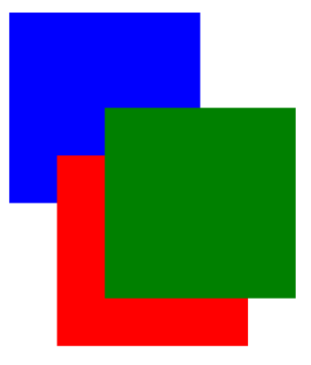

## 22. Positioning

- static: 預設值，元素按順序渲染，就像他們出現在文件流程中一樣。top, right, bottom, left 與 z-index 屬性無法被使用。
- relative: 元素定位相對於本身的偽製，因此 left: 20px 會將元素從原本的位置往左移 20px 。
- fixed: 元素的定位相對於瀏覽器的視窗 (一直固定在畫面某一個地方)
- absolute: 元素相對於其第一個定位（非靜態）祖先元素定位
- initial: 設定屬性的預設值
- sticky: 實驗功能。 它的行為類似於 position：在其父級中為 static，直到達到給定的偏移量閾值為止，然後它作為 position：fixed。
- unset: 結合了 initial 與 inherit

### 22.1 Overlapping Elements with z-index

要改變默認的定位元素堆疊順序 (position 屬性設定成 relative, absolute 或 fixed) 然後使用 z-index 屬性

越高的 z-index 元素會被堆疊的越上面

`Example`

```html
<div id="div1"></div>
<div id="div2"></div>
<div id="div3"></div>
```

```css
div {
  position: absolute;
  height: 200px;
  width: 200px;
}
div#div1 {
  z-index: 1;
  left: 0px;
  top: 0px;
  background-color: blue;
}
div#div2 {
  z-index: 3;
  left: 100px;
  top: 100px;
  background-color: green;
}
div#div3 {
  z-index: 2;
  left: 50px;
  top: 150px;
  background-color: red;
}
```



`Syntax`

> z-index: [number] | auto;

`Parameter`  
number: 整數值。 z-index 堆棧上的數字越高越好。 默認值為 0。 允許負值。

auto: 為元素提供與其父元素相同的堆疊上下文。

### 22.2 Absolute Position

使用絕對定位時，所需元素的框將從“正常流”中移出，它不再影響頁面上其他元素的位置。

位移屬性:

1. top
2. left
3. right
4. bottom

指定元素應相對於其下一個非靜態包含元素出現。

```css
.abspos {
  position: absolute;
  top: 0px;
  left: 500px;
}
```

此程式碼會將屬性為 class =“ abspos”的包含元素的框相對於其包含元素向下移 0px，向右移 500px。

### 22.3 Fixed Position

將定位設為 fixed 我們可以從當前的文件流移除元素並且將它的定位相對於瀏覽器視窗。蓋板廣告

```css
#stickyDiv {
  position: fixed;
  top: 10px;
  left: 10px;
}
```

### 22.4 Relative Position

相對定位會移動元素相對於正常流中。  
Offset 屬性

- top
- left
- right
- bottom

```css
.relpos {
  position: relative;
  top: 20px;
  left: 30px;
}
```
