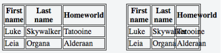
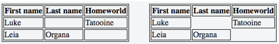
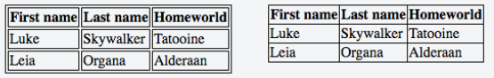
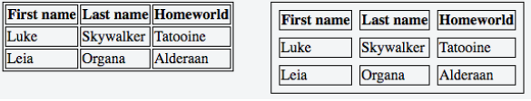
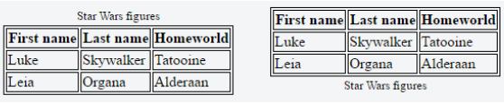

## 25. Tables

### 25.1 table-layout

table-layout 屬性改變用於表的布局的演算法。

下面範例中兩張表的寬度都被設為 150px

左邊表的 table-layout: auto 而右邊表的 table-layout: fixed。前者會比指定的寬度還要寬，但是內容會更適合。後面的表會使用定義的 150px 的寬度，無論內容是否有超出。

- auto: 預設值。他定義了表格的布局，此布局由單元格的內容決定
- fixed: 設定此參數，table 的布局寬度就會是由 table 的寬度設定決定。如果裡面的內容超過了設定的寬度，單元格並不會重新設定大小而是讓裡面的內容超出

### 25.2 empty-cells

empty-cells 屬性用來決定是否應顯示不包含任何內容的單元格。並且廚方將 border-collapse 設為 separate 否則不會有效果。

下面的範例有兩格表格，分別設定不同的 empty-cells 屬性值

左邊的表格設定 empty-cells: show 而右邊的表格設定 empty-cells: hide。前面會顯示空的表格而右邊則沒有顯示

- show: 預設值，顯示單元格即使是空的內容
- hide: 完全隱藏單元格，當單元格裡面沒有內容時

### 25.3 border-collapse

border-collapse 屬性決定 table 的 border 是否應該分開還是合併

下面的兩個表格設定了不同的 border-collapse 的屬性值

左邊的表格 border-collapse: separate 而右邊的表格 border-collapse: collapse

- separate: 此為預設值，它會使 table 的 border 彼此之間分開來
- collapse: table 的 border 會合併再一起而不是分開的

### 25.4 border-spacing

border-spacing 屬性決定單元格之間的距離。同樣如果沒有將 border-collapse 設為 separate 會沒有效果。

下面的兩個表格有不同的 border-spacing 的值

左邊的表格 border-spacing: 2px (預設值)而右邊的表格 border-spacing: 設為 8px

- length: 此為預設行為，儘管確切的值可能會因為瀏覽器而不同
- length length: 可以分別設定水平與垂直的距離

### 25.5 caption-side

caption-side 屬性決定在 table 中 caption 元素的垂直位置。

下面的範例為兩個設定不同 caption-side 屬性的表格

左邊的 table caption-side: top 而又邊的表格 caption-side: bottom

- top: 預設值，這會將 caption 放在 table 的上面
- bottom: 將 caption 放在 table 的下方
