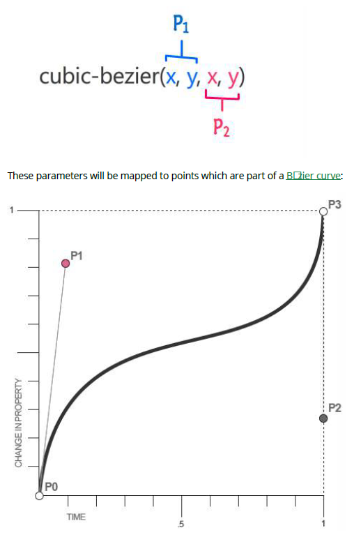

## 26. Transitions

- transition-property: 特定的 CSS 屬性更改其值改變特定屬性值
- transition-duration: 必須持續的時間 (或週期)，以秒 (s) 或毫秒 (ms) 為單位
- transition-timing-function: 描述過渡期間中間值的計算方式的函數。通常使用的值為 ease, ease-in, ease-out, ease-in, linear, cubic-bezier(), steps()。
- transition-delay: 轉場動畫要延後幾秒或幾毫秒才開始執行轉場動畫

### 26.1 Transition shorthand

```css
div {
  width: 150px;
  height: 150px;
  background-color: red;
  transition: background-color 1s;
}
div:hover {
  background-color: green;
}
```

```html
<div></div>
```

<style>
#div {
    width: 150px;
    height: 150px;
    background-color: red;
    transition: background-color 1s;
}
#div:hover {
background-color: green;
}
</style>
<div id='div'></div>

### 26.2 cubic-bezier

cubic-bezier 函式是 transition-timing-function 通常被使用來客製化或平滑轉場

transition-timing-function: cubic-bezier(0.1, 0.7, 1.0, 0.1);

cubic-bezier(P1_x, P1_y, P2_x, P2_y)



CSS 貝茲曲線，P0 與 P3 通常在同樣的位置，P0 (0, 0), P3 (1, 1) 這意味著參數透過貝茲曲線的函數只可以在 0 與 1 之間。

透過 cubic-bezier 你可以彈性的製作轉場動畫給其他的屬性

- linear: cubic-bezier(0,0,1,1)
- ease-in: cubic-bezier(0.42, 0.0, 1.0, 1.0)
- ease-out: cubic-bezier(0.0, 0.0, 0.58, 1.0)
- ease-in-out: cubic-bezier(0.42, 0.0, 0.58, 1.0)

### 26.3 Transition (longhand)

```css
div {
  height: 100px;
  width: 100px;
  border: 1px solid;
  transition-property: height, width;
  transition-duration: 1s, 500ms;
  transition-timing-function: linear;
  transition-delay: 0s, 1s;
}
```

```html
<div></div>
```

<style>
#div1 {
height: 100px;
width: 100px;
border: 1px solid;
transition-property: height, width;
transition-duration: 1s, 500ms;
transition-timing-function: linear;
transition-delay: 0s, 1s;
}
#div1:hover {
height: 200px;
width: 200px;
}
</style>

<div id=div1></div>
