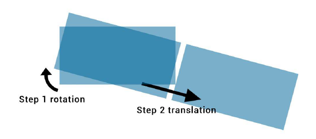
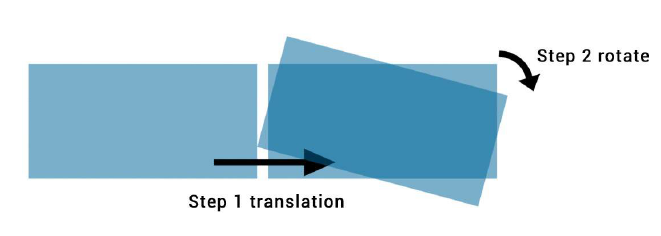

## 28. 2D Transforms

- rotate(x): 定義一個轉換，使元素繞 Z 軸上的固定點移動
- translate(x, y): 移動元素在 X 與 Y 軸上的位置
- translateX(x): 移動元素在 X 軸上的位置
- translateY(y): 移動元素在 Y 軸上的位置
- scale(x, y): 修改元素在 X 軸與 Y 軸上的大小
- scaleX(x): 修改元素在 X 軸上的大小
- scaleY(y): 修改元素在 Y 軸上的大小
- skew(x, y): 剪切映射或對流使元素的每個點在每個方向上變形一定角度
- skewX(x): 水平剪切貼圖將元素的每個點在水平方向上扭曲一定角度
- skewY(y): 垂直剪切貼圖在垂直方向上將元素的每個點變形一定角度
- matrix(): 以轉換矩陣的形式定義 2D 轉換。
- angle(): 元素旋轉或傾斜的角度（取決於所使用的功能）。 可以以度（deg），刻度（grad），弧度（rad）或圈數（turn）提供角度。 在 skew（）函數中，第二個角度是可選的。 如果未提供，則 Y 軸將沒有（0）偏斜。
- length-or-percentage: 以元素應轉換的長度或百分比表示的距離。 在 translate（）函數中，第二個長度或百分比是可選的。 如果未提供，則 Y 軸將沒有（0）平移。
- scale-factor:　一個數字，用於定義元素應在指定軸上縮放多少次。 在 scale（）函數中，第二個比例因子是可選的。 如果未提供，則第一比例因子也將應用於 Y 軸。

### 28.1 Rotate

```html
<div class="rotate"></div>
```

```css
.rotate {
  width: 100px;
  height: 100px;
  background: teal;
  transform: rotate(45deg);
}
```

<style>
.rotate {
width: 100px;
height: 100px;
background: teal;
transform: rotate(45deg);
}
</style>
<div class="rotate"></div>

上面的範例中 div 會順時針旋轉 45 度。旋轉中心位於 div 的中心，距左 50％，距頂部 50％。

您可以通過設置 transform-origin 屬性來更改旋轉中心。

`transform-origin: 100% 50%`  
上面的 css 屬性將旋轉中心設置在右側末端的中間。

### 28.2 Scale

```html
<div class="scale"></div>
```

```css
.scale {
  width: 100px;
  height: 100px;
  background: teal;
  transform: scale(0.5, 1.3);
}
```

<style>
.scale {
  width: 100px;
  height: 100px;
  background: teal;
  transform: scale(0.5, 1.3);
}
</style>
<div class="scale"></div>
本範例會將 div 縮放到X軸上的100px * 0.5 = 50px，Y軸上的100px * 1.3 = 130px。

變換的中心位於 div 的中心，左起 50％，頂起 50％。

### 28.3 Skew

```html
<div class="skew"></div>
```

```css
.skew {
  width: 100px;
  height: 100px;
  background: teal;
  transform: skew(20deg, -30deg);
}
```

<style>
.skew {
width: 100px;
height: 100px;
background: teal;
transform: skew(20deg, -30deg);
}
</style>
<div class="skew"></div>

本範例將 div 在 X 軸上傾斜 20 度，在 Y 軸上傾斜-30 度。
變換的中心位於 div 的中心，left 50％，top 50％。

### 28.4 Multiple transforms

多重轉換可以應用到一個元素的一個屬性上

```css
transform: rotate(15deg) translateX(200px);
```

此元素會順時針旋轉 15 度以及往右位移 200 px

在鍊式變換中，坐標係與元素一起移動。這意味著平移將不是水平的，而是在一個軸上按順時針方向旋轉 15 度，如下圖所示：



如果改變 transform 的順序輸出就會改變。與上面的範例不一樣

```css
transform: translateX(200px) rotate(15deg);
```

```html
<div class="transform"></div>
```

```css
.transform {
  transform: rotate(15deg) translateX(200px);
}
```



### 28.5 Translate

```html
<div class="translate"></div>
```

```css
.translate {
  width: 100px;
  height: 100px;
  background: teal;
  transform: translate(200px, 50%);
}
```

本範例將 div 在 X 軸上移動 200px，在 Y 軸上移動 100px \* 50％= 50px。

你也可以針對單一軸進行設定

```css
.translate {
  transform: translateX(200px);
}
```

```css
.translate {
  transform: translateY(50%);
}
```

### 28.6 Transform Origin

相對於由 transform-origin 屬性定義的點進行轉換。

The property takes 2 values : transform-origin: X Y;

在下面的示例中，第一個 div（.tl）使用 transform-origin 繞左上角旋轉：0 0; 第二個（.tr）在其右上角以 transform-origin：100％0 進行變換。旋轉應用於懸停：

```html
<div class="transform originl"></div>
<div class="transform origin2"></div>
```

```css
.transform {
  display: inline-block;
  width: 200px;
  height: 100px;
  background: teal;
  transition: transform 1s;
}
.origin1 {
  transform-origin: 0 0;
}
.origin2 {
  transform-origin: 100% 0;
}
.transform:hover {
  transform: rotate(30deg);
}
```

<style>
.transform {
display: inline-block;
width: 200px;
height: 100px;
background: teal;
transition: transform 1s;
}
.origin1 {
transform-origin: 0 0;
}
.origin2 {
transform-origin: 100% 0;
}
.transform:hover {
transform: rotate(30deg);
}
</style>
<div class="transform originl"></div>
<div class="transform origin2"></div>
