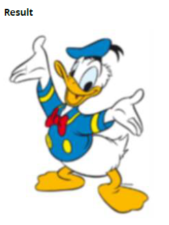
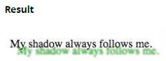
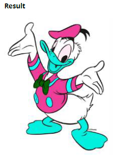
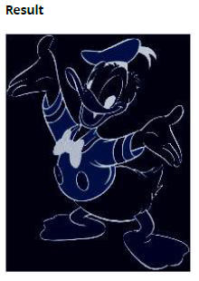
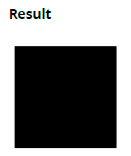

## 30. Filter Property

- blur(x): 模糊化圖片 x pixel
- brightness(x): 以高於 1.0 或 100％的任何值增亮圖像。 在此之下，圖像將變暗。
- contrast(x): 在 1.0 或 100％以上的任何值下，都可以為圖像提供更多對比度。 低於該值，圖像飽和度會降低。
- drop-shadow(h, v, x, y, z): 使圖像具有陰影。 h 和 v 可以為負值。 x，y 和 z 是可選的。
- greyscale(x): 以灰度顯示圖像，最大值為 1.0 或 100％。
- hue-rotate(x): 將色調旋轉應用於圖像。
- invert(x): 反轉圖像的顏色，最大值為 1.0 或 100％。
- opacity(x): 設置圖像的不透明/透明程度，最大值為 1.0 或 100％。
- saturate(x): 以大於 1.0 或 100％的任何值飽和圖像。 在此之下，圖像將開始去飽和。
- sepia(x): 將圖像轉換為最大值為 1.0 或 100％的棕褐色。

### 30.1 Blur

```html

```

```css
img {
  -webkit-filter: blur(1px);
  filter: blur(1px);
}
```



### 30.2 Drop Shadow (use box-shadow instead if possible)

```html
<p>My shadow always follows me.</p>
```

```css
p {
  -webkit-filter: drop-shadow(10px 10px 1px green);
  filter: drop-shadow(10px 10px 1px green);
}
```



### 30.3 Hue Rotate

```html

```

```css
img {
  -webkit-filter: hue-rotate(120deg);
  filter: hue-rotate(120deg);
}
```



### 30.4 Multiple Filter Values

要使用多個過濾器，請用空格分隔每個值。

```html

```

```css
img {
  -webkit-filter: brightness(200%) grayscale(100%) sepia(100%) invert(100%);
  filter: brightness(200%) grayscale(100%) sepia(100%) invert(100%);
}
```



### 30.5 Invert Color

```html
<div></div>
```

```css
div {
  width: 100px;
  height: 100px;
  background-color: white;
  -webkit-filter: invert(100%);
  filter: invert(100%);
}
```



從白色轉回黑色
