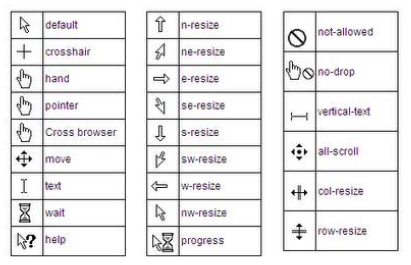

## 31. Cursor Styling

### 31.1 Changing cursor type

> cursor: value;
> 

- none: 沒有游標顯示在元素上
- auto: 預設，瀏覽器預設游標

### 31.2 pointer-events

指針事件屬性允許控制 HTML 元素如何響應鼠標/觸摸事件。

```css
.disabled {
  pointer-events: none;
}
```

'none'阻止指定 HTML 元素上的所有單擊，狀態和光標選項

### 31.3 caret-color

插入符顏色 CSS 屬性指定插入符的顏色，即插入點的可見指示符。
通過用戶的鍵入或編輯在其中插入文本和其他內容的元素。

```html
<input id="example" />
```

```css
#example {
  caret-color: red;
}
```
