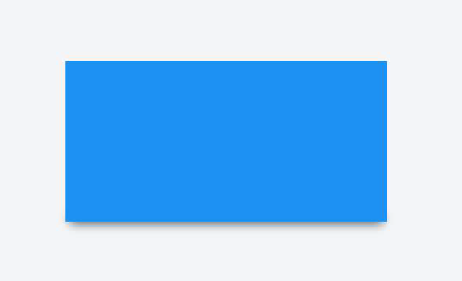

## 32. box-shadow

- insert: 默認情況下，陰影被視為投影陰影。 inset 關鍵字在幀/邊框內部繪製陰影。
- offset-x: 水平距離
- offset-y: 垂直距離
- blur-radius: 默認為 0。 值不能為負。 值越大，陰影變得越大和越亮。
- spread-radius: 默認為 0。 正值將導致陰影擴大。 負值將導致陰影縮小。
- color: 可以有多種表示法：color 關鍵字，十六進制 rgb(), rgba(), hsl(), hsla()

### 32.1 bottom-only drop shadow using a pseudo-element

```html
<div class="box_shadow"></div>
```

```css
.box_shadow {
  background-color: #1c90f3;
  width: 200px;
  height: 100px;
  margin: 50px;
}
.box_shadow:after {
  content: '';
  width: 190px;
  height: 1px;
  margin-top: 98px;
  margin-left: 5px;
  display: block;
  position: absolute;
  z-index: -1;
  -webkit-box-shadow: 0px 0px 8px 2px #444444;
  -moz-box-shadow: 0px 0px 8px 2px #444444;
  box-shadow: 0px 0px 8px 2px #444444;
}
```



### 32.2 drop shadow

```html
<div class="box_shadow"></div>
```

```css
.box_shadow {
  -webkit-box-shadow: 0px 0px 10px -1px #444444;
  -moz-box-shadow: 0px 0px 10px -1px #444444;
  box-shadow: 0px 0px 10px -1px #444444;
}
```

### 32.3 inner drop shadow

```html
<div class="box_shadow"></div>
```

```css
.box_shadow {
  background-color: #1c90f3;
  width: 200px;
  height: 100px;
  margin: 50px;
  -webkit-box-shadow: inset 0px 0px 10px 0px #444444;
  -moz-box-shadow: inset 0px 0px 10px 0px #444444;
  box-shadow: inset 0px 0px 10px 0px #444444;
}
```


### 32.4: multiple shadows

```html
<div class="box_shadow"></div>
```

```css
.box_shadow {
  width: 100px;
  height: 100px;
  margin: 100px;
  box-shadow: -52px -52px 0px 0px #f65314, 52px -52px 0px 0px #7cbb00,
    -52px 52px 0px 0px #00a1f1, 52px 52px 0px 0px #ffbb00;
}
```


