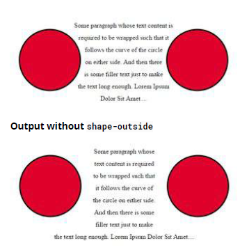
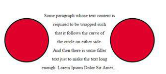

## 33. Shapes for floats

- none: none 代表浮動區域 (用於將內容包在浮動元素周圍的區域) 不受影響。預設值
- basic-shape: 引用 inset（），circle（），ellipse（）或 polygon（）中的一種。 使用這些功能之一及其值定義形狀。
- shape-box: 指的是邊距框，邊框，填充框，內容框之一。 如果僅提供<shape-box>（不提供\<basic-shape>），則此框為形狀。 與\<basic-shape>一起使用時，它用作參考框。
- image:提供圖像作為值時，將根據圖像的 Alpha 通道計算形狀指定。

### 33.1 Shape Outside with Basic Shape - circle()

使用 shape-outside CSS 屬性，可以為浮動區域定義形狀值，以便內聯內容環繞形狀而不是浮動框。

```css
img:nth-of-type(1) {
  shape-outside: circle(80px at 50% 50%);
  float: left;
  width: 200px;
}
img:nth-of-type(2) {
  shape-outside: circle(80px at 50% 50%);
  float: right;
  width: 200px;
}
p {
  text-align: center;
  line-height: 30px; /* purely for demo */
}
```

```html


<p>
  Some paragraph whose text content is required to be wrapped such that it
  follows the curve of the circle on either side. And then there is some filler
  text just to make the text long enough. Lorem Ipsum Dolor Sit Amet....
</p>
```

在上面的示例中，兩個圖像實際上都是正方形圖像，並且當文本放置時沒有 shapeoutside 屬性時，它將不會在兩側的圓周圍流動。 它只會在圖像的包含框周圍流動。 對於外部形狀，將浮動區域重新定義為一個圓形，並使內容圍繞使用外部形狀創建的該假想圓流動。

用於重新定義浮動區域的假想圓是從圖像參考框的中點繪製的半徑為 80px 的圓。

以下是一些屏幕截圖，用於說明使用 shape-outside 和不使用 shape-outside 時內容將如何環繞。



### 33.2 Shape margin

shape-margin CSS 屬性為 shape-outside 添加了一個邊距。

```css
img:nth-of-type(1) {
  shape-outside: circle(80px at 50% 50%);
  shape-margin: 10px;
  float: left;
  width: 200px;
}
img:nth-of-type(2) {
  shape-outside: circle(80px at 50% 50%);
  shape-margin: 10px;
  float: right;
  width: 200px;
}
p {
  text-align: center;
  line-height: 30px; /* purely for demo */
}
```

```html


<p>
  Some paragraph whose text content is required to be wrapped such that it
  follows the curve of the circle on either side. And then there is some filler
  text just to make the text long enough. Lorem Ipsum Dolor Sit Amet....
</p>
```

在此示例中，使用 shape-margin 在形狀周圍添加了 10px 的邊距。 這會在定義浮動區域的假想圓和周圍流動的實際內容之間創建更多的空間。


