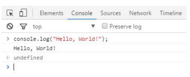
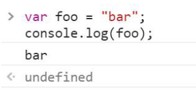
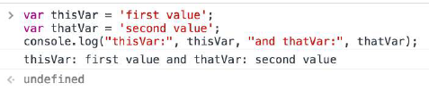
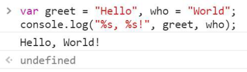
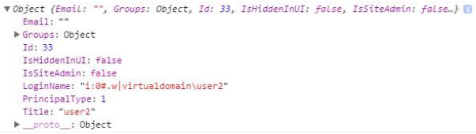
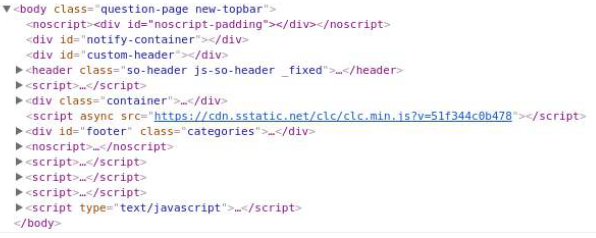
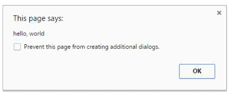
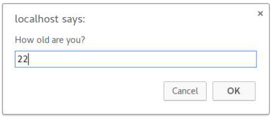
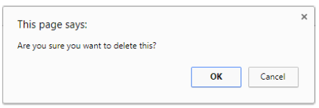

## 1. Getting started with JavaScript

### 1.1. Using console.log()
#### Introduction  
所有現代的網頁瀏覽器、Node.js 以及幾乎其他所有 JavaScript 環境都支援一套日誌 (Logging) 紀錄方法將訊息寫到控制台。這些方法最常見的是 console.log()

在瀏覽器中， console.log() 的函式主要是以除錯為目的來使用。

打開瀏覽器輸入 console.log('Hello world'); 除了會印出 Hello, world! 之外，還會返回一個 undefined 的值。這是因為 console.log() 沒有明確的回傳值。



#### Logging variables 
console.log() 可用於紀錄任何類型的變數；不只是字串而已。傳入你想要的顯示的任何變數。

```javascript
var foo = 'bar';
console.log(foo);
```



如果你想要紀錄兩個以上的值，只要用逗號將他們分開即可。輸出的時候這些參數之間將會自動添加空格。

```javascript
var thisVar = 'first value';
var thatVar = 'second value';
console.log('thisVar:', thisVar, 'and thatVar:', thatVar);
```



#### placeholders
你可以將 console.log() 與佔位符結合使用

```javascript
var greet = 'Hello', who = 'world';
console.log('%s, %s', greet, who);
```



#### Logging Objects
下圖我們可以看到紀錄物件的結果。這對於紀錄來自 API 呼叫的 JSON 回饋通常是很有用的。
```javascript
console.log({
    'Email': '',
    'Groups': {},
    'Id': 33,
    'IsHiddenInUI': false,
    'IsSiteAdmin': false,
    'LoginName': 'i:0#.w|virtualdomain\\user2',
    'PrincipalType': 1,
    'Title': 'user2'
});
```



#### Logging HTML elements
你可以記錄任何在 DOM 裡面的元素。在下面的範例我們紀錄 body 元素：

```javascript
console.log(document.body);
```



- Logging String
- Logging Variable
- Logging Placeholder
- Logging Object
- Logging HTML element

### 1.2. Using the DOM API
DOM 稱為 (Document Object Model) 文件物件模型。這是一種`結構化文件的物件導向表示法`，如 XML 與 HTML。

設定元素的 textContent 屬性是網頁上輸出文字的一種方法。

```html
<p id="paragraph"></p>
```
要改變 textContent 屬性，我們可透過以下的 JavaScript：

```javascript
document.getElementById('paragraph').textContent = 'Hello, world';
```

使用上面的 JavaScript 會將 id 為 paragraph 的元素，將其 textContent 屬性設定為 "Hello, World"。
```html
<p id="paragraph">Hello, World</p>
```

你可以程式化地使用 JavaScript 建立新的 HTML 元素。例如，以下的 HTML 文件
```html
<body>
   <h1>Adding an element</h1>
</body>
```
透過 JavaScript，我們可以建立一個新的 p 標籤並且設置 textContent 然後將這個標籤加入至 html body 的末端。

```javascript
var element = document.createElement('p');
element.textContent = 'Hello, World';

// add the newly created element to the DOM
document.body.appendChild(element);  
```

透過上面的方法 HTML 文件畫面成以下形式：
```html
<body>
   <h1>Adding an element</h1>
   <p>Hello, World</p>
</body>
```

注意，為了要使用 JavaScript 來操作 DOM 裡面的元素，JavaScript 程式碼必須跑在在要套用的物件創建到文件之後。可以透過將 JavaScript 的 script 標籤放在 body 內容的最後面。或者，你可以使用 event listener 來監聽，例如 window 的 onload 事件，將你的程式碼添加到該事件監聽器延遲程式碼的執行，直到頁面上的所有內容都加載完畢才會執行你的程式碼。

第三種確保你的 DOM 已經被載入，是將你的程式包裝在 timeout 函式裡面，並且設定為 0ms。這種方法， JavaScript 程式碼會在執行序列的尾端排隊，這將會給瀏覽器一個機會完成一些非 JavaScript 的事情，這些事情完成之後才會執行 JavaScript 程式碼。

- 操作 DOM 須等到待 DOM 元素建立完畢
  - 將 JavaScript 的 Script 放到 body 的最後面
  - 使用物件監聽器的方式，延遲程式碼的執行
  - 使用 timeout 函式

### 1.3. Using window.alert()
alert 方法顯示可視化的警告視窗在畫面上。這個 alert 方法會以純文字的形式顯示給使用者觀看。

```javascript
window.alert(message);
```

因為 window 是全域的物件，因此你可以值些使用以下方法 `this === window`
```javascript
alert('hello, world');
```


> Notes:
> alert 方法技術上是屬於 window 物件，但是因為所有的 window 屬性自動地是全域變數，我們可以使用 alert() 作為全域變數而不是 window.alert()。

不像使用 console.log, alert 動作像是強制提示訊息，當程式呼叫 alert 將會暫停運行後面的程式碼，直到提示被回答為止。

```javascript
alert('Pause!');
console.log('Alert was dismissed');
```

但是，該規範實際上允許其他事件觸發程式碼繼續執行，即使對強制視窗顯示出來了。

通常不鼓勵使用 alert ，通常建議使用其他不會阻止使用者與網頁互動的方法，讓使用者有更好的使用者體驗。儘管如此，alert 還是適用於除錯使用。

- alert 方法建議
  - 不要使用在產品程式碼中，以免影響使用者與網頁的互動體驗
  - 除錯時可以使用


### 1.4. Using window.prompt()
從使用者那邊取得輸入的簡單方法是使用 prompt() 方法。

`Syntax`  
> prompt(text, [default]);
> - text: 顯示在 prompt box 上面的訊息
> - default: 輸入欄位的預設值 (optional)

`Examples`  

```javascript
var age = prompt('How old are you?');
console.log(age);  // Prints the value inserted by the user
```



當按下 enter 時，輸入的值會被回傳，反之按下取消時，函式會回傳 null。

prompt 的回傳值是 string，除非是按下 cancel 回傳 null。  
Safari 是例外的當使用者按下 Cancel 時，他會回傳空字串。  
因此，你可將字串透過轉型轉成你想要的任何型別

> Notes:
> 當 prompt box 顯示時，使用者是無法訪問頁面的其他部分的。
> 從 Chrome 46.0 開始，除非 iframe 的沙箱屬性的值為 allow-modal，否則此方法會在 iframe 中被阻擋。

### 1.5. Using window.confirm()
window.confirm() 方法會顯示選擇視窗，有選擇訊息以及兩顆按鈕，OK 與 Cancel。

```javascript
result = window.confirm(message);
```
message 是可選的字串顯示在對話視窗並且 result 會是 bool 值代表是 OK 還是 Cancel 被選擇了 (OK 是 true)

window.confirm() 基本上用來詢問使用者確定是否要進行危險的操作，像是刪除一些東西。

```javascript
if (window.confirm('Are you sure you want to delete this?')) {
    deleteItem(itemId);
}
```


如果你等等會使用到只個回傳值，可將它存在某個變數
```javascript
var deleteConfirm = window.confirm("Are you sure you want to delete this?");
```

> Note:
> 參數是規範的，規格並未要求一定要有
> 對話視窗是屬於強制視窗 - 他可以避免使用者還未關閉視窗，就訪問其他網頁其他部分。因此，不應該過度使用對話視窗的功能。
> 從 Chrome 46.0 開始 iframe 會阻擋 modal 除非將沙箱的屬性設為 allow-modal
> 由於 window 物件始終是隱式的，因此在刪除 window 符號後調用 confirm 方法是普遍接受的。但是，建議明確定義 window 物件，因為預期的行為可能會因使用類似方法命名的較低範圍級別的實現而發生更改。

### 1.6. Using the DOM API (with graphical text: Canvas, SVGm or image file)
#### Using canvas element
HTML 提供 canvas 元素來建立網格為基礎的圖像。

首先，建立一個 canvas 來存放圖片 pixel 的資訊。
```javascript
var canvas = document.createElement('canvas');
canvas.width = 500;
canvas.height = 250;
```

設定圖闢的渲染環境，這邊設定為 2D 環境

```javascript
var ctx = canvas.getContext('2d');
```

然後設定相對應的屬性到文字上
```javascript
ctx.font = '30px Cursive';
ctx.fillText('Hello world!', 50, 50);
```

然後將 canvas 元素加入至網頁中讓他生效。
```javascript
document.body.appendChild(canvas);
```

#### Using SVG
SVG 用來建立可擴展向量為基礎的圖形，同樣可以在 HTML 中使用。

首先，建立一個具有尺寸的 SVG 元素容器
```javascript
var svg = document.createELementNS('http://www.w3.org/2000/svg', 'svg');
svg.width = 500;
svg.height = 50;
```

然後，建立一個文字元素在期望的位置以及字體特徵：
```javascript
var text = document.createElementNS('http://www.w3.org/2000/svg', 'text');
text.setAttribute('x', '0');
text.setAttribute('y', '50');
text.style.fontFamily = 'Times New Roman';
text.style.fontSize = '50';
```

然後加入實際的文字來顯示
```javascript
text.textContent = 'Hello world!';
```

最後加入 text 元素到 svg 容器中，並且將 svg 容器加入到 HTML 文件中。
```javascript
svg.appendChild(text);
document.body.appendChild(svg);
```

#### Image file
如果你已經有圖片檔包含了想要的文字，並且已經放在伺服器上面，你可以添加圖片的 URL 然後將圖片加入至文件中。

```javascript
var img = new Image();
img.src = 'https://i.ytimg.com/vi/zecueq-mo4M/maxresdefault.jpg';
document.body.appendChild(img);
```