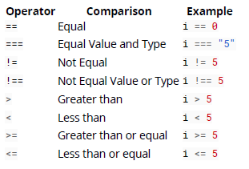

## 10. Comparison Operations

### 10.1. Abstract equality / inequality and type conversion

#### The Problem

如果運算元的型別不相等的話，一般相等與不相等運算子 (== 和 !=) 會轉換運算元。  
這種強制性是導致人們對這些運算符的結果產生混淆的常見原因，尤其是，這些運算符並不總是像人們期望的那樣可傳遞的。

```javascript
'' == 0; // true A
0 == '0'; // true A
'' == '0'; // false B
false == 0; // true
false == '0'; // true
'' != 0; // false A
0 != '0'; // false A
'' != '0'; // true B
false != 0; // false
false != '0'; // false
```

如果考慮 JavaScript 如何將空字符串轉換為數字，則結果將變得有意義。

```javascript
Number(''); // 0
Number('0'); // 0
Number(false); // 0
```

#### The Solution

在陳述 false B 中，兩個運算元都是字串　("" 和 "0")，因此這沒有型別轉型，並且因為 "" 以及 "0" 是不相等的字串，以此預期得到 false 是正確的。

為了要消除不預期的行為，這邊確保你總是以相同的型別進行比較，如果要數值比較的結果，請使用顯式轉換

```javascript
var test = (a, b) => Number(a) == Number(b);
test('', 0); // true;
test('0', 0); // true
test('', '0'); // true;
test('abc', 'abc'); // false as operands are not numbers
```

或是你想要進行字串比較

```javascript
var test = (a, b) => String(a) == String(b);
test('', 0); // false;
test('0', 0); // true
test('', '0'); // false;
```

> 注意: Number("0") 與 new Number("0") 是不同的東西! 前面值行型別轉換，而後面是建立新的物件。物件的比較是使用參考而不是值，這會導致產生不預期的結果。

```javasript
Number("0") == Number("0"); // true;
new Number("0") == new Number("0"); // false
```

最後，你有一個選擇使用嚴格相等與嚴格不相等的運算子，其不會進行隱式的型別轉換

```javascript
'' === 0; // false
0 === '0'; // false
'' === '0'; // false
```

### 10.2. NaN Property of the Global Object

NaN ("Not a Number") 是一個特殊的值，被使用於非數值提供了但是數值並不是預期的數值 (1 \* "two") 或是當計算並不是有效的數值時顯示 NaN (Math.sqrt(-1))

NaN 進行的任何相等或關係比較都會返回 false，即使將其與自身進行比較。因為 NaN 被假設來代表荒謬的計算結果，因此，它不等於任何其他無意義的計算的結果。

```javascript
1 * 'two' === NaN; //false
NaN === 0; // false
NaN === NaN; // false
Number.NaN === NaN; // false
NaN < 0; // false
NaN > 0; // false
NaN > 0; // false
NaN >= NaN; // false
NaN >= 'two'; // false
```

不相等比較總是回傳 true

```javascript
NaN !== 0; // true
NaN !== NaN; // true
```

#### Checking if a value is NaN

你可以測試一個值會是表達式是不是 NaN 透過使用 isNaN()

```javascript
Number.isNaN(NaN); // true
Number.isNaN(0 / 0); // true
Number.isNaN('str' - 12); // true
Number.isNaN(24); // false
Number.isNaN('24'); // false
Number.isNaN(1 / 0); // false
Number.isNaN(Infinity); // false
Number.isNaN('str'); // false
Number.isNaN(undefined); // false
Number.isNaN({}); // false
```

你可以檢查值是不是 NaN 透過與自己比較的方式

```javascript
value !== value; // true for NaN, false for any other value
```

你可以使用以下程式碼

```javascript
Number.isNaN =
  Number.isNaN ||
  function(value) {
    return value !== value;
  };
```

相比之下，全局函數 isNaN（）不僅對 NaN 返回 true，而且對無法強制轉換為數字的任何值或表達式返回 true：

```javascript
isNaN(NaN); // true
isNaN(0 / 0); // true
isNaN('str' - 12); // true
isNaN(24); // false
isNaN('24'); // false
isNaN(Infinity); // false
isNaN('str'); // true
isNaN(undefined); // true
isNaN({}); // true
```

ECMAScript 定義了一種稱為 SameValue 的“相同性”算法，自 ECMAScript 6 起，該算法可通過 Object.is 進行調用。 與==和===比較不同，使用 Object.is（）會將 NaN 視為與自己相同（而-0 則與+0 不相同）：

```javascript
Object.is(NaN, NaN); // true
Object.is(+0, 0); // false
(NaN ===
  NaN + // false
    0) ===
  0; // true
```

你可以使用以下方法的 Object.is()

```javascript
if (!Object.is) {
  Object.is = function(x, y) {
    // SameValue algorithm
    if (x === y) {
      // Steps 1-5, 7-10
      // Steps 6.b-6.e: +0 != -0
      return x !== 0 || 1 / x === 1 / y;
    } else {
      // Step 6.a: NaN == NaN
      return x !== x && y !== y;
    }
  };
}
```

#### Points to note

NaN 本身是數值，意味著他與字串的 "NaN" 是不相等的

```javascript
typeof NaN === 'number'; //true
```

### 10.3. Short-circuiting in boolean operators

and 運算子 (&&) 以及 or 運算子 (||) 運行短路來避免不確定的運作，當操作並沒有因為額外的工作發生。

x && y 如果 x 的計算結果為 false，則不會計算 y，因為可以保證整個表達式為 false。

x || y 如果 x 評估為 true，則不會評估 y，因為可以保證整個表達式為 true。

#### Example with functions

```javascript
function T() {
  // True
  console.log('T');
  return true;
}
function F() {
  // False
  console.log('F');
  return false;
}
```

#### Example 1

```javascript
T() && F(); // false
```

> Output:  
> 'T'  
> 'F'

#### Example 2

```javascript
F() && T(); // false
```

> Output:  
> 'F'

#### Example 3

```javascript
T() || F(); // true
```

> Output:  
> 'F'

#### Example 4

```javascript
F() || T(); // true
```

> Output:  
> 'F'  
> 'T'

#### Short-circuiting to prevent errors

```javascript
var obj; // object has value of undefined
if (obj.property) {
} // TypeError: Cannot read property 'property' of undefined
if (obj.property && obj !== undefined) {
} // Line A TypeError: Cannot read property 'property' of
undefined;
```

如果你將第一個判斷條件的順序顛倒，則可以避免第二個錯誤

```javascript
if (obj !== undefined && obj.property) {
} // no error thrown
```

但是只應在你希望未定義的情況下使用

```javascript
if (typeof obj === 'object' && obj.property) {
} // safe option but slower
```

#### Short-circuiting to provide a default value

|| 運算子可以被使用在選擇 "truty" 或是默認值。

舉例來說，這可以用來確保 nullable value 轉為不可為空的值

```javascript
var nullableObj = null;
var obj = nullableObj || {}; // this selects {}
var nullableObj2 = { x: 5 };
var obj2 = nullableObj2 || {}; // this selects {x: 5}
```

或是回傳第一個 truthy 的值

```javascript
var truthyValue = { x: 10 };
return truthyValue || {}; // will return {x: 10}
```

> or 的運算子如果第一個判斷為 true 就使用第一個就不會再用第二個，只有在第一個為 false 時，才繼續執行

可使用相同的方法往後判斷

```javascript
envVariable || configValue || defaultConstValue; // select the first "truthy" of these
```

#### Short-circuiting to call an optional function

&& 運算子可以被使用來評估回呼；

```javascript
function myMethod(cb) {
  // This can be simplified
  if (cb) {
    cb();
  }
  // To this
  cb && cb();
}
```

當然，上面的測試並不能驗證 cb 實際上是一個函數，而不僅僅是對象/數組/字符串/數字。

### 10.4. Null and Undefined

#### The differences between null and undefined

null 與 undefined 共享一般相等 (abstract equailty) == 但是不共享嚴格相等 (strict equality) ===

```javascript
null == undefined; // true
null === undefined; // false
```

他們代表不同的事情

- undefined: 代表沒有賦值
- null: 代表故意設定空值到以建立的識別符或是屬性的值。

它們是不同的語法類型:

- undefined: 全域物件的屬性，通常在全域範圍中是不可變得。這意味著您可以在全局命名空間之外定義標識符的任何地方都可以在該範圍內隱藏未定義的內容（儘管仍然可以定義未定義的內容）
- null: 是一個字面值，因此它的含義永遠無法更改，嘗試這樣做將引發錯誤。

#### The similarities between null and undefined

null 和 undefined 都是 falsy

```javascript
if (null) console.log("won't be logged");
if (undefined) console.log("won't be logged");
```

null 與 undefined 都屬於 false

```javascript
false == undefined; // false
false == null; // false
false === undefined; // false
false === null; // false
```

#### Using undefined

- 如果當前範圍不能被信任，請使用評估為 undefined 的值，例如 void 0;。
- 如果 undefined 被另一個值遮蔽，則與遮罩 Array 或 Number 一樣糟糕。
- 避免將某些內容設置為 undefined。 如果要從 Object foo 中刪除屬性欄，請刪除 foo.bar; 代替。
- 針對未定義的存在測試標識符 foo 可能會引發“引用錯誤”，而應針對“未定義”使用 typeof foo。

### 10.5. Abstract Equality (==)

在將一般相等運算符的操作數轉換為通用類型後進行比較。這種轉換是如何發生的取決於運算子的規範：

#### Examples

```javascript
1 == 1; // true
1 == true; // true (operand converted to number: true => 1)
1 == '1'; // true (operand converted to number: '1' => 1 )
1 == '1.00'; // true
1 == '1.00000000001'; // false
1 == '1.00000000000000001'; // true (true due to precision loss)
null == undefined; // true (spec #2)
1 == 2; // false
0 == false; // true
0 == undefined; // false
0 == ''; // true
```

### 10.6. Logic Operators with Booleans

```javascript
var x = true,
  y = false;
```

#### AND

此運算子子有在兩個表達式評估都是 true 的時候才會回傳 true。  
布林運算子會使用短路 (short-circuiting) 在當 x 評估為 false 時，就不會再評估 y

x && y

這個會回傳 false 因為 y 是 false

#### OR

當其中一個表達式評估為 true 的時候此運算子會回傳 true 。此布林運算子會執行短路 (short-circuiting) 當 x 評估為 true 時，就不會再評估 y

x || y

此會回傳 true 因為 x 是 true

#### NOT

當運算子在右手邊評估為 true 時，搭配此運算子會回傳 false，反之

!x;

此回回傳 false 因為 x 是 true

### 10.7. Automatic Type Conversions

注意，屬字可能意外地轉成字串或是 NaN。
JavaScript 變數可以抱含不同的資料型別，而且變數可以改變他的資料型別：

```javascript
var x = 'Hello'; // typeof x is a string
x = 5; // changes typeof x to a number
```

當進行數學運算時， JavaScript 可以將數字轉換為字串

```javascript
var x = 5 + 7; // x.valueOf() is 12, typeof x is a number
var x = 5 + '7'; // x.valueOf() is 57, typeof x is a string
var x = '5' + 7; // x.valueOf() is 57, typeof x is a string
var x = 5 - 7; // x.valueOf() is -2, typeof x is a number
var x = 5 - '7'; // x.valueOf() is -2, typeof x is a number
var x = '5' - 7; // x.valueOf() is -2, typeof x is a number
var x = 5 - 'x'; // x.valueOf() is NaN, typeof x is a number
```

從字串中減去字串不會產生錯誤，但會返回 NaN（不是數字）：

```javascript
'Hello' - 'Dolly'; // returns NaN
```

### 10.8. Logic Operators with Non-boolean values (boolean coercion)

邏輯或 OR (||)，從左邊讀到右邊評估第一個 truthy 值，當不是 truthy 值，最後一個值會返回。

```javascript
var a = 'hello' || ''; // a = 'hello'
var b = '' || []; // b = []
var c = '' || undefined; // c = undefined
var d = 1 || 5; // d = 1
var e = 0 || {}; // e = {}
var f = 0 || '' || 5; // f = 5
var g = '' || 'yay' || 'boo'; // g = 'yay'
```

邏輯 AND (&&) 從左邊讀取到右邊評估第一個 falsy 值。如果都沒有 falsy 值則會回傳最後一個值

```javascript
var a = 'hello' && ''; // a = ''
var b = '' && []; // b = ''
var c = undefined && 0; // c = undefined
var d = 1 && 5; // d = 5
var e = 0 && {}; // e = 0
var f = 'hi' && [] && 'done'; // f = 'done'
var g = 'bye' && undefined && 'adios'; // g = undefined
```

例如，可以使用此技巧來為函數參數設置默認值（ES6 之前）。

```javascript
var foo = function(val) {
  // if val evaluates to falsey, 'default' will be returned instead.
  return val || 'default';
};
console.log(foo('burger')); // burger
console.log(foo(100)); // 100
console.log(foo([])); // []
console.log(foo(0)); // default
console.log(foo(undefined)); // default
```

請記住，對於參數，0 和（在較小程度上）空字符串通常也是有效的值，應該可以將其顯式傳遞並覆蓋默認值，在這種模式下，它們將不會（因為它們 是虛假的。

### 10.9. Empty Array

```javascript
/* ToNumber(ToPrimitive([])) == ToNumber(false) */
[] == false; // true
```

當執行[] .toString（）時，它將調用[] .join（）（如果存在），否則調用 Object.prototype.toString（）。 此比較返回 true，因為[] .join（）返回”，該值強制為 0，等於 false ToNumber。

但是請注意，所有對像都是真實的，而 Array 是 Object 的實例：

```javascript
// Internally this is evaluated as ToBoolean([]) === true ? 'truthy' : 'falsy'
[] ? 'truthy' : 'falsy'; // 'truthy'
```

### 10.10. Equality comparison operations

JavaScript 有四種不同的等號比較運算子

#### SameValue

如果兩個運算元屬於相同的 Type 且具有相同的值，則返回 true。

注意: 物件的值是參考

你使用比較演算法透過 Object.is

#### Examples

```javascript
Object.is(1, 1); // true
Object.is(+0, -0); // false
Object.is(NaN, NaN); // true
Object.is(true, 'true'); // false
Object.is(false, 0); // false
Object.is(null, undefined); // false
Object.is(1, '1'); // false
Object.is([], []); // false
```

此演算法有相等關係的屬性

- Reflexivity: Object.is(x, x) 為 true 當 x 是任意值的時候
- Symmetry: Object.is(x, y) 是 true，當 x 與 y 都是 true 的時候才會是 true
- Transitivity: 當 Object.is(x, y) 以及 Object.is(y, z) 是 true，則 Object.is(x, z) 也是 true

#### SameValueZero

你可以使用 Array.prototype.includes 比較演算法

#### Examples

```javascript
[1].includes(1); // true
[+0].includes(-0); // true
[NaN].includes(NaN); // true
[true].includes('true'); // false
[false].includes(0); // false
[1].includes('1'); // false
[null].includes(undefined); // false
[[]].includes([]); // false
```

此演算法有相等關係的屬性

- Reflexivity: Object.is(x, x) 為 true 當 x 是任意值的時候
- Symmetry: Object.is(x, y) 是 true，當 x 與 y 都是 true 的時候才會是 true
- Transitivity: 當 Object.is(x, y) 以及 Object.is(y, z) 是 true，則 Object.is(x, z) 也是 true

#### Strict Equality Comparison

他與 SameValue 作用一樣，但是

- +0 與 -0 會是一樣的
- NaN 不同於其他值包掛 NaN 自己

#### Example

```javascript
1 === 1; // true
+0 === -0; // true
NaN === NaN; // false
true === 'true'; // false
false === 0; // false
1 === '1'; // false
null === undefined; // false
[] === []; // false
```

#### Abstract Equality Comparison

如果兩個操作數屬於同一類型，則其行為類似於嚴格相等比較。

否則，將強制它們如下：

- undefined 與 null 被視為是相同的
- 當數字與字串進行比較時，字串會被強制轉為數字
- 當布林值與其他類型比較時，布林會強制轉成數字
- 當物件與數字，字串或是 symbol 比較時，物件會強制轉為原始型別

如果存在強制，則將遞歸比較強制值。 否則，算法返回 false。

```javascript
1 == 1; // true
+0 == -0; // true
NaN == NaN; // false
true == 'true'; // false
false == 0; // true
1 == '1'; // true
null == undefined; // true
[] == []; // false
```

### 10.11. Relational operators (<, <=, >, >=)

當運算元都是數值，可進行一般的比較

```javascript
1 < 2; // true
2 <= 2; // true
3 >= 5; // false
true < false; // false (implicitly converted to numbers, 1 > 0)
```

當兩個運算元是字串，可用辭典順序比較

```javascript
'a' < 'b'; // true
'1' < '2'; // true
'100' > '12'; // false ('100' is less than '12' lexicographically!)
```

當其中一個運算元是字串另一個是數字，字串會在比較前轉成數字型別

```javascript
'1' < 2; // true
'3' > 2; // true
true > '2'; // false (true implicitly converted to number, 1 < 2)
```

當字串是非數值型別，數值轉換會轉成 NaN。然後與 NaN 比較會一直是 false

```javascript
1 < 'abc'; // false
1 > 'abc'; // false
```

主義數值與 null, undefined 與空字串的比較

```javascript
1 > ''; // true
1 < ''; // false
1 > null; // true
1 < null; // false
1 > undefined; // false
1 < undefined; // false
```

當一個運算元是一個物件而另一個院算元是一個數字時，該物件在比較之前會轉換為數字。null 是一種特殊情況，因為 Number（null）; // 0

```javascript
new Date(2015) < 1479480185280; // true
null >
  -1(
    //true
    {
      toString: function() {
        return 123;
      },
    },
  ) >
  122; //true
```

### 10.12. Inequality

運算子 != 是運算元 == 相反的

如果它們不是同一類型，則 JavaScript 引擎將嘗試將兩個操作數轉換為匹配類型。 注意：如果兩個操作數在內存中具有不同的內部引用，則將返回 false。

#### Sample

```javascript
1 != '1'; // false
1 != 2; // true
```

在上面的示例中，1！='1'為假，因為正在將原始數字類型與 char 值進行比較。 因此，JavaScript 引擎不在乎 R.H.S 值的數據類型。

運算符：！==是===運算符的反函數。 如果操作數不相等或類型不匹配，則返回 true

#### Example:

```javascript
1 !== '1'; // true
1 !== 2; // true
1 !== 1; // false
```

### 10.13. List of Comparison Operators



### 10.14. Grouping multiple logic statements

你可以群組多個布林邏輯的陳述。

```javascript
if ((age >= 18 && height >= 5.11) || (status === 'royalty' && hasInvitation)) {
  console.log('You can enter our club');
}
```

我們還可以將分組的邏輯移至變量，以使該語句更短且更具描述性：

```javascript
var isLegal = age >= 18;
var tall = height >= 5.11;
var suitable = isLegal && tall;
var isRoyalty = status === 'royalty';
var specialCase = isRoyalty && hasInvitation;
var canEnterOurBar = suitable || specialCase;
if (canEnterOurBar) console.log('You can enter our club');
```

### 10.15. Bit fields to optimise comparison of multi state data

位字段是將各個布爾狀態保存為單個位的變量。 一點點亮代表真，而點點滅代表假。 過去，通常使用位字段，因為它們節省了內存並減少了處理負載。 儘管不再需要使用位字段，但它們確實提供了一些可以簡化許多處理任務的好處。

例如用戶輸入。 當從鍵盤的方向上，向下，向左，向右獲取輸入時，可以將各個鍵編碼為單個變量，並為每個方向分配一個位。

```javascript
var bitField = 0; // the value to hold the bits
const KEY_BITS = [4, 1, 8, 2]; // left up right down
const KEY_MASKS = [0b1011, 0b1110, 0b0111, 0b1101]; // left up right down
window.onkeydown = window.onkeyup = function(e) {
  if (e.keyCode >= 37 && e.keyCode < 41) {
    if (e.type === 'keydown') {
      bitField |= KEY_BITS[e.keyCode - 37];
    } else {
      bitField &= KEY_MASKS[e.keyCode - 37];
    }
  }
};
```

Example reading as an array

```javascript
var directionState = [false,false,false,false];
window.onkeydown = window.onkeyup = function (e) {
if(e.keyCode >= 37 && e.keyCode <41){
directionState[e.keyCode - 37] = e.type === "keydown";
}
```

要按位或|來打開 和該位對應的值。 因此，如果您希望設置第二位 bitField | = 0b10，則會將其打開。 如果要關閉一點，請按位和＆並使用將所需位全部打開的值。

使用 4 位並將第二位關閉 bitfield＆= 0b1101;
您可能會說，上面的示例似乎比將各種鍵狀態分配給數組要復雜得多。 是的，設置起來有點複雜，但是在詢問狀態時會帶來好處。

如果您要測試所有鍵是否都打開。

```javascript
// as bit field
if(!bitfield) // no keys are on
// as array test each item in array
if(!(directionState[0] && directionState[1] && directionState[2] && directionState[3])){
You can set some constants to make things easier
// postfix U,D,L,R for Up down left right
const KEY_U = 1;
const KEY_D = 2;
const KEY_L = 4;
const KEY_R = 8;
const KEY_UL = KEY_U + KEY_L; // up left
const KEY_UR = KEY_U + KEY_R; // up Right
const KEY_DL = KEY_D + KEY_L; // down left
const KEY_DR = KEY_D + KEY_R; // down right
You can then quickly test for many various keyboard states
if ((bitfield & KEY_UL) === KEY_UL) { // is UP and LEFT only down
if (bitfield & KEY_UL) { // is Up left down
if ((bitfield & KEY_U) === KEY_U) { // is Up only down
if (bitfield & KEY_U) { // is Up down (any other key may be down)
if (!(bitfield & KEY_U)) { // is Up up (any other key may be down)
if (!bitfield ) { // no keys are down
if (bitfield ) { // any one or more keys are down
```

鍵盤輸入只是一個示例。 當您必須組合使用各種狀態時，位域很有用。 JavaScript 最多可將 32 位用於位字段。 使用它們可以顯著提高性能。
他們值得熟悉。
