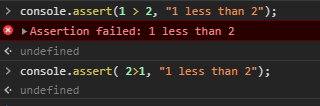
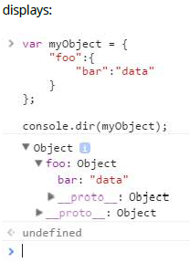

## 5. Console

debugging / web console 顯示的訊息可以透過 JavaScript 物件的多個 console 方法來取得，可以透過 console.dir(console) 查詢有多少 console 的方法。除了 console.memory 屬性之外，以下是 console 方法的列表 (從 Chrome 輸出的來的)
- assert: 用來做程式邏輯判斷，當邏輯為 false 的話，會印出後面的錯誤訊息



- clear: 清空畫面，如果執行成功畫面會顯示 `Console was cleared`


- count: 回傳呼叫 console.count() 的次數

- debug: 與 log 的方法一樣，還有  warn 與 info 一樣，只是使用的情境不一樣，還有顯示出來的顏色不一樣。

- dir: 顯示指定 JavaScript 物件的屬性列表。

- dirxml: 顯示指定的 XML/HTML 元素的樹狀結構

- error: 顯示 error 訊息


- group: 可透過此方法將訊息已結構化的方式呈現


- groupCollapsed:

- groupEnd: group 指令結束
- info: 顯示 info 等級的訊息

- log: 顯示輸出訊息
- markTimeline: Node.js 在用的
- profile: 開始記錄 CPU 性能
- profileEnd: 結束紀錄 CPU 性能
- table:將資料的呈現方式以 table 的樣式呈現

- time: 開始記錄程式中指定任務執行時間
- timeEnd: 結束紀錄程式中指定執行時間
- timeStamp: 用來記錄在 time 使用的過程中，呼叫到此函 timestamp 的時間與訊息
- timeline: Node.js 使用 (time 的棄用型)
- timelineEnd: Node.js 使用 (timeEnd 的棄用型)
- trace: 用於掩飾執行函式的呼叫追蹤

- warn: 輸出一個 warning 訊息

#### Opening the Console
現今大部分瀏覽器， JavaScript Console 都被整合在開發人員工具中。底下是一些瀏覽器的快捷鍵。

`Chrome`  
開啟 "Console" 開發人員工具
- Ctrl + Shift + J 直接就會在 Console
- Ctrl + Shift + I 在點擊 Console
- F12 在點擊 Console 

`FireFox`  
- Ctrl + Shift + K 直接就會在 Console
- Ctrl + Shift + I 在點擊 Console
- F12 在點擊 Console 

`IE and Edge`  
- F12 在點擊 Console 

`Safari`  
開啟 Safari 的 Web Inspector Console (但是要先開啟開發選單)

`Opera` 
- Ctrl + Shift + I 在點擊 Console

#### Compatibility
當使用或模擬 Internet Explorer 8或更早版本時（例如通過 Compatibility View / Enterprise Mode），僅在開發人員工具處於活動狀態時才定義控制台，因此console.log（） 語句可能會導致異常並阻止代碼執行。 為了減輕這種情況，您可以在登錄之前檢查控制台是否可用：

```javascript
if (typeof window.console !== 'undefined')
{
console.log("Hello World");
}
```

或是在一開始時，先識別 window 的 console 函式是否存在，如果不存在定義一個 null 的函式，避免出錯

```javascript
if (!window.console)
{
console = {log: function() {}};
}

```

開發人員通常使用瀏覽器的除錯控制台或Web 控制台來識別錯誤，理解執行流程，記錄數據以及在運行時用於許多其他目的。 通過控制台對象可以訪問此訊息。


### 5.1. Measuring time - console.time()
console.time() 可被用來測量你程式碼中的某一段程式執行了多久的時間。

呼叫 console.time() 開始一個新的計時器。當 console.timeEnd() 被呼叫時，經過的時間會以 milliseconds 表示。

透過上面的方法，你可以重複呼叫 timeEnd() 去記錄從 time() 開始經過了多少時間。

#### Example 1:
```javascript
console.time('response in');
alert('Click to continue');
console.timeEnd('response in');
alert('One more time');
console.timeEnd('response in');
```
```javascript
response in: 774.967ms
response in: 1402.199ms
```

經過測試無法在 Chrome 中重複呼叫 timeEnd() 可能是被改掉了吧!

### 5.2 Formatting console output
console 的許多輸出方法可以像是 C 語言一樣將字串格式化，透過使用 % 的 token。
> console.log('%s has %d points', 'Sam', 100);
> Display: Sam has 100 points.

JavaScript 格式說明符如下列表：
- %s: 字串值的格式
- %i / %d: 整數值的格式
- %f: 符點數的格式
- %o: 將值格式化為可擴展的 DOM 元素
- %O: 將值格式化為可擴展的 JavaScript 物件
- %c: 將 CSS 樣式套用到輸出的字串，透過指定第二個函式參數為 CSS 規則

#### 進階樣式
當 CSS 格式說明符 (%c) 在字串的左手邊， print 方法會接受第二個參數作為 CSS 規則，允許對該字串進行詳細的格式化字串。
> console.log('%cHello world!', 'color: blue; font-size: xx-large');


可以使用多個 %c 格化說明符
- 任何在 %c 右手邊的子字串會對應後面個別的參數

```javascript
console.log("%cHello %cWorld%c!!", // string to be printed
"color: blue;", // applies color formatting to the 1st substring
"font-size: xx-large;", // applies font formatting to the 2nd substring
"/* no CSS rule*/" // does not apply any rule to the remaining substring
);
```


#### using groups to indent output
在除錯 console 下，輸出可以被縮排與包含在摺疊的 group 中。
- console.groupCollapsed(): 建立一個折疊的條目群組，可以通過顯示的按鈕展開這些條目，以顯示在調用此方法之後執行的所有條目；
- console.group(): 建立一個擴展的條目群組，可以折疊這些條目，以便在調用此方法後隱藏條目。
- console.groupEnd(): 離開當前的群組，允許在調用此方法後在父組中打印更新的條目。


### 5.3. Printing to a browser's debugging console
瀏覽器的 Debug console 可以用來輸出一些簡單的訊息。這個 Debugging 或是 web console 可以直接在瀏覽器中打開 (F12) 並且使用 JavaScript 的 console.log() 方法使用。
```javascript
console.log('My message');
```

console.log() 可以帶有當前作用域中任何數量的參數與變數。多個參數會在同一行中被印出來，並且印出的參數之間會有一個小空格。

```javascript
var obj = { test: 1 };
console.log(['string'], 1, obj, window);
```


除了純文字之外，console.log() 還可以處裡其他類型，如: 陣列、物件、Date、函式等等:

```javascript
console.log([0, 3, 32, 'a string']);
console.log({ key1: 'value', key2: 'another value'});
```


巢狀物件會被摺疊起來
```javascript
console.log({ key1: 'val', key2: ['one', 'two'], key3: { a: 1, b: 2 } });
```


確定的型態例如日期物件以及 function 顯示結果是不一樣的:
```javascript
console.log(new Date(0));
console.log(function test(a, b) { return c; });
```


#### Other print methods
除了 log 方法之外，現代瀏覽器還支援相似的方法；
- console.info: 小訊息圖示（ⓘ）出現在輸出的字符或對象的左邊。
- console.warn: 小警告圖示（!）出現在輸出的字符或對象的左邊。在某些瀏覽器中，log 的背景顏色會是黃色的。
- console.error: 小錯誤圖示（⊗）出現在輸出的字符或對象的左邊。在某些瀏覽器中，log 的背景顏色會是紅色的。
- console.timeStamp: 輸出當前的時間以及指定的訊息，不是標準

- console.trace: 輸出當前堆疊追蹤或是顯示，如果在全域範圍內調用，則顯示與log方法相同的輸出。
```javascript
function sec() {
    first();
}
function first() {
    console.trace();
}

sec();
```


上面的圖片顯示所有含是，除了 timeStamp 沒有之外。 (Chrome 56)

這些方法與 log 很像只是呈現不同的顏色與格式

在某些 debugger 中，可以通過點擊輸出的文本或引用相應物件屬性的小三角形（►）來進一步擴展各個物件訊息。 這些折疊的物件屬性可以在日誌中打開或關閉。

### 5.4. Including a stack trace when logging - console.trace()
```javascript
function foo() {
    console.trace("My log statement");
}

foo();
```


> 注意：使用 Error 物件的屬性對於存取相同的堆疊與追蹤是很有用的。這對於後處理和收集自動回饋很有用。

```javascript
var e = new Error('foo');
console.log(e.stack);
```


### 5. Tabulating values - console.table()
在大部分環境下，console.table() 可以被使用來將物件與陣列以表格的格式呈現。

#### For example:
```javascript
console.table(['Hello', 'world']);
```


```javascript
console.table({ foo: 'bar', bar: 'baz' });
```


```javascript
var personArr = [
{
  "personId": 123,
  "name": "Jhon",
  "city": "Melbourne",
  "phoneNo": "1234567890"
},
{
  "personId": 124,
  "name": "Amelia",
  "city": "Sydney",
  "phoneNo": "1234567890"
},
{
  "personId": 125,
  "name": "Emily",
  "city": "Perth",
  "phoneNo": "1234567890"
},
{
  "personId": 126,
  "name": "Abraham",
  "city": "Perth",
  "phoneNo": "1234567890"
}];

console.table(personArr, ['name', 'personId']);
```


### 5.6. Counting - console.count()
console.count([obj]) 在作為參數提供的物件上放置一個計數器。每次此方法被呼叫，計數器會增加 (除了空字串之外)。label 會與數字一起顯示在 debugging console 如以下格式：
[label] : x

label 代表物件被當作參數傳入的值然後 x 代表計數器的值

```javascript
var o1 = 1, o2 = '2', o3 = "";
console.count(o1);
console.count(o2);
console.count(o3);
console.count(1);
console.count('2');
console.count('');
```


數字字串會被轉換成數字物件
```javascript
console.count(42.3);
console.count(Number('42.3'));
console.count('42.3');
```


函式會指向全域的 Function 物件
```javascript
console.count(console.constructor);
console.count(function(){});
console.count(Object);
var fn1 = function myfn(){};
console.count(fn1);
console.count(Number);
```


某些物件獲得與他們所引用的物件類型相關的特定計數器

```javascript
console.count(undefined);
console.count(document.Batman);
var obj;
console.count(obj);
console.count(Number(undefined));
console.count(NaN);
console.count(NaN+3);
console.count(1/0);
console.count(String(1/0));
console.count(window);
console.count(document);
console.count(console);
console.count(console.__proto__);
console.count(console.constructor.prototype);
console.count(console.__proto__.constructor.prototype);
console.count(Object.getPrototypeOf(console));
console.count(null);
```


#### Empty string or absence of argument

如果在 debugging console 中順序輸入 count 方法時未提供任何參數，則假定一個空字符作為參數，即：
```javascript
console.count();  // : 1
console.count('');  // : 2
console.count("");  // : 3
```
目前使用上面的方法在 Chrome 上面都會輸出 1

### 5.7. Clearing the console - console.clear()
可以透過此方法 console.clear() 將目前 debugging console 上面的訊息全部清空。

### 5.8. Displaying objects and XML interactively - console.dir(), console.dirxml();

console.dir(object) 顯示指定 JavaScript 物件屬性的互動列表。輸出顯示為帶有顯示三角形的層次結構列表，可讓您查看子物件的內容。
```javascript
var myObject = {
"foo":{
"bar":"data"
}
};
console.dir(myObject);
```


console.dirxml(object) 如果可以的話會印出物件後代元素以 XML 表示，如果不行會是以 JavaScript 方式表示。

對 HTML 以及 XML 使用 console.dirxml() 同等於使用 console.log()

#### Example 1:
```javascript
console.dirxml(document);
```


#### Example 2:
```javascript
console.log(document);
```


#### Example 3:
```javascript
var myObject = {
"foo":{
"bar":"data"
}
};
console.dirxml(myObject);
```


### 5.9. Debugging with assertions - console.assert()

當判斷是是 false 的話添加錯誤訊息到 console 上面，如果判斷式是 true 則不會顯示訊息

```javascript
console.assert('one' === 1);
```


可以放置多個參數在 assert 後面，當判斷式是 false ，則會將他們全部印出來。


console.assert 不會丟出 AssertionError (除了 Node.js)，這意味著此方法不相容大部分的測試框架並且程式碼的執行並不會因為失敗的 assert 而中斷。