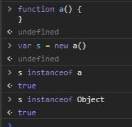

## 6. Datatypes in JavaScript
### 6.1. typeof
typeof 是正式的函數，用來在 JavaScript 中取得類型，然而，在某些情況他可能產生一些意外的結果。

#### 1. Strings
- typeof "String" or
- typeof Date(2019, 10, 10)

> "string"

#### 2. Numbers
- typeof 42
> "number"

#### 3. Bool
- typeof true (true/false)
> "boolean"

#### 4. Object
- typeof {}
- typeof []
- typeof null
- typeof /aaa/
- typeof Error()
> "object"

#### 5. Function
- typeof function() {}
> "function"

#### 6. Undefined
- var var1; typeof var1
> "undefined"

### 6.2. Finding an object's class
為了只到物件是不是有某個建構子建構出來或是從某個物件繼承而來，可以使用 instanceof 指令


```javascript
// We want this function to take the sum of the numbers passed to it
// It can be called as sum(1, 2, 3) or sum([1, 2, 3]) and should give 6
function sum(...arguments) {
    if (arguments.length === 1) {
        const [firstArg] = arguments;
        
        // firstArg is something like [1, 2, 3]
        if (firstArg instanceof Array) {
            return sum(...firstArg) // call sum(1, 2, 3)
        }
    }
    return arguments.reduce((a, b) => a + b);
}

console.log(sum(1, 2, 3));  // 6
console.log(sum([1, 2, 3])); // 6
console.log(sum(4));  // 4
```

> 注意: 原生值不被視為任何類別的實利
```javascript
console.log(2 instanceof Number) //false
console.log('abc' instanceof String) //false
console.log(true instanceof Boolean) //false
console.log(Symbol() instanceof Symbol) //false
```

所有在 JavaScript 的值除了 null 與 undefined 都有 constructor 的屬性用於儲存建構它的函式。這同樣適用於原生值。

```javascript
// Whereas instanceof also catches instances of subclasses,
// using obj.constructor doesn't not
console.log([] instanceof Object, [] instanceof Array) //true true
console.log([].constructor === Object, [].constructor === Array) //false true

function isNumber(value) {
  //null.constructor and undefined.constructor throw an error when accessed
  if (value === null || value === undefined) return false
return value.constructor === Number
}

console.log(isNumber(null), isNumber(undefined)) //false false
console.log(isNumber('abc'), isNumber([]), isNumber(() => 1)) //false false false
console.log(isNumber(0), isNumber(Number('10.1')), isNumber(NaN)) //true true true

```

### 6.3. Getting object type by constructor name
有一些使用 typeof 運算元的方法會得到 object，無法看出他到底屬於哪個類別，可以使用 `Object.prototype.toString.call(yourObject)` 來看實際的類別

當一個帶有 typeof 運算符的人得到物件類型時，他就屬於某種類費類別...

在實務上你可能需要將範圍縮小到實際上是哪種"物件"，而實現他的一種方法是使用物件建構函式名稱來取得其實際的物件風格Object.prototype.toString.call(yourObject)

#### 1. String
Object.prototype.toString.call("String")
> "[object String]"

#### 2. Number
Object.prototype.toString.call(43);
> "[object Number]"

#### 3. Bool
Object.prototype.toString.call(true)
> "[object Boolean]"

#### 4. Object
Object.prototype.toString.call(Object())   
Object.prototype.toString.call({})
> "[object Object]"

#### 5. Function
Object.prototype.toString.call(function(){})
> "[object Function]"

#### 6. Date
Object.prototype.toString.call(new Date(2015,10,21))
> "[object Date]"

#### 7. Regex
Object.prototype.toString.call(new RegExp())  
Object.prototype.toString.call(/foo/);  
> "[object RegExp]"

#### 8. Array
Object.prototype.toString.call([]);
> "[object Array]"

#### 9. Null
Object.prototype.toString.call(null);
> "[object Null]"

#### 10. Undefined
Object.prototype.toString.call(undefined);
> "[object Undefined]"

#### 11. Error
Object.prototype.toString.call(Error());
> "[object Error]"