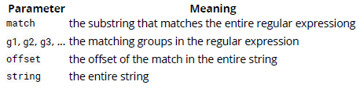

## 7. Strings
### 7.1. Basic Info and String Concatenation
在 JavaScript 字串可以用雙引號或是單引號來代表，在 ES6 中又多了一個文字模板，分別如下所述：
```javascript
var hello = "Hello";
var world = 'world';
var helloW = `Hello World`;
```
字串可透過使用 String() 函式，來將其他型別轉成字串型別。
```javascript
var intString = String(32);  // "32"
var booleanString = String(true);  // "true"
var nullString = String(null);  // null
```

或是可以使用 toString() 轉換 Number, Booleans 或是 Object。

```javascript
var intString = (532).toString();  // "532"
var booleanString = (false).toString();  // "false"
var objString = ({}).toString();  // "[object Object]"
```

字串同樣可以透過 CharCode 的方法組成字串，透過使用 .fromCharCode 的方法來建立字串。

```javascript
String.fromCharCode(104, 101, 108, 108, 111);  // "hello"
```

建立 String 物件使用 new 關鍵字來建立也是被允許的，但是不建議這樣使用因為這會是 Object 而不是原生的 string

```javascript
var objectString = new String("Yes, I am a String object");
typeof objectString;  // "object"
typeof objectString.valueOf();  // "string"
```

#### Concatenating Strings
字串串接可以透過 + 的連結運算子或是透過`String 物件原型內建的 concat()` 來將字串串接。
```javascript
var foo = "Foo";
var bar = "Bar";
console.log(foo + bar);  // "FooBar"
console.log(foo + " " + bar);  // "Foo Bar"

foo.concat(bar);  // "FooBar"
"a".concat("b", " ", "d");  // "ab d"
```

字串可以與非字串變數串接，但是非字串變數會經過轉型成字串
```javascript
var string = "string";
var number = 32;
var boolean = true;

console.log(string + number + boolean);  // "string32true"
```

#### String Templates
字串可以透過文字樣板 (反引號) 建立
```javascript
var greeting = `Hello`;
```

透過文字樣板，你可以使用字串插值 (${variable}) 在文字樣板中。
```javascript
var place = `World`;
var greet = `Hello ${place}!`;

console.log(greet);  // "Hello World!"
```

你可以使用 String.raw 來將反斜線包含在字串中而不需要進行修改
不會與後面的字變成跳脫字元

```javascript
`a\\b`  // a\b
String.raw `a\\b`  // a\\b
```

### 7.2. Reverse String
在 JavaScript 中，最常將反轉字串的方法如下所示：

```javascript
function reverseString(str) {
    return str.split('').reverse().join('');
}

reverseString('string');  // "gnirts"
```

然而，這種做法只有在反轉字串不包含代理對的狀況下才有效。星號 (即基本多語言平面之外的字串) 可能由兩個程式碼單元表示，這將導致這種天真的技術產生錯誤的結果。此外，帶有組合標記的字串 (例如: diaeresis) 將出現在邏輯 "下一個" 字串上，而不是與之組合的原始字串。
```javascript
'?????.'.split('').reverse().join('');  // false
```

儘管該方法對大多數語言都適用，但真正涉及到字符串反向編碼的準確編碼算法要稍微複雜一些，其中一個實現是一個名為Esrever的小型庫，該庫使用正則表達式匹配組合的標記和替代對以執行 完美地反轉。

#### Explanation
- str: 輸入字串 => "string"
- String.prototype.split(分隔符號): 切分 str 字串到陣列中。"" 代表要切開每個字元  => ["s", "t", "r", "i", "n", "g"]
- Array.prototype.reverse()  從切分的字串陣列中，將裡面的內容反轉 => ["g", "n", "i", "r", "t", "s"]
- Array.prototype.join(分隔符號): 將陣列中的元素結合成字串，分隔符代表在字與字之間加入一個字元

#### Using spread operator
```javascript
function reverseString(str) {
    return [...String(str)].reverse().join('');
}

console.log(reverseString('stackoverflow')); // "wolfrevokcats"
console.log(reverseString(1337)); // "7331"
console.log(reverseString([1, 2, 3])); // "3,2,1"
```

#### Custom reverse() function
```javascript
function reverse(string) {
    var strRev = '';
    for (var i = string.length - 1; i >= 0; i--) {
        strRev += string[i];
    }
    return strRev;
} 
reverse('zebra');  //'arbez'
```

### 7.3. Comparing Strings Lexicographically
要按字母順序比較字串，可以使用 localeCompare()。如果 a 字串的詞彙順序大於 b 字串，回傳 1，如果 a 字串的詞彙順序小於 b 字串，回傳 -1 ，如果 a 與 b 字串都相同則會回傳 0

```javascript
var a = "hello";
var b = "world";

console.log(a.localeCompare(b));  // -1
```

\> 與 < 的運算子可以按字典順序比較字串，但是無法回傳 0 的值 (可以使用 == 進行測試)，如果要自行建立比較可以這樣寫。

```javascript
function strcmp(a, b) {
  if(a === b) {
    return 0;
  }
  if (a > b) {
    return 1;
  }
  
  return -1;
}

console.log(strcmp("hello", "world")); // -1
console.log(strcmp("hello", "hello")); // 0
console.log(strcmp("world", "hello")); // 1
```

上面的方法對於進行陣列字串排序是很有幫助的。

```javascript
var arr = ["bananas", "cranberries", "apples"];
arr.sort(function(a, b) {
  return a.localeCompare(b);
});
console.log(arr); // [ "apples", "bananas", "cranberries" ]
```

### 7.4. Access character at index in string
`charAt()` 可以從字串中取得指定位置的字元。
```javascript
var string = "Hello, World!";
console.log( string.charAt(4) ); // "o"
```

另外，由於字串可以向陣列一樣處理，可以直接使用中括號加上索引值取得指定位置的字元。

```javascript
var string = "Hello, World!";
console.log( string[4] ); // "o"
```

如果想要拿的字串中指定索引值字元的 character code ，可以使用 `charCodeAt()`
```javascript
var string = "Hello, World!";
console.log( string.charCodeAt(4) ); // 111
```
> 注意：這些方法全部都是 getter 方法。String 在 JavaScript 中是不可以修改的。換言之，上面的方法都無法在字串中的某個位置設置字元。

### 7.5. Escaping quotes
你可以使用反斜線 (\\) 來跳脫字元
```javascript
var text = 'L\'albero means tree in Italian';
console.log( text ); \\ "L'albero means tree in Italian"
```

如果要將 HTML 的表示形式用字串表示，則必須注意。
```javascript
var content = "<p class=\"special\">Hello World!</p>"; // valid String
var hello = '<p class="special">I\'d like to say "Hi"</p>'; // valid String
```

如果字串中有單引號與雙引號要顯示，可以考慮使用文字模板，這樣就不需要使用跳脫字元。
```javascript
var x = `"Escaping " and ' can become very annoying`;
```

### 7.6. Word Counter
假設你有一個 \<textarea>，而且你想要檢索以下的訊息：
- Characters (total)
- Characters (no spaces)
- Words
- Lines
  
```javascript
function wordCount( val ){
  var wom = val.match(/\S+/g);

  return {
    charactersNoSpaces : val.replace(/\s+/g, '').length,
    characters : val.length,
    words : wom ? wom.length : 0,
    lines : val.split(/\r*\n/).length
  };
}

// Use like:
wordCount( someMultilineText ).words; // (Number of words)
```

### 7.7. Trim whitespace
要從字串的邊緣修剪空格，可以使用 String.prototype.trim:
```javascript
" some whitespaced string ".trim(); // "some whitespaced string"
```

許多 JavaScript 的引擎(除了 IE)，有實作非標準的 trimLeft 與 trimRight 方法。這個提案目前在第一階段，有一個標準化的 trimStart 與 trimEnd 方法的建議，是 trimLeft 與 trimRight 的別名。

```javascript
// Stage 1 proposal
" this is me ".trimStart(); // "this is me "
" this is me ".trimEnd(); // " this is me"
// Non-standard methods, but currently implemented by most engines
" this is me ".trimLeft(); // "this is me "
" this is me ".trimRight(); // " this is me"
```

### 7.8. Splitting a string into an array
使用 .split 可以將字串根據指定字元進行字串的切割，然後將切割完的各個字串存到陣列中。
```javascript
var s = "one, two, three, four, five"
s.split(", "); // ["one", "two", "three", "four", "five"]
```

使用陣列方法 `.join` 可以將陣列轉回字串
```javascript
s.split(", ").join("--"); // "one--two--three--four--five"
```

### 7.9. Strings are unicode
#### All JavaScript strings are unicode!
```javascript
var s = "some Δ≈ƒ unicode ¡™£¢¢¢";
s.charCodeAt(5); // 8710
```
JavaScript 沒有原生 byte 或是二進制字串。為了有效處裡二進制資料，請使用 Typed Array

### 7.10. Detecting a string
如果要鑒察一個參數是否是原生字串，請使用 typeof

```javascript
var aString = "my string";
var anInt = 5;
var anObj = {};
typeof aString === "string"; // true
typeof anInt === "string"; // false
typeof anObj === "string"; // false
```

如果你曾經使用 new String("somestr") 建立物件類別，上面的 typeof 方法不會有作用，因為出來會是 object。但是如果 instanceof 就可以使用:

```javascript
var aStringObj = new String("my string");
aStringObj instanceof String; // true
```

為了要同時讓這兩個判斷都生效，可以撰寫一個簡單的函式
```javascript
var isString = function(value) {
  return typeof value === "string" || value instanceof String;
};
var aString = "Primitive String";
var aStringObj = new String("String Object");
isString(aString); // true
isString(aStringObj); // true
isString({}); // false
isString(5); // false
```

或是我們可以使用物件的 toString 函式。如果我們必須在switch語句中還要檢查其他類型，這將很有用，因為此方法也支持typeof等其他數據類型。

```javascript
var pString = "Primitive String";
var oString = new String("Object Form of String");
Object.prototype.toString.call(pString);//"[object String]"
Object.prototype.toString.call(oString);//"[object String]"
```

一個更強大的解決方案是根本不檢測字符串，而僅檢查所需的功能。 例如：

```javascript
var aString = "Primitive String";
// Generic check for a substring method
if(aString.substring) {
}
// Explicit check for the String substring prototype method

if(aString.substring === String.prototype.substring) {
  aString.substring(0, );
}
```

### 7.11. Substrings with slice
使用 .slice() 給定兩個索引值，來擷取需要的子字串

```javascript
var s = "0123456789abcdefg";
s.slice(0, 5); // "01234"
s.slice(5, 6); // "5"
```

如果只只有給定一個索引值，則會從這個索引值擷取到字串的末端。

```javascript
s.slice(10); // "abcdefg"
```

### 7.12. Character code
charCodeAt 檢索單個字元的 Unicode 字元代號。
```javascript
var charCode = "μ".charCodeAt();  // The character code of the letter μ is 181
```

要獲取字串中字串的字元代碼，字串從 0 開始的位置作為參數傳遞給 charCodeAt：
```javascript
var charCode = "ABCDE".charCodeAt(3); // The character code of "D" is 68
```

某些 Unicode 符號不適合單個字元，而是需要兩個 UTF-16 代理對進行編碼。

超出216-1或63553的字符代碼就是這種情況。可以使用codePointAt檢索以下擴展的字符代碼或代碼點值：

```javascript
// The Grinning Face Emoji has code point 128512 or 0x1F600
var codePoint = "????".codePointAt();
```

### 7.13. String Representations of Numbers

JavaScript具有從 2 到 36 的任何基數的從 Number 到 String 表示形式的本地轉換。

十進制（以10為基數）之後最常見的表示形式是十六進制（以16為基數），但是本節的內容適用於範圍內的所有基數。

為了將數字從十進制（基數10）轉換為十六進制（基數16）字符串表示形式，toString方法可與基數16一起使用。

```javascript
// base 10 Number
var b10 = 12;
// base 16 String representation
var b16 = b10.toString(16); // "c"
```
如果數字是整數的話，可以使用 parseInt 以及 16 來達成同樣的目的

```javascript
// base 16 String representation
var b16 = 'c';
// base 10 Number
var b10 = parseInt(b16, 16); // 12
```

要將任意數字（即非整數）從其String表示形式轉換為Number，必須將操作分為兩部分； 整數部分和小數部分。

```javascript
let b16 = '3.243f3e0370cdc';
// Split into integer and fraction parts
let [i16, f16] = b16.split('.');
// Calculate base 10 integer part
let i10 = parseInt(i16, 16); // 3
// Calculate the base 10 fraction part
let f10 = parseInt(f16, 16) / Math.pow(16, f16.length); // 0.14158999999999988
// Put the base 10 parts together to find the Number
let b10 = i10 + f10; // 3.14159
```
 
### 7.14. String Find and Replace Functions
為了要在字串中找到指定的字串，以下有幾個方法；
- indexOf(searchString)
- lastIndexOf(searchString)
- includes(searchString, start)
- replace(regexp|substring, replacement|replaceFunction)

indexOf 會回傳第一個碰到的搜尋字串的索引值，如果沒有找到回傳 -1

```javascript
var string = "Hello, World!";
console.log( string.indexOf("o") ); // 4
console.log( string.indexOf("foo") ); // -1
```

lastIndexOf() 會回傳最後一次搜尋到的字串的索引值，沒有找到回傳 -1
```javascript
var string = "Hello, World!";
console.log( string.lastIndexOf("o") ); // 8
console.log( string.lastIndexOf("foo") ); // -1
```

includes() 回傳 boolean 通知是否指定字串存在字串中，可以指定 start 參數，指定要從引數多少開始找 (預設是 0)
```javascript
var string = "Hello, World!";
console.log( string.includes("Hello") ); // true
console.log( string.includes("foo") ); // false
```

replace（）將返回一個字串，該字串具有與 RegExp regexp 或帶有字串替換項或返回的 replaceFunction 值的子字串匹配的所有子字串。replace() 
```javascript
var string = "Hello, World!";
string = string.replace( "Hello", "Bye" );
console.log( string ); // "Bye, World!"
string = string.replace( /W.{3}d/g, "Universe" );
console.log( string ); // "Bye, Universe!"
```

replaceFunction可用於條件替換正則表達式對象（即，與regexp一起使用）。 參數的順序如下：


```javascript
var string = "heLlo, woRlD!";
string = string.replace( /([a-zA-Z])([a-zA-Z]+)/g, function(match, g1, g2) {
return g1.toUpperCase() + g2.toLowerCase();
});
console.log( string ); // "Hello, World!"
```

### 7.15. Find the index of a substring inside a string 
indexOf 會回傳第一個碰到的搜尋字串的索引值，如果沒有找到回傳 -1

```javascript
'Hellow World'.indexOf('Wor'); // 7
```

.indexOf 還支援額外的數字參數，從第幾個字開始往後搜尋
```javascript
"harr dee harr dee harr".indexOf("dee", 10); // 14
```

須注意 .indexOf 是有區分大小寫的
```javascript
'Hellow World'.indexOf('WOR'); // -1
```

### 7.16. String to Upper Case
> String.prototype.toUpperCase()

```javascript
console.log('qwerty'.toUpperCase()); // 'QWERTY'
```

### 7.17. String to Lower Case
> String.prototype.toLowerCase()

```javascript
console.log('QWERTY'.toLowerCase()); // 'qwerty'
```

### 7.18. Repeat a String
字串重複

```javascript
"abc".repeat(3); // Returns "abcabcabc"
"abc".repeat(0); // Returns ""
"abc".repeat(-1); // Throws a RangeError
```

在一般情況下，應為ES6 String.prototype.repeat（）方法使用正確的polyfill。
或者 new Array（n + 1）.join（myString）可以將字符串myString重複n次：
```javascript
var myString = "abc";
var n = 3;
new Array(n + 1).join(myString); // Returns "abcabcabc"
```