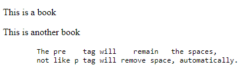
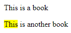
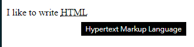
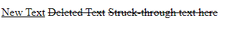
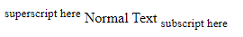

# 100 days of code front end - Day 01

## 前言

主要會想參加這個專案是因為我自己對於前端網頁的技術還有很多需要更加深入學習的地方，希望可以將基礎再打得更牢固一點。

在網路上到很多人對於參加 100 days of code 的參加心得，看著看著突然覺得很熱血，想看看透過參加這樣類似的活動可以增強自己的實力，又可以增加自身的動力，畢竟是連續 100 天，雖然我本身有工作每天都會去寫程式，但大多數都是桌面的應用程式，對於網頁部分真的是想要將這方面的技能在增強一點。

雖然我之前有寫過 Vue.js 的前端網頁以及 node.js express 的後端 server，但在開發的過程中，程式碼感覺都是拼拼湊湊出來的，由於是拼拼湊湊出來的，也無法證明說這樣子的寫法到底可不可行。

基於上述的原因希望透過 100 days of code front end 逼自己每天進步一點，剛好找到 nas5w/100-days-code-frontend 的 Github 裡面有列出詳細的前端網站的學習步驟以及建議天數，覺得還不錯，期望 100 天回頭再看可以很明顯的感受到自己真的有進步，還有希望自己真的可以撐過這 100 天!

每天我都會記錄學習心得在這裡

## 筆記

### 1. Getting start with HTML

HTML 是設計用於在 Web 瀏覽器中顯示的文檔標準標記語言。

HTML 主要是網頁的框架，讓網站有個主要的架構，美化外觀的部分是由層級樣式表 (CSS) 定義，並由瀏覽器呈現。

HTML 有時被叫做程式語言但是並沒有邏輯可言，所以是叫做標記語言。

HTML 標籤提供了語義的意義並且讓機器可以讀取頁面中的內容。 (機器並不知道文章的哪裡是重點那裡的語氣加重，只能透過我們去將他們標記出來)

元素通常由一個開始標記語一個結束標記組成，標記的元素名稱會使用尖括號括起來，裡面的內容會在這兩個標記之間。

```html
<p>This is a book</p>
```

有一些 HTML 元素並沒有結束標籤或是任何的內容。這些通常被叫做空元素，包括 \, \<meta>, \<link> 以及 \<input>

元素名稱可以被視為他們所包含內容的描述性關鍵字例如，video, audio, table, footer。

一個 HTML 頁面可能潛在組成上百個元素，這些元素將被瀏覽器讀取、翻譯並且在螢幕上呈現出人類可以聽讀的內容。

`元素與標籤的區別`  
元素 (Element): video, audio, table, footer  
標籤 (Tags): \<video>, \<audio>, \<table>, \<footer>

```html
<!DOCTYPE html>
<html lang="en">
  <head>
    <meta charset="UTF-8" />
    <title>Hello!</title>
  </head>

  <body>
    <h1>Hello World!</h1>
    <p>This is a simple paragraph.</p>
  </body>
</html>
```

\<!DOCTYPE html>: 代表目前使用 HTML5
\<html>: 表示 html 開始的地方，lang 主要是給瀏覽器看能更確的解析與編碼
\<head>: 大部分不會呈現在網頁上，主要是提供一些 HTML 檔案的資訊，成為 metadata
\<meta>: charset 屬性宣告 HTML 檔案的編碼格式
\<title>: 網頁的標題，會呈現在瀏覽器的 tab 上
\<body>: 網頁內容呈現主要撰寫的地方

`網頁存檔要存成 UTF-8 的格式`

### Doctypes

Doctypes (document type) 幫助瀏覽器了解 HTML 的版本，以獲得更好的解釋能力。

Doctypes 不是 HTML 標籤並且放在文件的最上方 \<!DOCTYPE>

doctype 的字串是大小寫不受限的

### 3. Headings

HTML 提供了六種 header 標籤，各自代表不同的尺寸與厚度的標題

從 h1 ~ h6 由大到小

\<h1> 最重要的標題
\<h6> 重要性比較低的標題

`正確的網站結構很重要`

搜尋引擎與其他用戶代理通常藉由標題元素來對網頁內容索引

一般來說，一個文章應該有一個 h1 元素作為主標題，接著是 h2 副標題，再根據需要持續往下排。

### 4. Paragraph

\<p>: 定義段落  
\<br>: 斷行  
\<pre>: 保留原本字串中有空白與換行的地方
ex.


<p>This is     another     paragraph</p>
瀏覽器在呈現時會移除額外的空白

### 5. Text Formatting

HTML 提供了文本格式標籤來讓指定的部分文字格式化

格式化包含了: highlighting, 粗體，底線，下標，刪除線等等

`hightlight`
\<mark>: 文字 highlight  

常見的範例是用在字串搜尋，對期待找到的字串標 highlight

`粗體 (Bold)`  
\<strong>, \<b>  
\<strong>: 是語意上的強調，強調語氣
\<b>: 單純視覺上的粗體
對於語音系統來說，使用 b 標籤的語氣與其他語氣是一樣的，但是如果使用 strong 的話，就加重語氣

`斜體 (Italic)`
\<em>, \<i>
\<em>: 語意上的強調，強調語氣  
\<b> : 單純視覺上的斜體

`下底線 (Underlined Text)`
\<u>: 文字下底線  
通常用來表示拼錯字

`縮寫 (Abbreviation`  
\<abbr title='Hypertext Markup Language'>HTML</abbr>


`insert, delete, stricken`  
\<ins>  
\<del>  
\<s>  


`Superscript and Subscript`  
\<sup>  
\<sub>  


### 6. Anchors and Hyperlinks (錨點與超連結)

href: 指定目的地位址，可以是絕對或相對 URL，或是錨點的 name。

- 絕對位置是完整的網站 URL
- 相對位址是網站的根目錄相對的資料夾或文件
- 通常指向資料夾並沒有給定文件的話，網站伺服器通常會回傳資料夾中的 index.html 檔案

hreflang: 指定 href 連結資源的語言 ???

rel: 指定檔前文件與連結文件之間的關聯

target: 指定連結打開後出現的地方，\_blank, \_self, \_parent, \_top

title: 指定額外的資訊給連結 (小標籤顯示)

download: 當使用者點擊連結時，將會進行下載的動作

`錨點`  
錨點可以在 HTML 網頁中跳到指定的 tag，標籤 a 可以用來指向任何指定 id 的 element

另外錨點也可以連到指定網頁的錨點位置
\<a href='page1.html#Topic1'>Look back in the First Topic</a>

`連結到同樣網址的 page`
可以使用相對路徑的方式，連到同一網站上的網頁  
\<a href='/example'> Text Here </a>  
Same as  
\<a href='http://example.com/example'>Text Here</a>

`tel 指定電話撥打`

`mailto:`  
可以指定要寄信的信箱

## 參考資源

主要 HTML 的部分我會以 `HTML5 Notes for Professionals` 這個網路上免費的 pdf 檔作為學習的主要書籍
