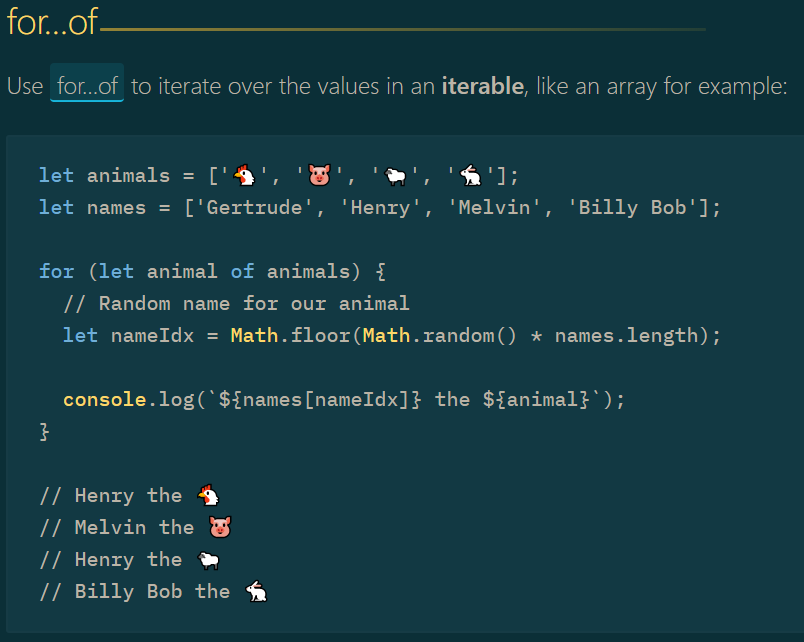
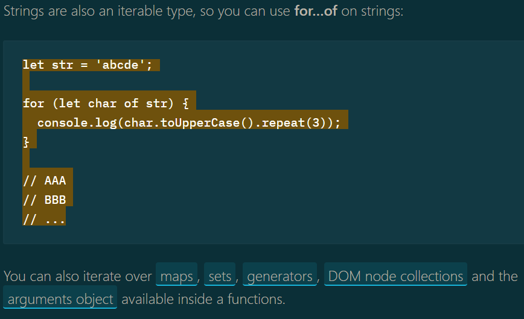
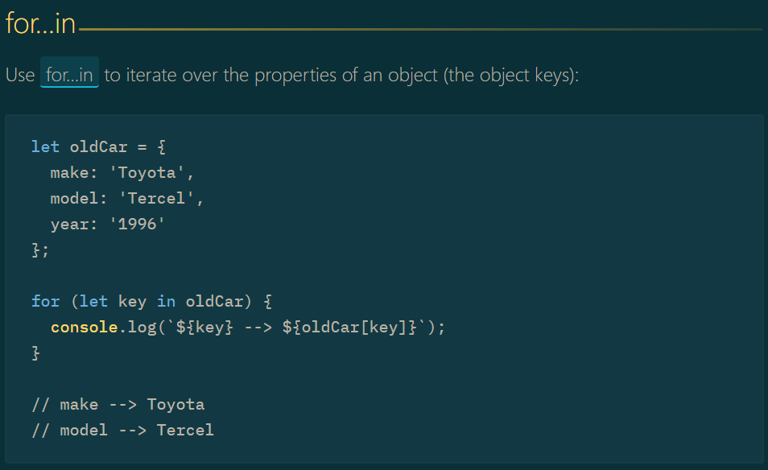
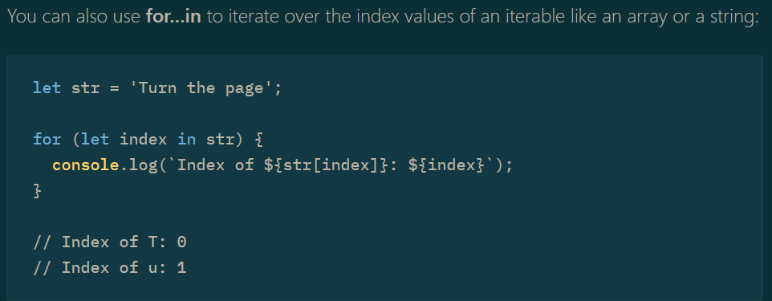

## 12. Arrays

### 12.1. Converting Array-like Objects to Arrays

#### What are Array-like Objects?

JavaScript 有"Array-like Objects (類似陣列的物件)"，將物件表示成有長度屬性的陣列

```javascript
var realArray = ['a', 'b', 'c'];
var arrayLike = {
  0: 'a',
  1: 'b',
  2: 'c',
  length: 3,
};
```

Array-like Object 常見範例是函式中的 arguments 物件以及從 document.getElementsByTagName 或是 document.querySelectorAll 之類的方法返回 HTMLCollection 或 NodeList 物件。

- Array-like object
  - function (傳入的參數 -> arguments)
  - document.getElementsByTagName (HTMLCollection)
  - document.querySelectorAll (NodeList)

然而，Array 與 Array-like Object 之間有一個關鍵的差異就是 Array-like 物件是繼承至 Object.prototype 而不是 Array.prototype。這代表 Array-like Object 不能使用一般 Array prototype 的方法像是 forEach(), push(), map(), filter() 以及 slice():

```javascript
var parent = document.getElementById('myDropdown');
var desiredOption = parent.querySelector('option[value='desired']');
var domList = parent.child;

domList.indexOf(desiredOption);  // Error! indexOf is not defined.
domList.forEach(function() {
  arguments.map(/* Stuff here */)  // Error! map is not defined
});  // Error! forEach is not defined

function func() {
  console.log(arguments);
}

func(1, 2, 3) // [1, 2, 3]  Array-like object
```

#### Convert Array-like Objects to Arrays in ES6

1. Array.from:

```javascript
const arrayLike = {
  0: 'Value 0',
  1: 'Value 1',
  length: 2,
};

arrayLike.forEach((value) => {
  /* Do something */
}); // Error
const realArray = Array.from(arrayLike);
realArray.forEach((value) => {
  /* Do something */
}); // Works
```

上面經過測試，如果 Array-like Object 沒有寫 length 屬性的話，使用 Array.from() 會建立出空陣列，而如果 length 寫入比物件屬性還要多的數量時，後面多的會直接寫成 undefined。

2. for...of

```javascript
var realArray = [];
// arrayLike 是不可迭代的物件
for (const element of arrayLike) {
  realArray.append(element); // append 應該改為 push
}

// 如果改成 for ... in 就可以運行
for (const element in arrayLike) {
  realArray.push(arrayLike[element]);
}
```

> 補充:  
>  >  >  > 

3. Spread operator
   [...arrayLike] // 不可迭代的物件也不可以使用 spread operator

4. Object.values:

```javascript
var realArray = Object.values(arrayLike);
```

5. Object.keys

```javascript
var realArray = Object.keys(arrayLike).map((key) => arrayLike[key]);

// 先使用 object.keys 取得物件的屬性名稱
// 再針對返回的 keys 使用 map 最後取得 realArray 的陣列
```

#### Convert Array-like Objects to Arrays in ES5

Use Array.prototype.slice like

```javascript
var arrayLike = {
  0: 'Value 0',
  1: 'Value 1',
  length: 2,
};

var realArray = Array.prototype.slice.call(arrayLike);
realArray = [].slice.call(arrayLike); // Shorter version

realArray.indexOf('Value 1'); // Wow this works!
```

你也可以使用 Function.prototype.call 直接在 Array-like object 呼叫 Array.prototype 方法，而不需要轉換他們：

```javascript
var domList = document.querySelectorAll('#myDropdown option');
domList.forEach(function() {
  // Do stuff
}); // Error! forEach is not defined.
Array.prototype.forEach.call(domList, function() {
  // Do stuff
}); // Wow! this works
```

你也可以使用 [].method.bind 借用陣列方法並將其綁定到物件上

```javascript
var arrayLike = {
  0: 'Value 0',
  1: 'Value 1',
  length: 2,
};
arrayLike.forEach(function() {
  // Do stuff
}); // Error! forEach is not defined.
[].forEach.bind(arrayLike)(function(val) {
  // Do stuff with val
}); // Wow! this works
```

#### Modifying items during conversion

在 ES6 中，當使用 Array.from 時，我們可以指定一個 map 函數，該函數返回要建立新物件的 map 值。

```javascript
Array.from(domList, (element) => element.tagName); // Creates an array of tagName's
```

### 12.2. Reducing values

reduce() 方法接收一個函數做為累加器，陣列中的每個元素 (從左到右) 開始縮減，最後變成一個值。

reduce() 裡面接收一個函式，此函式裡面有累加器，此累加器會與陣列的每個值進行累加的動作，最會累加成一個值。

#### Array Sum

此方法可以用來將陣列中的所有值濃縮成單一個值

```javascript
[1, 2, 3, 4].reduce(function(a, b) {
  return a + b;
});
```

第二個參數是可選的可以被傳入 reduce()。他的值會做為第一次呼叫的回呼 (指定為 function(a, b)) 的第一個參數 (指定為 a)。

簡單來說，第二個參數的值會是指定累加器的初始值，如果沒有指定的話，一開始的累加器的值會是 0。

```javascript
[2].reduce(function(a, b) {
  console.log(a, b);
  return a + b;
}, 1);
```

#### Flatten Array of Objects

下面的範例說明如何將物件的陣列攤平成單一物件

```javascript
var array = [
  {
    key: 'one',
    value: 1,
  },
  {
    key: 'two',
    value: 2,
  },
  {
    key: 'three',
    value: 3,
  },
];

array.reduce(function(obj, current) {
  obj[current.key] = current.value;
  return obj;
}, {});

// or version >= 6
array.reduce((obj, current) => Object.assign(obj, {
  [current.key]: current.value
}, {});

// or version >= 7
array.reduce(obj, current) => ({...obj, [current.key]: current.value}), {});
```

> 注意， Rest/Spread Properties 不不是 es2016 的最終提案。因此並不再 ES2016 支援，但是我們可以使用 babel 插件 babel-plugin-transform-object-rest-spread 支援。

上面所有的範例在攤平陣列後如下

```javascript
{
  one: 1,
  two: 2,
  three: 3
}
```

#### Map Using Reduce

作為另一個使用初始值參數的範例，請考慮在陣列項目上呼叫一個函式，然後將結果回傳到新的陣列上。因為陣列是一般值，串列連接是普通函式，因此我們可以使用 reduce 來累積串列，如以下範例所示:

```javascript
function map(list, fn) {
  return list.reduce(function(newList, item) {
    return newList.concat(fn(item)); // 這邊用 concat 的原因是因為他會回傳陣列，如果用 push 的話是會回傳陣列長度
  }, []);
}

// Usage:
map([1, 2, 3], function(n) {
  return n * n;
});
// [1, 4, 9]
```

請注意，這裡僅用於說明 (初始值參數)，請使用內建的 map 來進行列表轉換

#### Find Min or Max Value

我們也可透過累加器來保持陣列物件的追蹤。在此範例中利用此特性來找到最小值

```javascript
var arr = [4, 2, 1, -10, 9];

arr.reduce(function(a, b) {
  return a < b ? a : b;
}, Infinity);
// -10
```

#### Find Unique Values

本範例使用 reduce 來返回陣列中的唯一值。空的陣列被傳入到第二個參數，並且由 prev 參考

```javascript
var arr = [1, 2, 1, 5, 9, 5];

arr.reduce((prev, number) => {
  if (prev.indexOf(number) === -1) {
    prev.push(number);
  }
  return prev;
}, []);
// [1, 2, 5, 9]
```

### 12.3. Mapping values

通常我們會需要基於現存的陣列的值來產生所需的新陣列。

例如，從字串陣列中產生字串長度的陣列

```javascript
// version >= 5.1
['one', 'two', 'three', 'four'].map(function(value, index, arr) {
  return value.length;
});
// [3, 3, 5, 4]

// version >= 6
['one', 'two', 'three', 'four'].map((value) => value.length);
```

在此範例中，匿名函式提供給 map() 函式，並且 map 函式會針對陣列中的每個元素呼叫此函式，並按照以下順序提供下列參數，:

- 元素本身
- 元素的索引 (0, 1, ...)
- 整個陣列

除此之外，map() 提供了一個可選的第二個參數，以便在 map 函數中設定其值。隨著執行環境，預設值的 this 可能不同；

在瀏覽器中，在瀏覽器中 this 的預設值通常是 window

```javascript
['one', 'two'].map(function(value, index, arr) {
  console.log(this); // window (the default value in browsers)
  return value.length;
});
```

你可以改變成任何客製化物件像是:

```javascript
['one', 'two'].map(
  function(value, index, arr) {
    console.log(this); // Object { documentation: "randomObject" }
    return value.length;
  },
  {
    documentation: 'randomObject',
  },
);
```

### 12.4. Filtering Object Arrays

filter() 方法接受一個測試函式，並且回傳一個新的陣列，其陣列只會包含元陣列中有通過測試的陣列。

```javascript
// Suppose we want to get all odd number in an array
var numbers = [5, 32, 43, 4];

// Version >= 5.1
var odd = numbers.filter(function(n) {
  return n % 2 !== 0;
});

// Version >= 6
let odd = numbers.filter((n) => n % 2 !== 0); // can be shortened to (n => n % 2)
```

也可在物件的陣列使用

```javascript
var people = [
  {
    id: 1,
    name: 'John',
    age: 28,
  },
  {
    id: 2,
    name: 'Jane',
    age: 31,
  },
  {
    id: 3,
    name: 'Peter',
    age: 55,
  },
];
```

```javascript
// Version >= 5.1
var young = people.filter(function(person) {
  return person.age < 35;
});

// Version >= 6
let young = people.filter((person) => person.age < 35);
```

young 將包含一下東西

```javascript
[
  {
    id: 1,
    name: 'John',
    age: 28,
  },
  {
    id: 2,
    name: 'Jane',
    age: 31,
  },
];
```

你可以針對某個值在整個陣列中進行搜尋

```javascript
var young = people.filter((obj) => {
  var flag = false;
  Object.values(obj).forEach((val) => {
    if (String(val).indexOf('J') > -1) {
      flag = true;
      return;
    }
  });
  if (flag) return obj;
});
```

上面會回傳

```javascript
[
  {
    id: 1,
    name: 'John',
    age: 28,
  },
  {
    id: 2,
    name: 'Jane',
    age: 31,
  },
];
```

### 12.5. Sorting Arrays

.sort() 方法排序陣列的元素。預設的方法排列陣列是根據字串的 Unicode 編碼點。為了要進行陣列數值化排序，.sort() 方法必須有一個 compareFunction 傳進去給他。

> 注意: .sort 是不純的方法。.sort() 會對陣列進行原位排序，例如，不是建立原始陣列的排序副本，它會重新排序原始陣列並返回它。

#### Default Sort

以 Unicode 的順訊排序陣列

```javascript
[
  's',
  't',
  'a',
  34,
  'K',
  'o',
  'v',
  'E',
  'r',
  '2',
  '4',
  'o',
  'W',
  -1,
  '-4',
].sort();

// [-1, '-4', '2', 34, '4', 'E', 'K', 'W', 'a', 'l', 'o', 'o', 'r', 's', 't', 'v']
```

> 注意: 大寫字會移動到小寫字的前面。陣列不是按字母順序，數字也不是數字順序。

#### Alphabetical Sort

```javascript
['s', 't', 'a', 'c', 'K', 'o', 'v', 'E', 'r', 'f', 'l', 'W', '2', '1'].sort(
  (a, b) => {
    return a.localeCompare(b);
  },
);

// ['1', '2', 'a', 'c', 'E', 'f', 'K', 'l', 'o', 'r', 's', 't', 'v', 'W']
```

> 注意: 上面的範例如果陣列中的元素不是字串，會拋出錯誤。如果你知道陣列中可能包含不是字串的元素，可以使用以下安全的版本。

```javascript
['s', 't', 'a', 'c', 'K', 1, 'v', 'E', 'r', 'f', 'l', 'o', 'W'].sort((a, b) => {
  return a.toString().localeCompare(b);
});
```

#### String sorting by length (longest first)

```javascript
['zebras', 'dogs', 'elephants', 'penguins'].sort(function(a, b) {
  return b.length - a.length;
});
// ["elephants", "penguins", "zebras", "dogs"];
```

#### String sorting by length (shortest first)

```javascript
['zebras', 'dogs', 'elephants', 'penguins'].sort(function(a, b) {
  return a.length - b.length;
});

// ["dogs", "zebras", "penguins", "elephants"];
```

#### Numerical Sort (ascending)

```javascript
[100, 1000, 10, 10000, 1].sort(function(a, b) {
  return a - b;
});

// [1, 10, 100, 1000, 10000]
```

#### Numerical Sort (descending)

```javascript
[100, 1000, 10, 10000, 1].sort(function(a, b) {
  return b - a;
});

// [10000, 1000, 100, 10, 1]
```

#### Sorting array by even and odd numbers

```javascript
[10, 21, 4, 15, 7, 99, 0, 12].sort(function(a, b) {
  return (a & 1) - (b & 1) || a - b;
});

// [0, 4, 10, 12, 7, 15, 21, 99]
```

#### Date Sort (descending)

```javascript
var dates = [
  new Date(2007, 11, 10),
  new Date(2014, 2, 21),
  new Date(2009, 6, 11),
  new Date(2016, 7, 23),
];
dates.sort(function(a, b) {
  if (a > b) return -1;
  if (a < b) return 1;
  return 0;
});
// the date objects can also sort by its difference
// the same way that numbers array is sorting
dates.sort(function(a, b) {
  return b - a;
});
```

Results

```javascript
[
  'Tue Aug 23 2016 00:00:00 GMT-0600 (MDT)',
  'Fri Mar 21 2014 00:00:00 GMT-0600 (MDT)',
  'Sat Jul 11 2009 00:00:00 GMT-0600 (MDT)',
  'Mon Dec 10 2007 00:00:00 GMT-0700 (MST)',
];
```

### 12.6. Iteration

#### A traditional for-loop

傳統的 for loop 有三個零件

1. initialization: 在迴圈區塊第一次執行前，執行初始化
2. condition: 在迴圈區塊執行前每次都會檢查是否符合條件，如果不符合就會跳出迴圈
3. afterthought: 當迴圈區塊執行完後，都會先執行此邏輯

三個零件使用 ; 做隔開。三個零件中的內容是可選的，意味著下面程式碼是最小的 for 迴圈架構

```javascript
for (;;) {
  // Do stuff
}
```

當然你可以在迴圈中加入判斷來跳出迴圈 break / return

通常，初始化用於宣告索引值，條件是用索引值與最大最小值比較，然後後面的遞增條件使用來增加或減少索引值

```javascript
for (var i = 0, length = 10; i < length; i++) {
  console.log(i);
}
```

#### Using a traditional for loop to loop through an array

```javascript
for (var i = 0, length = myArray.length; i < length; i++) {
  console.log(myArray[i]);
}
```

或是，你偏好使用反向迴圈

```javascript
for (var i = myArray.length - 1; i > -1; i--) {
  console.log(myArray[i]);
}
```

但是，可能有多種變數，例如這種變數：

```javascript
for (
  var key = 0, value = myArray[key], length = myArray.length;
  key < length;
  value = myArray[++key]
) {
  console.log(value);
}
```

或是

```javascript
var i = 0,
  length = myArray.length;

for (; i < length; ) {
  console.log(myArray[i]);
  i++;
}
```

或是

```javascript
var key = 0,
  value;
for (; (value = myArray[key++]); ) {
  console.log(value);
}
```

#### A while loop

另一種替代 for 迴圈的是 while 迴圈。如果要走訪所有陣列，你可以這樣寫

```javascript
var key = 0;
while ((value = myArray[key++])) {
  console.log(value);
}
```

另外，請注意，每個 while 迴圈都可以重寫為 for 迴圈，例如，上述 while 迴圈的行為與此 for 循環完全相同：

**for...in**

```javascript
for (i in myArray) {
  console.log(myArray[i]);
}
```

但是，應謹慎使用，它的行為與傳統的 for 迴圈不同，並且需要考慮潛在的副作用。

**for...of**
在 ES6 中，for-of 迴圈是被推薦在迭代陣列的值

```javascript
// Version >= 6
let myArray = [1, 2, 3, 4];
for (let value of myArray) {
  let twoValue = value * 2;
  console.log('2 * value is: %d', twoValue);
}
```

下面的範例說明 for...in 與 for...of 之間的不同

```javascript
// Version >= 6
let myArray = [3, 5, 7];
myArray.foo = 'hello';
for (var i in myArray) {
  console.log(i); // logs 0, 1, 2, "foo"
}
for (var i of myArray) {
  console.log(i); // logs 3, 5, 7
}
```

#### Array.prototype.keys()

Array.prototype.keys() 方法可以被使用於迭代索引值

```javascript
// Version >= 6
let myArray = [1, 2, 3, 4];
for (let i of myArray.keys()) {
  let twoValue = myArray[i] * 2;
  console.log('2 * value is: %d', twoValue);
}
```

#### Array.prototype.forEach()

.forEach（...）方法是 ES5 及更高版本中的一個功能。所有現代瀏覽器以及 Internet Explorer 9 及更高版本均支持該功能。

```javascript
// Version ≥ 5
[1, 2, 3, 4].forEach(function(value, index, arr) {
  var twoValue = value * 2;
  console.log('2 * value is: %d', twoValue);
});
```

與傳統的 for 迴圈相比，我們不可以再 forEach 迴圈中跳出。在這種情況下，請使用 for 循環，或使用下面介紹的部分迭代。

在 JavaScript 的所有版本中，使用傳統的 C 風格的 for 迴圈可以遍歷陣列的索引

```javascript
var myArray = [1, 2, 3, 4];
for (var i = 0; i < myArray.length; ++i) {
  var twoValue = myArray[i] * 2;
  console.log('2 * value is: %d', twoValue);
}
```

while loop

```javascript
var myArray = [1, 2, 3, 4],
  i = 0,
  sum = 0;
while (i++ < myArray.length) {
  sum += i;
}
console.log(sum);
```

#### Array.prototype.every

從 ES5 開始，如果要迭代陣列的一部分，則可以使用 Array.prototype.every，`它會迭代直到我們返回false為止`：

```javascript
// Version ≥ 5
// [].every() stops once it finds a false result
// thus, this iteration will stop on value 7 (since 7 % 2 !== 0)
[2, 4, 7, 9].every(function(value, index, arr) {
  console.log(value);
  return value % 2 === 0; // iterate until an odd number is found
});
```

與一般的 for 迴圈相等

```javascript
var arr = [2, 4, 7, 9];
for (var i = 0; i < arr.length && arr[i] % 2 !== 0; i++) {
  // iterate until an odd number is
  found;
  console.log(arr[i]);
}
```

#### Array.prototype.some

Array.prototype.some `迭代直到我們回傳 true`

```javascript
// Version ≥ 5
// [].some stops once it finds a false result
// thus, this iteration will stop on value 7 (since 7 % 2 !== 0)
[2, 4, 7, 9].some(function(value, index, arr) {
  console.log(value);
  return value === 7; // iterate until we find value 7
});
```

與一般的 for 迴圈相等

```javascript
var arr = [2, 4, 7, 9];
for (var i = 0; i < arr.length && arr[i] !== 7; i++) {
  console.log(arr[i]);
}
```

#### Libraries

最後，許多實用程序庫也具有各自的 foreach 變數。 最受歡迎的三個是：

#### jQuery.each() in jQuery

```javascript
$.each(myArray, function(key, value) {
  console.log(value);
});
```

#### \_.each() in Underscore.js

```javascript
_.each(myArray, function(value, key, myArray) {
  console.log(value);
});
```

#### \_.forEach() in Lodash.js

```javascript
_.forEach(myArray, function(value, key) {
  console.log(value);
});
```

#### 12.7. Destructuring an array

// Version >= 6
當要賦值給新的變數時，陣列可以解構

```javascript
const triangle = [3, 4, 5];
const [length, height, hypotenuse] = triangle;
length === 3; // true
height === 4; // true
hypotneuse === 5; // true
```

可以跳過元素

```javascript
const [, b, , c] = [1, 2, 3, 4];
console.log(b, c); //  2, 4
```

Rest operator 也可使用

```javascript
const [b, c, ...xs] = [2, 3, 4, 5];
console.log(b, c, xs); // 2, 3, [4, 5]
```

如果陣列是函數的參數，則陣列也可以被解構。

```javascript
function area([length, height]) {
  return (length * height) / 2;
}

const triangle = [3, 4, 5];
area(triangle); // 6
```

### 12.8. Removing duplicate elements

從 ES5.1 開始，可以使用內件方法 Array.prototype.filter 走訪陣列，只保留通過給定回呼函數的項目。

在以下範例中，我們的回呼檢查給定值是否出現在數組中。如果是這樣，它將是重複項，並且不會複製到結果陣列中。

```javascript
// version >= 5.1
var uniqueArray = ['a', 1, 'a', 2, '1', 1].filter(function(value, index, self) {
  return self.indexOf(value) === index; // indexOf 從前面開始找
}); // returns ['a', 1, 2, '1']
```

如果您的環境支持 ES6，則還可以使用 Set 對象。 該物件使您可以存儲任何類型的唯一值，無論是原始值還是物件引用

```javascript
// version >= 6
var uniqueArray = [...new Set(['a', 1, 'a', 2, '1', 1])];
```

### 12.9. Array Comparision

為了進行簡單的數組比較，您可以使用 JSON stringify 並比較輸出字符串：

```javascript
JSON.stringify(array1) === JSON.stringify(array2);
```

> 注意：這僅在兩個物件都可以 JSON 序列化並且不包含循環引用的情況下起作用。
> 將循環結構轉換為 JSON，可能引起錯誤

你可以使用遞迴函式來比較陣列

```javascript
function compareArrays(array1, array2) {
  var i, isA1, isA2;
  isA1 = Array.isArray(array1);
  isA2 = Array.isArray(array2);
  if (isA1 !== isA2) {
    // is one an array and the other not?
    return false; // yes then can not be the same
  }
  if (!(isA1 && isA2)) {
    // Are both not arrays
    return array1 === array2; // return strict equality
  }
  if (array1.length !== array2.length) {
    // if lengths differ then can not be the same
    return false;
  }
  // iterate arrays and compare them
  for (i = 0; i < array1.length; i += 1) {
    if (!compareArrays(array1[i], array2[i])) {
      // Do items compare recursively
      return false;
    }
  }
  return true; // must be equal
}
```

> 警告: 使用上面的函數很危險，如果懷疑陣列有循環引用（對包含自身的引用的陣列的引用），則應將其包裝在 try catch 中

```javascript
a = [0];
a[1] = a;
b = [0, a];
compareArrays(a, b); // throws RangeError: Maximum call stack size exceeded
```

> 注意：該函數使用嚴格相等運算符 === 比較非陣列項目 {a：0} === {a：0} 為 false

### 12.10. Reversing arrays

.reverse 用於反轉陣列中項目的順序。

```javascript
[1, 2, 3, 4].reverse();

// [4, 3, 2, 1]
```

> 注意: .reverse (Array.prototype.reverse) 會回傳原本的陣列，而不是回傳翻轉過後的副本，因此他是回傳同一個陣列，只是翻轉過來而以。
>
> ```javascript
> var arr1 = [11, 22, 33];
> var arr2 = arr1.reverse();
> console.log(arr2); // [33, 22, 11]
> console.log(arr1); // [33, 22, 11]
> ```

您還可以通過以下方式“深度”反轉陣列：

```javascript
function deepReverse(arr) {
  arr.reverse().forEach((elem) => {
    if (Array.isArray(elem)) {
      deepReverse(elem);
    }
  });
  return arr;
}
```

Example for deepReverse

```javascript
var arr = [1, 2, 3, [1, 2, 3, ['a', 'b', 'c']]];
deepReverse(arr);

arr; // -> [[['c','b','a'], 3, 2, 1], 3, 2, 1]
```

### 12.11. Shallow cloning an array

有時，你需要使用陣列同時確保不會修改到原始陣列。陣列有 slice 方法，而不是 cline 方法，讓你可以執行陣列任意部分的淺層複製。請記住，這只會複製第一層。這對於原始型別 (例如數字和字串) 有效，但不適用於物件。

要淺層複製一個陣列 (即具有一個新的陣列實例，但具有相同元素)，可以使用以下指令；

```javascript
var clone = arrayToClone.slice();
```

這將呼叫內件的 JavaScript Array.prototype.slice 方法。如果將參數傳遞給 slice，則會得到更複雜的行為，這些行為會創建僅一部分陣列的淺層副本，但出於我們的目的，僅調用 slice（）會創建整個陣列的淺層副本。

```javascript
// Version ≥ 6
arrayToClone = [1, 2, 3, 4, 5];
clone1 = Array.from(arrayToClone);
clone2 = Array.of(...arrayToClone);
clone3 = [...arrayToClone]; // the shortest way

// Version ≤ 5.1
arrayToClone = [1, 2, 3, 4, 5];
clone1 = Array.prototype.slice.call(arrayToClone);
clone2 = [].slice.call(arrayToClone);
```

### 12.12. Concatenating Arrays

#### Two Arrays

```javascript
var array1 = [1, 2];
var array2 = [3, 4, 5];
// Version ≥ 3
var array3 = array1.concat(array2); // returns a new array

// Version ≥ 6
var array3 = [...array1, ...array2];

// [1, 2, 3, 4, 5]
```

#### Multiple Arrays

```javascript
var array1 = ['a', 'b'],
  array2 = ['c', 'd'],
  array3 = ['e', 'f'],
  array4 = ['g', 'h'];
```

Version >= 3
提供更多 Array 參數給 array.concat()

```javascript
var arrConc = array1.concat(array2, array3, array4);
```

Version >= 6
提供更多參數到 []

```javascript
var arrConc = [...array1, ...array2, ...array3, ...array4];
// ["a", "b", "c", "d", "e", "f", "g", "h"]
```

#### Without Copying the First Array

```javascript
var longArray = [1, 2, 3, 4, 5, 6, 7, 8],
  shortArray = [9, 10];
```

Version >= 3

提供 shortArray 的元素作為參數以使用 Function.prototype.apply push

```javascript
longArray.push.apply(longArray, shortArray);
```

Version >= 6
使用 spread operator 傳送 shortArray 的 element 到 push 中

```javascript
longArray.push(...shortArray);
```

longArray 的值現在為
[1, 2, 3, 4, 5, 6, 7, 8, 9, 10]

> 注意如果第二個陣列的元素太大 (超過 100,000 個項目)，你可能會得到 stack overflow 的錯誤 (因為 apply 的運作就是這樣)，為了避免出錯你可以使用以下方法

```javascript
shortArray.forEach(function(elem) {
  longArray.push(elem);
});
```

#### Array and non-array values

```javascript
var array = ['a', 'b'];
// Version ≥ 3
var arrConc = array.concat('c', 'd');
// Version ≥ 6
var arrConc = [...array, 'c', 'd'];
// ["a", "b", "c", "d"]
```

或是

```javascript
var arr1 = ['a', 'b'];
var arr2 = ['e', 'f'];
var arrConc = arr1.concat('c', 'd', arr2);
// ["a", "b", "c", "d", "e", "f"]
```

### 12.13. Merge two array as key value pair

當我們有兩個陣列並且我們想要使用從這兩個陣列建立鍵值對，我們可以使用 陣列的 reduce 函式

```javascript
var columns = ['Date', 'Number', 'Size', 'Location', 'Age'];
var rows = ['2001', '5', 'Big', 'Sydney', '25'];
var result = rows.reduce(function(result, field, index) {
  result[columns[index]] = field;
  return result;
}, {});
console.log(result);
```

```javascript
// output
{
  Date: "2001",
  Number: "5",
  Size: "Big",
  Location: "Sydney",
  Age: "25"
}
```

### 12.14. Array spread / rest

#### Spread operator

version >= 6
在 ES6 中，你可以使用擴展來擴展各自的元素到逗號擴展語法:

```javascript
let arr = [1, 2, 3, ...[4, 5, 6]]; // [1, 2, 3, 4, 5, 6]
// in ES < 6, the operations above are equivalent to
arr = [1, 2, 3];
arr.push(4, 5, 6);
```

擴展運算符還對字串起作用，將每個單獨的字符分成一個新的字串元素。
因此，使用陣列函數將它們轉換為整數，上面創建的陣列等效於下面的數組：

```javascript
let arr = [1, 2, 3, ...[...'456'].map((x) => parseInt(x))]; // [1, 2, 3, 4, 5, 6]
```

或是使用單一字串

```javascript
let arr = [...'123456'].map((x) => parseInt(x)); // [1, 2, 3, 4, 5, 6]
```

如果 map 沒有執行，可使用:

```javascript
let arr = [...'123456']; // ["1", "2", "3", "4", "5", "6"]
```

擴展運算符還可以用於將參數傳到函數中：

```javascript
function myFunction(a, b, c) {}
let args = [0, 1, 2];
myFunction(...args);
// in ES < 6, this would be equivalent to:
myFunction.apply(null, args);
```

#### Rest operator

其餘運算子與擴展運算子是相反的功能，他是透過將多個元素合併成一個

```javascript
[a, b, ...rest] = [1, 2, 3, 4, 5, 6]; // rest is assigned [3, 4, 5, 6]
```

蒐集參數

```javascript
function myFunction(a, b, ...rest) {
  console.log(rest);
}
myFunction(0, 1, 2, 3, 4, 5, 6); // rest is [2, 3, 4, 5, 6]
```

### 12.15. Filtering values
filter（）方法建立一個陣列，該陣列填充了所有通過作為函數提供的測試的陣列元素

```javascript
// version >= 5.1
[1, 2, 3, 4, 5].filter(function(value, index, arr) {
return value > 2;
});
// Version ≥ 6
[1, 2, 3, 4, 5].filter(value => value > 2);

// [3, 4, 5]
```

#### Filter falsy values
```javascript
// Version ≥ 5.1
var filtered = [ 0, undefined, {}, null, '', true, 5].filter(Boolean);

// [ {}, true, 5 ]

```
由於布林值是原始 JavaScript 函數/構造函數，它採用[一個可選參數]，並且 filter 方法也採用函數並將當前陣列項作為參數傳遞給它，因此您可以像下面這樣讀取它：
1. Boolean(0) returns false
2. Boolean(undefined) returns false
3. Boolean({}) returns true which means push it to the returned array
4. Boolean(null) returns false
5. Boolean('') returns false
6. Boolean(true) returns true which means push it to the returned array
7. Boolean(5) returns true which means push it to the returned array

#### Another simple example
此示例採用了傳遞帶有一個參數的函數的相同概念
```javascript
Version ≥ 5.1
function startsWithLetterA(str) {
if(str && str[0].toLowerCase() == 'a') {
return true
}
return false;
}
var str = 'Since Boolean is a native javascript function/constructor that takes [one
optional parameter] and the filter method also takes a function and passes it the current array
item as a parameter, you could read it like the following';
var strArray = str.split(" ");
var wordsStartsWithA = strArray.filter(startsWithLetterA);
//["a", "and", "also", "a", "and", "array", "as"]
```

### 12.16. Searching an array
ES5 推薦的方法是使用 Array.prototype.find:
```javascript
let people = [
{ name: "bob" },
{ name: "john" }
];
let bob = people.find(person => person.name === "bob");
// Or, more verbose
let bob = people.find(function(person) {
return person.name === "bob";
});
```
在任何版本的JavaScript中，也可以使用標準的for循環：
```javascript
for (var i = 0; i < people.length; i++) {
if (people[i].name === "bob") {
break; // we found bob
}
}
```

#### FindIndex
如果陣列中的元素滿足提供的測試功能，則 findIndex（）方法將返回陣列中的索引。 否則返回-1。

```javascript
array = [
{ value: 1 },
{ value: 2 },
{ value: 3 },
{ value: 4 },
{ value: 5 }
];
var index = array.findIndex(item => item.value === 3); // 2
var index = array.findIndex(item => item.value === 12); // -1
```

### 12.17. Convert a String to an Array
.split() 方法分割字串到子字串的陣列。預設，.split() 會將字串根據提供的拆分規則將字串拆分後放到陣列中。

.split() 指定傳入字元，或是正則表達式，用此規則切分字串。

```javascript
var strArray = "StackOverflow".split("");
// strArray = ["S", "t", "a", "c", "k", "O", "v", "e", "r", "f", "l", "o", "w"]
// Version ≥ 6
var strArray = [..."sky is blue"];
// strArray = ["s", "k", "y", " ", "i", "s", " ", "b", "l", "u", "e"]
```

### 12.18. Removing items from an array
#### Shift
.shift 會從陣列的開頭移除元素
```javascript
var array = [1, 2, 3, 4];
array.shift();
// [2, 3, 4]
```
#### Pop
.pop 會從陣列的尾巴移除元素
```javascript
var array = [1, 2, 3];
array.pop();
// [1, 2]
```

#### Splice 
使用 .splice() 可以從陣列中移除一系列的元素，splice 接受兩個參數，開始索引以及第二個參數 (如果第二個參數超過，.splice 會從開始點移除後面的所有元素)

```javascript
var array = [1, 2, 3, 4];
array.splice(1, 2);

// [1, 4]
```

array.splice() 回傳的是新的陣列，包含從原始陣列移除的元素
```javascript
[2, 3]
```

因此，省略第二個參數可有效地將數組分為兩個數組，原始數組在指定的索引之前結束：
```javascript
var array = [1, 2, 3, 4];
array.splice(2);

// 移除 [1, 2]
// 剩餘 [3, 4]
```

#### Delete
使用 delete 從陣列移除項目而不改變陣列長度
```javascript
var array = [1, 2, 3, 4, 5];
console.log(array.length); // 5
delete array[2];
console.log(array); // [1, 2, undefined, 4, 5]
console.log(array.length); // 5
```

#### Array.prototype.length
將值分配給數組的長度會將長度更改為給定值。 如果新值小於數組長度，則將從值末尾刪除項目

```javascript
array = [1, 2, 3, 4, 5];
array.length = 2;
console.log(array); // [1, 2]
```

### 12.19. Removing all element
```javascript
var arr = [1, 2, 3, 4];
```

#### Method 1
建立一個新的陣列並且覆寫現存的 array 參考
```javascript
arr = [];
```

必須小心，因為這不會從原始陣列中刪除任何項目。傳遞給函數時，陣列可能已經關閉。 該數組將在函數的生命週期內保留在記憶體中，儘管您可能不知道這一點。這是記憶體洩漏的常見原因。

由錯誤的陣列清除導致的內存洩漏示例：

```javascript
var count = 0;
function addListener(arr) { // arr is closed over
var b = document.body.querySelector("#foo" + (count++));
b.addEventListener("click", function(e) { // this functions reference keeps
// the closure current while the
// event is active
// do something but does not need arr
});
}
arr = ["big data"];
var i = 100;
while (i > 0) {
addListener(arr); // the array is passed to the function
arr = []; // only removes the reference, the original array remains
array.push("some large data"); // more memory allocated
i--;
}
// there are now 100 arrays closed over, each referencing a different array
// no a single item has been deleted
```

為了防止發生內存洩漏的風險，請使用以下2種方法之一在上述示例的while循環中清空數組。

#### Method 2
設置length屬性會將所有數組元素從新數組長度刪除到舊數組長度。 這是刪除和取消引用數組中所有項目的最有效方法。 保留對原始數組的引用
```javascript
arr.length = 0;
```

#### Method 3
與方法2相似，但返回包含刪除項的新數組。 如果不需要項目，則此方法效率不高，因為仍然僅創建新數組以立即取消引用。
```javascript
arr.splice(0); // should not use if you don't want the removed items
// only use this method if you do the following
var keepArr = arr.splice(0); // empties the array and creates a new array containing the
// removed items
```

### 12.20. Finding the minimum or maximum element
如果您的陣列或類似陣列的物件是數字，也就是說，如果它的所有元素都是數字，則可以通過將 null 作為第一個參數，並將陣列作為第二個參數來使用Math.min.apply 或 Math.max.apply。

```javascript
var myArray = [1, 2, 3, 4];
Math.min.apply(null, myArray); // 1
Math.max.apply(null, myArray); // 4

// Version ≥ 6
var myArray = [1, 2, 3, 4, 99, 20];
var maxValue = Math.max(...myArray); // 99
var minValue = Math.min(...myArray); // 1
```

下面是使用 for 迴圈的方法
```javascript
var maxValue = myArray[0];
for(var i = 1; i < myArray.length; i++) {
var currentValue = myArray[i];
if(currentValue > maxValue) {
maxValue = currentValue;
}
}
```

下面使用 Array.prototype.reduce() 來搜尋最大最小值
```javascript
var myArray = [1, 2, 3, 4];
myArray.reduce(function(a, b) {
return Math.min(a, b);
}); // 1
myArray.reduce(function(a, b) {
return Math.max(a, b);
}); // 4
```

version >= 6
使用 arrow function

```javascript
myArray.reduce((a, b) => Math.min(a, b)); // 1
myArray.reduce((a, b) => Math.max(a, b)); // 4
```

為了產生 reduce 版本
```javascript
function myMax(array) {
return array.reduce(function(maxSoFar, element) {
return Math.max(maxSoFar, element);
}, -Infinity);
}
myMax([3, 5]); // 5
myMax([]); // -Infinity
Math.max.apply(null, []); // -Infinity
```

### 12.21. Standard array initialization
有很多創建陣列的方法。 最常見的是使用陣列文字或 Array 構造函數：
```javascript
var arr = [1, 2, 3, 4];
var arr2 = new Array(1, 2, 3, 4);
```

如果 Array 建構子沒有使用參數，會建立空陣列
```javascript
var arr3 = new Array();
// []
```

請注意，如果它僅與一個參數一起使用並且該參數是一個數字，則將創建具有所有未定義值的該長度的數組

```javascript
var arr4 = new Array(4);

// [undefined, undefined, undefined, undefined]
```

Version >= 6
類似於陣列文字，Array.of 可用於在給定許多參數的情況下創建新的 Array 實例。

```javascript
Array.of(21, "Hello", "World");
// [21, "Hello", "World"]
```

與 Array 構造函數相比，創建具有單個數字的陣列（例如Array.of（23））將創建一個新陣列[23]，而不是長度為23的Array。

創建和初始化陣列的另一種方法是 Array.from
```javascript
var newArray = Array.from({ length: 5 }, (_, index) => Math.pow(index, 4));
// [0, 1, 16, 81, 256]
```

### 12.22. Joining array elements in a string
要將陣列的所有元素連接到字串中，可以使用 join 方法：
```javascript
console.log(["Hello", " ", "world"].join("")); // "Hello world"
console.log([1, 800, 555, 1234].join("-")); // "1-800-555-1234"
```

### 12.23. Removing / Adding elements using splice()
splice（）方法可用於從陣列中刪除元素。
```javascript
var values = [1, 2, 3, 4, 5, 3];
var i = values.indexOf(3);
if (i >= 0) {
values.splice(i, 1);
}
// [1, 2, 4, 5, 3]
```

splice（）方法還可以用於向陣列添加元素。 在此示例中，我們將數字6、7和8插入數組的末尾。
```javascript

```

splice（）方法的第一個參數是要刪除/插入元素的索引。 第二個參數是要刪除的元素數。 第三個參數及以後的值是要插入數組的值。

### 12.24. The entries() method
entrys（）方法返回一個新的Array Iterator對象，該對象包含數組中每個索引的鍵/值對。

version >= 6
```javascript
var letters = ['a','b','c'];
for(const[index,element] of letters.entries()){
console.log(index,element);
}
```
```javascript
0 "a"
1 "b"
2 "c"
```

### 12.25. Remove value from array
當需要從陣列中刪除特定值時，可以使用以下單行代碼創建不具有給定值的副本陣列：
```javascript
array.filter(function(val) { return val !== to_remove; });
```

或者，如果您想在不創建副本的情況下更改數組本身（例如，如果編寫的函數將數組作為函數進行操作），則可以使用以下代碼段：

```javascript
while(index = array.indexOf(3) !== -1) { array.splice(index, 1); }
```

```javascript
var index = array.indexOf(to_remove);
if(index !== -1) { array.splice(index , 1); }
```

### 12.26. Flattening Arrays
#### 2 Dimensional arrays
在 ES6 可以透過擴展運算子來攤平陣列
```javascript
// version >= 6
function flattenES6(arr) {
return [].concat(...arr);
}
var arrL1 = [1, 2, [3, 4]];
console.log(flattenES6(arrL1)); // [1, 2, 3, 4]

// version >= 5
function flatten(arr) {
return [].concat.apply([], arr);
}
var arrL1 = [1, 2, [3, 4]];
console.log(flatten(arrL1)); // [1, 2, 3, 4]
```

#### Higher Dimension Arrays
```javascript
var deeplyNested = [4,[5,6,[7,8],9]];

console.log(String(deeplyNested).split(',').map(Number);
// => [4,5,6,7,8,9]

// or 
const flatten = deeplyNested.toString().split(',').map(Number)
console.log(flatten);
// => [4,5,6,7,8,9]
```

以上兩種方法僅在陣列僅由數字組成時才起作用。使用此方法無法攤平物件的多維陣列。

### 12.27. Append / Prepend items to Array
#### Unshift
使用 unshift 加入一個或多個元素到陣列的開頭
```javascript
var array = [3, 4, 5, 6]
array.unshift(1, 2);

// [1, 2, 3, 4, 5, 6]
```
#### Push
使用 push 加入一個或多個元素到陣列的尾巴
```javascript
var array = [1, 2, 3];
array.push(4, 5, 6);

// [1, 2, 3, 4, 5, 6]
```

### 12.28. Object keys and values to array
```javascript
var object = {
  key1: 10,
  key2: 3, 
  key3: 40,
  key4: 20
};

var array = [];
for(var people in object) {
  array.push([people, object[people]]);
}
```

```javascript
// New array is 
[
["key1", 10],
["key2", 3],
["key3", 40],
["key4", 20]
]
```

### 12.29. Logical connective of values
.some 與 .every 允許陣列值的邏輯連接  
.some 將返回值與 OR 組合在一起，而.every 將返回值與 AND 組合在一起。

Example .some
```javascript
[false, false].some(function(value) {
  return value;
});
// Result: false

[false, true].some(function(value) {
  return value;
});
// Result: true

[true, true].some(function(value) {
  return value;
});
// Result: true
```

Example .every
```javascript
[false, false].every(function(value) {
return value;
});
// Result: false
[false, true].every(function(value) {
return value;
});
// Result: false
[true, true].every(function(value) {
return value;
});
// Result: true
```

### 12.30. Checking if an object is an Array
Array.isArray(obj) 檢測當物件是陣列時回傳 true，反之，false
```javascript
Array.isArray([]) // true
Array.isArray([1, 2, 3]) // true
Array.isArray({}) // false
Array.isArray(1) // false
```

大部分的情況下你可以使用 instanceOf 檢查物件是否是陣列
```javascript
[] instanceof Array; // true
{} instanceof Array; // false
```

與使用 instanceof check相比，Array.isArray 的優勢在於，即使更改了陣列的原型，該陣列仍將返回 true；如果將非陣列的原型更改為 Array 原型，則將返回false。

```javascript
var arr = [];
Object.setPrototypeOf(arr, null);
Array.isArray(arr); // true
arr instanceof Array; // false
```

### 12.31. Insert an item into an array at a specific index
簡單的元素插入可以使用 Array.prototype.splice 方法
```javascript
arr.splice(index, 0, item);
```

更進一步，變數具有多個參數以及鏈接支援:
```javascript
/* Syntax:
array.insert(index, value1, value2, ..., valueN) */
Array.prototype.insert = function(index) {
this.splice.apply(this, [index, 0].concat(
Array.prototype.slice.call(arguments, 1)));
return this;
};
["a", "b", "c", "d"].insert(2, "X", "Y", "Z").slice(1, 6); // ["b", "X", "Y", "Z", "c"]
```

並通過陣列類型參數合併和鏈接支持：
```javascript
/* Syntax:
array.insert(index, value1, value2, ..., valueN) */
Array.prototype.insert = function(index) {
index = Math.min(index, this.length);
arguments.length > 1
&& this.splice.apply(this, [index, 0].concat([].pop.call(arguments)))
&& this.insert.apply(this, arguments);
return this;
};
["a", "b", "c", "d"].insert(2, "V", ["W", "X", "Y"], "Z").join("-"); // "a-b-V-W-X-Y-Z-c-d"
```

### 12.32. Sorting multidimensional array
```javascript
var array = [
  ["key1", 10],
  ["key2", 3],
  ["key3", 40],
  ["key4", 20]
];
```

使用 sort 排序
```javascript
array.sort(function(a, b) {
return a[1] - b[1];
});

array.sort((a,b) => a[1] - b[1]);

```
output: 
```javascript
[
["key2", 3],
["key1", 10],
["key4", 20],
["key3", 40]
]
```

請注意，sort 方法對陣列進行操作。 它改變了陣列。大多數其他陣列方法都返回一個新陣列，而原始陣列則保持不變。如果您使用函數式編程風格並且希望函數沒有副作用，那麼要特別注意這一點。

### 12.33. Test all array items for equality

### 12.34. Copy part of an Array