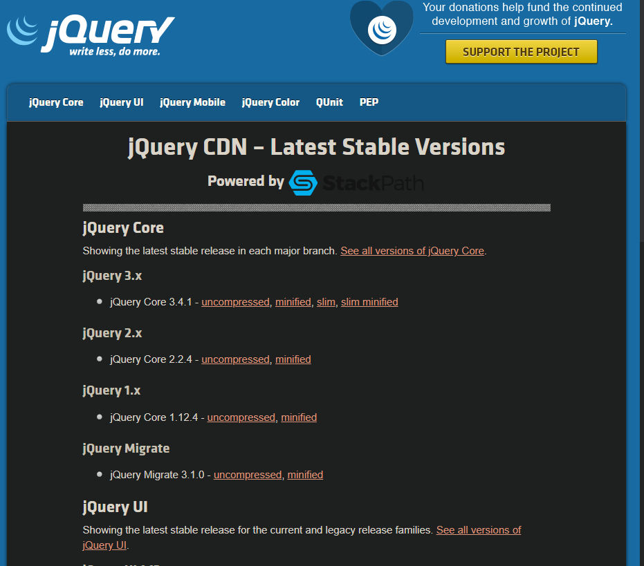
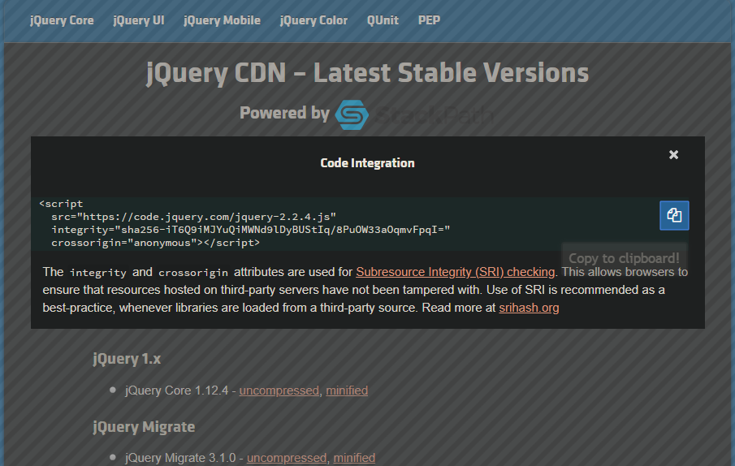

## 1. Getting started with jQuery

### 1.1. Getting Started

```html
<!DOCTYPE html>
<html>
  <head>
    <title>Hello, World!</title>
  </head>
  <body>
    <div>
      <p id="hello">Some random text</p>
    </div>
    <script src="https://code.jquery.com/jquery-2.2.4.min.js"></script>
    <script>
      $(document).ready(function() {
        $('#hello').text('Hello, World!');
      });
    </script>
  </body>
</html>
```

打開瀏覽器的話，p 裡面的 Some random text 會變成 Hello, World!

**Explanation of code**

1. 從 CDN 引入 jQuery 函式庫

   ```html
   <script src='https://code.jquery.com/jquery-2.2.4.min.js></script>
   ```

   這會引入 \$ 全域變數，這是 jQuery 函數和命名空間的別名。

   > 注意: 在引入 jQuery 時，最常見的錯誤之一是，在可能依賴或利用 jQuery 的其他函式庫之前，未能將 jQuery 引入載入。

2. 延遲一個函式的執行，當 DOM 被 jQuery 偵測到 ready 時，才執行延遲的函式。

```javascript
// when the document is `ready`, execute this function
$(document).ready(function() {...});

// A commonly used shorthand version (behaves the same as the above);
$(function() {...});
```

3. 一旦 DOM 準備好了，jQuery 執行一個回呼函式 (如上所示)。在我們的函式中，這個回呼函式主要完成兩個任務
   1. 取得 id 屬性等於 hello 的元素。使用選取器作為傳遞的參數是 jQuery 功能和命名的核心；整個函式庫基本上是從擴充 document.querySelectorAll 演變而來
   2. 設定 text() 在所選的元素，設為 Hello, World!  
      \# ↓ - Pass a `selector` to `$` jQuery, returns our element  
      \$('#hello').text('Hello, World!');  
      \# ↑ - Set the Text on the element

### 1.2. Avoiding namespace collisions

jQuery 以外的其他函式庫可能也使用 \$ 作為別名。這可能導致其他函式庫與 jQuery 之間發生干擾。

為了釋放 \$ 供其他函式庫使用:

```javascript
jQuery.noConflict();
```

呼叫這個函式之後，\$ 就不在是 jQuery 的別名了。然而，你仍然可以使用 jQuery 來存取 jQuery 的函式。

```javascript
jQuery('#hello').text('Hello, World!');
```

可選的，你可以分配一個不同的變數名稱作為 jQuery 的別名:

```javascript
var jqy = jQuery.noConflict();
jqy('#hello').text('Hello, World!');
```

相反的，為了防止其他函式庫干擾 jQuery，你可以將使用到 jQuery 的程式碼使用立即函式 (IFEE) 包裝起來，並將 jQuery 作為參數傳入。

```javascript
(function($) {
  $(document).ready(function() {
    $('#hello').text('Hello, World!');
  });
})(jQuery);
```

`在 IFFE 中，\$ 就是只是 jQuery 的別名`

保護 jQuery 的 \$ 別名並確保 DOM 準備就緒的另一種簡單方法：

```javascript
jQuery(function($) {
  // DOM is ready
  // You're now free to use $ alias
  $('#hello').text('Hello, World!');
});
```

總結:

- jQuery.noConflict(): \$ 不再參考 jQuery，而是使用 jQuery 變數
- var jQuery2 = jQuery.noConflict(): \$ 不再參考到 jQuery ，而 jQuery 變數與 jQuery2 變數還是可以參考到 jQuery

#### 第三種使用情境

現在如果我們只想要 jQuery 只能被 jQuery2 參考要怎麼辦?

```javascript
var jQuery2 = jQuery.noConflict(true);
```

上面將會導致 \$ 或是 jQuery 都不再參考 jQuery

當有多個版本的 jQuery 要載入到同一個頁面時，這是很有用的

```javascript
<script src='https://code.jquery.com/jquery-1.12.4.min.js'></script>
<script>
var jQuery1 = jQuery.noConflict(true);
</script>
<script src='https://code.jquery.com/jquery-3.1.0.min.js'></script>
<script>
// Here, jQuery1 refers to jQuery 1.12.4 while, $ and jQuery refers to jQuery 3.1.0.
</script>
```

### 1.3. jQuery Namespace ("jQuery" and "\$")

jQuery 變數是撰寫 jQuery 程式碼的起始點。他可以用來作為函式 jQuery(...) 或是變數 jQuery.foo。

\$ 是 jQuery 的別名，通常兩者可以相互互換（已使用 jQuery.noConflict（）; 的情況除外-請參閱避免名稱空間衝突）。

假設我們使用以下 HTML 程式碼

```javascript
<div id="demo_div" class="demo"></div>
```

我們可能想要加入一些文字內容到 div 中。我們可以使用 jQuery text() 函式。

```javascript
jQuery('#demo_div').text('Demo Text!');
// or
$('#demo_div').text('Demo Text!');
```

由於 \$ 比 jQuery 更為簡潔，因此通常是撰寫 jQuery 程式碼的首選方法。

jQuery 使用 CSS 選擇器，在上面的範例中使用了 ID 選擇器。 有關 jQuery 中選擇器的更多訊息，請參見選擇器類型。

### 1.4. Loading jQuery via console on a page the does not have it

有時人們必須作業於沒有使用 jQuery 的網頁，但是大多數開發人員習慣使用 jQuery。

在這種情況下，可以使用 Chrome Developer Tools 控制台（F12）通過執行以下命令在加載的網頁上手動添加 jQuery：

```javascript
var j = document.createElement('script');
j.onload = function() {
  jQuery.noConflict();
};

j.src = 'https://ajax.googleapis.com/ajax/libs/jquery/1.12.4/jquery.min.js';
document.getElementsByTagName('head')[0].appendChild(j);
```

### 1.5. Include script tag in head of HTML page

要從官方 CDN 加載 jQuery，請訪問 jQuery 網站。 您會看到可用的不同版本和格式的列表。



進入網頁後可以選擇要載入的版本以及程式碼的資源 uncompressed 或是 minified



將上面的 src 複製到 head 或是 body 裡面

最佳做法是使用 async 屬性在 head 標籤處加載所有外部 JavaScript 類別庫。

```html
<!DOCTYPE html>
<html>
  <head>
    <title>Loading jquery-2.2.4</title>
    <script src="https://code.jquery.com/jquery-2.2.4.min.js" async></script>
  </head>
  <body>
    <p>This page is loaded with jquery.</p>
  </body>
</html>
```

當使用 async 時，請注意，因為 javascript 函式庫隨後會非同步加載並且盡快執行。如果包含的兩個函式庫，其中第二個函式庫依賴於第一函式庫，在此情況下，如果第二個函式庫在第一個函式庫之前加載並執行，可能會引起錯誤，並且程式可能會中斷。

### 1.6. The jQuery Object

每次 jQuery 是使用 \$() 或是 jQuery() 呼叫時，在內部，他是使用 new 來建立 jQuery 實例。下面是說明如何建立新物件

```javascript
// Define a local copy of jQuery
jQuery = function(selector, context) {
  // The jQuery object is actually just the init constructor 'enhanced'
  // Need init if jQuery is called (just allow error to be thrown if not included)
  return new jQuery.fn.init(selector, context);
};
```

jQuery 在內部將其原型稱為 .fn 並且此處內部實例化 jQuery 物件所使用的樣式允許公開該原型，而不須呼叫方明顯使用 new。

除了設置實例（公開的 .each，children，filter 等 jQuery API 的方法）之外，jQuery 內部還將建立類似於陣列的結構以匹配選擇器的結果（前提是除了參數之外，傳遞了其他內容（未定義，undefined，null 或類似內容）作為參數）。對於單個項目，這種類似陣列的結構將僅容納該項目。

一個簡單的範例是找到一個具有 id 的元素，然後訪問 jQuery 物件以返回底層的 DOM 元素（當匹配或存在多個元素時，這也將起作用）。

```javascript
var $div = $('#myDiv'); //populate the jQuery object with the result of the id selector
var div = $div[0]; //access array-like structure of jQuery object to get the DOM Element
```
