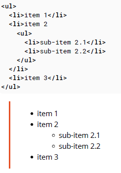
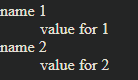
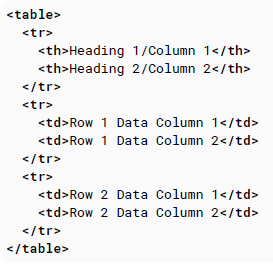
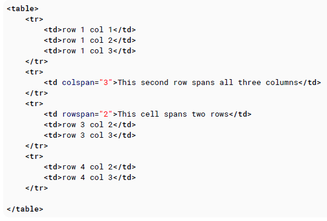
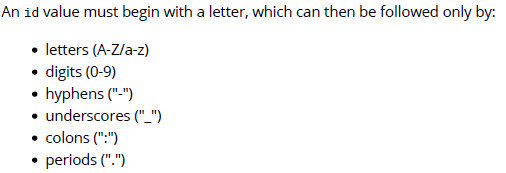

# 100 days of code front end - Day 02

## 前言

昨天一天學習了 HTML, DOCTYPE, 段落, 格式化文字, 錨點與超連結，稍微總結一下昨天所學到的。

HTML 主要是網頁的架構，有了主體的架構之後，會再透過 CSS 幫網頁進行美化外觀，如果想要讓使用者與網頁之間有有更好的互動體驗，會再搭配 JavaScript 的程式，讓使用者可以與網頁進行互動。

在撰寫 HTML 網頁時，會透過定義 DOCTYPE 的方式，讓瀏覽器知道，目前使用的 HTML 　的版本是多少，目前我們在撰寫 Doctype 的話，通常只要 \<!DOCTYPE> 這樣寫瀏覽器就會知道是使用 HTML5 的版本。

HTML 元素的組成通常會包含開始標籤與結束標籤，但有一些 HTML 元素並未包含結束標籤，這些通常叫做空元素。

通常一篇文章會有標題與內容，標題的話我們會使用 h1~h6 六種等級的標題標籤，來標示出文章的標題，並且會使用段落標籤 p ，來將內容標記出來，通常文章會有一些需要強調語氣的部分，就會使用 strong, em 等標籤，讓文章的語氣加強，或是使用 b, i 來凸顯文章的重點部分等格式化文字。

最後我們可能會想要連結到不同的網站，或是在一篇文章中設定錨點，只要 url 指定錨點 id 就可以立即跳至指定的地方，此功能是使用 a 標籤來達成。

經過昨天的測試，我發現單純看文件學習的成效好像沒有想像中來的好，我覺得我比較適合做中學，昨天只有少為寫到一點 HTML 的程式碼，今天我希望可以稍微製作一點網站的樣子出來，從做中學我覺得只有這樣才會學的比較快。

今天是第二天，希望能持續下去，每天進步一點點!!!

## 筆記

### 7.Lists

HTML 提供了三種方式來指定 List: 有序清單, 無序清單與說明清單。

- Ordered list 使用了有序序列的方式來表示有順序的元素
- Unordered list 使用符號例如原點來當作元素的標記，不具有順序意義
- Description list 使用縮排來列出他們的子元素。

#### 7.1 Ordered List (ol)

有順序的列表通常會使用 ol 標籤並且每個列表項目會使用 li 的元素將內容包起來

```html
<ol>
  <li>Item</li>
  <li>Another Item</li>
</ol>

// 1. Item // 2. Another
```

我們可以手動的改變號碼的顯示，可在 ol 元素加上 start 的屬性指定要從幾號開始  
ex. `<ol start='3'>`  
這樣就會從 3 號開始編碼

也可以直接對裡面的項目指定號碼  
ex. `<li value='7'>`  
後面的 li 就會跟著這個值繼續往下加一排下去

切記 start 與 value 只接受數值，即使呈現的方式是使用羅馬數字還是一樣

如果我們想要將編碼順序由大到小排列，可在 ol 標籤加上 reversed  
`<ol reversed>`  
順序就會是由大到小

`變更順序樣式` \<ol type="1|a|A|i|I0">

#### 7.2 Unordered List (ol)

無順序的列表通常會使用 ul 標籤並且每個列表項目會使用 li 的元素將內容包起來

```html
<ul>
  <li>Item</li>
  <li>Another Item</li>
</ul>

// . Item // . Another
```

當有順序的清單順序並不是很重要時，應該使用無序清單的方式呈現。

#### 7.3 Nested List



#### 7.4 Description List

敘述清單可透過 dl 的標籤創造。標籤是使用 dt 建立，而裡面的項目名稱是使用 dd 創建

```html
<dl>
  <dt>name 1</dt>
  <dd>value for 1</dd>
  <dt>name 2</dt>
  <dd>value for 2</dd>
</dl>
```



## 8. Tables

https://footmark.info/web-design/html/html-table-structured-merge-group/

### 8.1 Simple Table

HTML 的 table 標籤可呈現表格資料，如文字, 圖片, 連結, 其他表格等

HTML 的表格是以 row 先定義，在定義 column



上面的 table 共有三列 tr，第一列式欄位名稱 th，其他兩列為欄位資料 td

- table 表
- tr 列
- th 欄位名稱
- td 欄位資料

### 8.2 Spanning columns or rows

可以在 td 屬性指定 colspan 或是 rowspan  

Result:


rowspan 只能是非負整數，其預設值是 1 ，如果將屬性設為 0 的話，會直接跨列到最後一列

colspan 只能是非負整數，其預設值是 1 ，如果將屬性設為 0 的話，會直接跨欄到最後一欄

### 8.3 Column Groups

`<colgroup>` 將表格中的 columns 群組

- 必須使用在 `<caption>` 標籤之後，且在任何 `<thead>,<tbody>,<tfoot>,<tr>` 標籤之前
- 可以向整個 columns 套用樣式，而不需重複為每個單元格或每一 column 設定樣式

### 8.4 Table with thead, tbody, tfoot and caption

`<thead>, <tbody>, <tfoot>, <caption>` 這些元素對於添加語意值到你的表中是非常有用的，並且提供個別的 CSS 樣式。

### 8.5 Heading Scope

scope 定義表頭單元格是否是 column, row, group columns 或是 group rows

## 9. Comments

HTML 提供開發者註解功能說明，但此註解並不會顯示到使用者畫面上
`<!-- -->`

## 10. Classes and IDs

> class: 表示元素的 class (非唯一)  
> id: 表示元素的 id (唯一)

class 與 id 讓腳本語言或是樣式表更容易的參考到 html 元素

class 屬性的名稱可以用於多個標籤 (多用於 CSS)

id 屬性名稱只能有唯一的名稱，並不能有重複的名稱 (多用於 javascript，並不建議在 CSS 中使用)

### 10.1 Giving an element a class

使用 class 屬性指定 class 名稱

```html
<div class="example-class"></div>
```

指定多個 class 名稱到同一個元素的 class 屬性中，多個 class 名稱之間使用空白隔開

```html
<div class="class1 class2"></div>
```

`CSS 使用 class`  
class 可用於樣式化某些元素，而毋需更改此類所有元素

```html
<span></span> <span class="special"></span>
```

同樣的 class 名稱可以分配給多個元素使用，這樣樣式表就可以透過 class 名稱給所有有命名的 class 一樣的樣式

```html
<div class="highlight">Lorem ipsum</div>
<span class="highlight">Lorem ipsum</span>
```

以 CSS 來說如果只想針對 div 套用 class 樣式可以這樣寫:

```html
div.highlight { color: green; }
```

通常一般會建議使用 class 名稱就好不要使用元素如上所述

class 可以是巢狀的

```html
.main .highlight { color: red;}
```

代表 .main 底下所有的.highlight class 名稱字形色彩要套用紅色的

```html
.footer > .highlight {color: blue;}
```

代表底下一層的 class .highlight 要套用樣式

### 10.2 Giving an element an ID

元素的 ID 屬性在整份 HTML 文件中必須是唯一的。此目的是黨在進行連結(錨點), 腳本語言或是 CSS 時要獨立識別元素。

通常 id 在 js 與 css 中都會前綴一個 #

### 10.3 Acceptable Values

ID

- 在文件中必須是唯一
- id 名稱不可以有空白
- 必須至少包含一個字元



Class
class 命名規則與 id 是一樣的
只是多個元素可以使用同一個 class 名稱

切記: 在 id 或 class 中，使用數字、標點符號或是特殊字元可能會在其他情況下引起不必要的麻煩

### 11. Data Attributes

#### 11. Older browsers support

早期的瀏覽器並沒有支援 Data Attribute 的功能，但是他們還是可以自行建立屬性名稱，並且檢索他們透過 javascript 的 setAttribute 與 getAttribute 的方法，只是你不能使用新的 dataset 屬性

#### 11.2 Data Attributes

HTML5 data-\* 屬性提供了儲存資料在 HTML 元素中的方便的方式。這個儲存的資料可以被 javascript 讀取或修改

```html
<div data-submitted="yes" class="user_profile">
  ... some content...
</div>
```

- Data Attribute 結構為 data-\* 名稱跟在 data-後面。使用此名稱屬性可以被存取
- 儲存的資料資料屬於字串格式 (包含 json)
