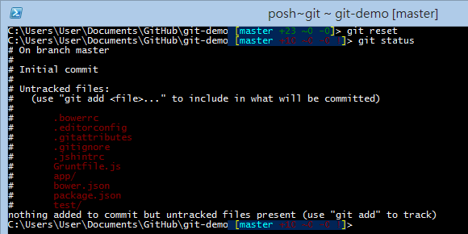
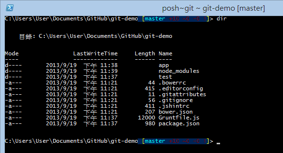
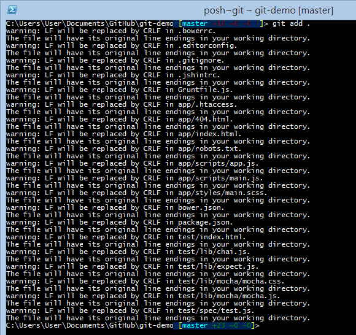
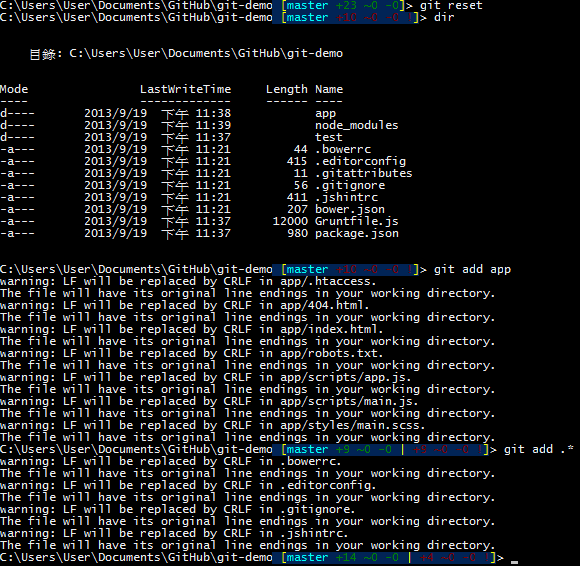
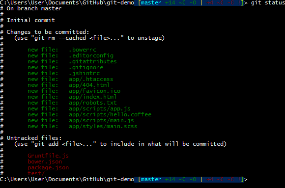
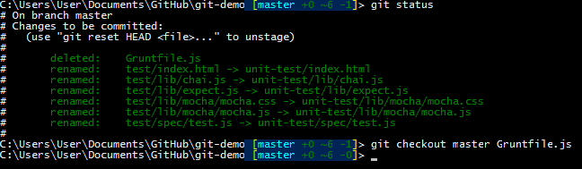

## 常用的 Git 版本控管指令
基本操作例如
- 新增
- 刪除
- 重新命名檔案
- 提交變更
- 查詢歷史紀錄等工作

### 建立儲存庫 git init
`git init`: 建立儲存庫 (預設儲存庫會放在 .git 資料夾中)
`git init --bare`: 建立共同儲存庫

### 查詢當前工作目錄狀態 git status
`git status`: 可用來查詢當前工作目錄的索引狀態

### 加入版本管控 git add .
`git add` 將檔案加入到 Git 版本控管。

如果使用 git shell 的 cmd 工具的話，會在命令提示的輸入開頭地方顯示檔案狀態
ex.

`[master +10 ~0 -0 !]`
- master 代表目前工作目錄是 master 分支，也是 Git 的預設
- 「紅色」的數字都代表為追蹤 (Untracked) 的檔案，也就是這些變更都不會進入版本控管。
- +10 代表有 10 個「新增」的檔案
- ~0 代表有 0 個「修改」的檔案
- -0 代表有 0 個刪除的檔案

將新增的檔案加入 Git 版本控管，你必須使用以下指令
> git add .

下這個指令，會將工作目錄下所有的檔案、目錄與子目錄下的所有檔案，全部都會加入到 Git 工作目錄的﹝索引﹞ 或﹝快取﹞ 中。 (此時並沒有建立任何版本，只是告知 Git 這些檔案即將被加入到 Git 版本庫而已)

命令提示字元的輸入開頭地方，原本由「紅色的數字」現在變成「綠色的數字」
- 「綠色」的數字代表 Staged (準備好的檔案)，也就是這些變更才會進入版本控管。
- +23 代表有 23 個「新增」的檔案將被建立一個版本
- ~0 代表有 0 個「修改」的檔案將被建立一個版本
- -0 代表有 0 個「刪除」的檔案將被建立一個版本

### 重設工作目錄的索引狀態 git reset
`git reset`: 重設工作目錄的索引狀態
> 將原本有進行 git add 的檔案，重新返回成未進入 git 版本控管前的狀態

### 新增部分檔案
剛剛提到的 git add . 指令會自動將所有檔案 (含子目路的檔案) 加入到工作目錄索引中，有時我們只想讓特定目錄或特定檔案加入版本，此時你也可以指定特定目錄，或利用萬國字元來加入檔案。

git add app 新增 app 這個資料夾底下的所有檔案

git add .* 新增所有以「點」開頭的檔案

### 提交變更 / 建立版本 git commit
在建立版本之前需先使用 git add 將本次預計更新為此版本的檔案加入

建立版本如下:
> git commit
> git commit -m "版本紀錄的說明文字"

在 Git 版本控管中，所有的版本都必須擁有 「版本紀錄的說明文字」(Log)

### 查詢歷史紀錄 git log
想要查詢版本歷史紀錄可以使用 `git log` 指令

有時紀錄太多可以使用 - 加上一個數字，輸出最近幾筆的資料
> git log -10

### 刪除檔案 git rm
`git rm`: 刪除檔案
> git rm 'Gruntfile.js'

這個 `git rm` 的指令執行時，會做兩件事情
1. 刪除工作目錄下的 'Gruntfile.js' 實體檔案 (代表真的能將這個實體檔案刪除)
2. 刪除工做目錄快取的 'Gruntfile.js' 這個檔案 (用來標示這個刪除檔案的動作要列入版本控管)

### 檔案更名 git mv
`git mv`: 用來變更檔案或目錄名稱
> git mv test unit-test
同樣這個操作會直接加入到版本控管

### 重置目前的工作目錄 git reset --hard
我們曾經學過如何利用 `git reset` 重置目前工作目錄的索引狀態，但請注意，這個指令預設只會重置「索引狀態」，那些你用 `git rm` 刪除的目錄或檔案，還是用 `git mv` 更名的目錄或檔案，透過 `git reset` 都無法把「實體檔案」給救回來。

如果想把工作目錄也給還原到目前的最新版，則必須輸入以下指令：
> git reset --hard

### 還原其中一個被改壞的檔案
如果檔案編輯到一半，發現被改壞了，你希望能救回沒修改前的本本，此時你可以利用以下指令還原
> git checkout master Gruntfile.js

使用此方式可以避免 git reset --hard 一次還原所有檔案