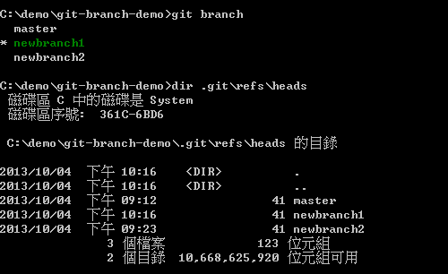

# 100 days of code front end - Day 39
## 解析 Git 資料結構 - 索引結構

### 關於索引
索引 (index)、快取 (cache)、目錄快取 (Directory cache)、
當前目錄快取 (Current directory cache)、
Staging area (等待被 commit 的地方)、Staged files(等待被 commit 的檔案)

「索引」的主要目的用來紀錄「有哪些檔案即將要被提交到下一個 commit 版本中」。

如果你像要提交一個版本到 Git 儲存庫，那麼你一定要先*更新索引狀態*，變更才會被提交出去。

這些改變的過程，都是在更新「索引檔」的過程

四種檔案狀態：
- untracked (未追縱的，代表尚未被加入 Git 儲存庫的檔案狀態)
- unmodified (未修改的，代表檔案第一次被加入，或是檔案內容與 HEAD 內容一致的狀態)
- modified (已修改的，代表檔案已經被編輯過，或是檔案內容與 HEAD 內容不一致的狀態)
- staged (等待被 commit 的，代表下次執行 git commit 會將這些檔案全部送入版本庫)

> Git 儲存庫的運作，是將工作目錄裡的變化，透過更新索引的方式，將資料寫入成 Git 物件。

git status -> 查看當前工作目錄下的狀態  
git ls-files -> 可列出所有目前已經存在「索引檔」中的那些檔案路徑

## 關於分支的基本觀念與使用方式
分支 (Branch)

有分支就醫定會有需要合併的場合

### 關於分支的基本觀念
分支的機制，最主要的目的就是用來解決開發過程中版本衝突的問題。

遠端的儲存庫可以有分支，本地的儲存庫可以有分支，你可以從遠端任何一個分支合併(pull)到本地分支，也可以將本地的分支推向(push)遠端的分支，你當然也可以從本地任何一個分支合併(merge)到本地的另一個分支。

好好學會「分支」與「合併」真的非常重要。例如 git-flow 就是一套廣受歡迎的分支管理模式，這不是一套工具，而是一種管理分支的邏輯。

git branch: 查看目前有多少分支

git branch -d [BranchName]: 刪除 git 分支 (無法刪除當前使用中的分支)

git branch [branchName]: 建立分支

git checkout -b [BranchName]: 建立分支並將工作目錄切換到新的分支

git checkout [BranchName]: 切換分支

git checkout [commit_id]: 可將工作目錄切換到此版本

## 比對檔案與版本差異
使用任何版控軟體的過程中，經常需要查看歷史紀錄與比對版本之間的差異。

### git diff 基本觀念
在 Git 中比對兩個版本之間的差異，通常會使用 git diff 命令，指令如下:
1. 先執行 git log 取得版本資訊，並取得最近兩個 commit 物件的 id
2. 在執行 `git diff commit1 commit2` 指令，比對兩個版本之間的差異

從上圖可以看到每一段都是以 `diff --git` 最為開頭，代表 git 對哪兩個檔案進行比對。

--- a/a.txt 代表兩個比對版本中「比較舊的」那個版本
+++ b/a.txt 代表兩個比對版本中「比較新的」那個版本
@@ -1 +1 @@ 代表這個檔案在舊版的總行數與新版的總行數 -1 代表舊版只有 1 行，+1 代表新版只有一行

最後則是列出所有變更的內容，這裡有三種可能的表示法：
- 以減號 - 號開頭，代表從舊版到新版的過程中，此行被刪除了。
- 以加號 + 號開頭，代表從舊版到新版的過程中，此行是被新增上去的。
- 以空白字元開頭，則代表這一行在兩個版本中都有出現，沒有任何變更。

在 Git 中使用 git diff 的時候，事實上是以 tree 物件為比較的單位

## 認識 Git 物件的絕對名稱
- git log: 取得完整的歷史紀錄
- git cat-file -p [object_id]: 取得 tree 物件的詳細內容
- git log --pretty=oneline: 取得較為精簡版本的歷史紀錄
- git log --pretty=online --abbrev-commit: 輸出部分絕對名稱

## 認識 Git 物件的與符號參照
參照名稱 (ref) 簡單來說就是 Git 物件的一個「指標」，或是相對於「絕對名稱」的另一個「好記名稱」，用一個預先定義或你自行定義的名稱來代表某一個 Git 物件。

之前用過的 HEAD (代表最新版本) 或是分支名稱，就是一個參照名稱為的就是好記而已

以分支名稱為例，透過 git branch 取得所以有分支名稱，裡面列出的所有分支名稱其實就是一個「參照名稱」，就代表這些分支對應到各自的 commit 物件

在下圖中你也可以看出這些分支的參照名稱其實就是一個檔案而已，所有「本地分支」的參照名稱皆位於 .git\refs\heads 目錄下：

在大多數的情況下，「參照名稱」通常都會指向一個 commit 物件，但並非必要，你也可以指向其他 Git 物件類型，像是 blob 物件、tree 物件、tag 物件等等。

### 關於 .git/refs/ 目錄
從上述可看出，所有的「參照名稱」都是個檔案，且一律放在 git/refs/ 目錄下。而 Git 的參照名稱所放置的目錄位置，主要有三個:
- 本地分支：.git/refs/heads/
- 遠端分支：.git/refs/remotes/
- 標　　籤：.git/refs/tags/

### 認識物件的符號參照名稱 (symref)
在 Git 工具中，預設會維護一些特別的符號參照，方便我們快速取得常用的 commit 物件，且這些物件預設都會儲存在 .git/ 目錄下。

- HEAD: 
  - 永遠會指向「工作目錄」中所設定的「分支」當中的「最新版」
  - 所以當你在在這個分支執行 `git commit` 後，這個 `HEAD` 符號參照也會更新成該分之最新版的那個 commit 物件。
- ORIG_HEAD:
  - 簡單來說就是 HEAD 這個 commit 物件的「前一版」，經常用來復原上一次的版本變更
- FETCH_HEAD:
  - 使用遠端儲存庫時，可能會使用 `git fetch` 指令取回所有遠端儲存庫的物件。這個 FETCH_HEAD 符號參照則會記錄遠端儲存中每個分支的 HEAD (最新版) 的 「絕對名稱」。
- MERGE_HEAD:
  - 當你執行合併工作時，「合併來源｣的 commit 物件絕對名稱會被記錄在 MERGE_HEAD 這個符號參照中。

### 一般參照與符號參照的使用方式
事實上你可以建立任意數量的「自訂參照名稱」，只要透過 git update-ref 就可以自由建立「一般參照」

## 認識 Git 物件的相對名稱
