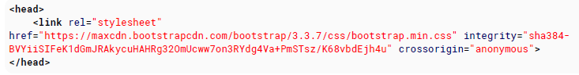

# 100 days of code front end - Day 03

## 前言

昨天主要學習了 List, Table, Comment, Id and Classes, Data Attribute，裡面我最不熟悉的就是 Data Attribute 了，因此今天我會特定花一些時間在搞懂一點。

List 主要有三種，有序清單、無序清單以及描述清單，在有序清單的部分，比較特別的是可以決定清單的起始號碼 "start" 以及裡面項目自行指定號碼 "value"，而後的號碼會隨著此號碼加一延續下去; 無序清單就一般的沒有順序的清單，蠻好理解的，再來是巢狀清單，清單裡面還可以再放置清單，最後是描述清單，我覺得蠻像凸排與縮排，只是清單的符號變成文字，dl > dt > dd

Table 的話 HTML 的表格是以 row 先定義，在定義 column，tr, th, td，然嘔我們可以指定 colspan 以及 rowspan 決定是否有要跨欄或是跨列，值得注意的是如果 colspan 或是 rowspan 的值指定為 0 的話，回直接跨欄或是跨列到最後 (只能是非負整數)。另外 colgroup 就是可以將整個 columns 套用樣式，而不需重複為每一個單元格設定樣式，另外還有一些 table 元素，caption, thead, tbody, tfoot 可以在設計的詳細一點，最後是 Heading Scope，可設定 col, row, colgroup, rowgroup 等屬性值。

Comment 註解就沒什麼好說的了，使用 `<!---->` 的方式進行 HTML 文件的註解

Classes 與 ID，主要的概念就是 classes 可以讓多個元素命名，但是 id 在一份 html 中只能有一個名稱不能重複

最後是 DataAttribute 好像是可以提供暫存的資料在 HTML 元素的屬性中，然後可以透過 JavaScript 進行存取。

昨天嘗試使用目前所會的技能想說寫一個 google 翻譯網頁的畫面，但是我發現我好像目標一開始訂得太大了，
想要在短短的一小時內將網頁做出來，想想也覺得好笑，雖然網頁事沒有做出來，但是過程中，回想一些之前學習的
概念，在今天進行搜尋變得比較能夠理解之前無法看懂的內容，我覺得這還算是不錯的，因此我決定我會持續這個
撰寫的活動下去，並且不會將一開始的目標訂得很大，先從非常簡單的靜態網頁開始 (沒有動畫或其他特效)，先釐清
網頁的版面規劃，然後我有一個另外的想法是，我一開始會在參考 YouTube 上面別人做的範例，跟著影片一起做，
雖然一開始一定會有很多不懂，但我相信這對接下來的學習日子是很有幫助的。

Data Attribute 補充: 之所以會有 data-_ 的出現，是因為在製作網頁的過程中，我們會添加一些自己需要用到的屬性名稱，以便自己理解，但總不能每個人在自己的網頁裡面都定義自己的屬性名稱，於是為了避免大家在 HTML 結構中隨意的添加屬性，在 HTML5 就多了 data-_ 的屬性，其中 \* 就是一個可以自定義的名稱。

JavaScript 可透過 dataset 的物件，就可以取得


也可透過 CSS 取得 data-\*


## 筆記
### 12. Linking Resources
href: 指定欲連結檔案的路徑
rel: 指定當前文件與 link 的文件之間的關係

#### 12.1 JavaScript
`同步`
```html
<script src='path/to.js'></script>
```
標準實務是將 JavaScript 的 Script 標籤放在 body 結束標籤的前面，這是因為應該要先讓你的網站視覺先顯示出來，並且也不建議你畫面元素還沒有載完就使用 JavaScript 與畫面互動。

`非同步`
```html
<script src='path/to.js'></script>
```
另一種情況是，JavaScript 程式碼的載入並不需要與畫面初始化一起，因此 JavaScript 的載入可以是非同步的

使用非同步瀏覽器將以平行加載腳本的內容，並且在完全下載後，會先中斷 HTML 的解析，為了要先解析 JavaScript 

`Deferred`
```html
<script src='path/to.js' defer></script>
```
延遲腳本就像非同步腳本，只有在 HTML 完全被解析後。延遲腳本保證按照聲明的順序載入，語同步腳本相同。

`noscript`
```html
<noscript>JavaScript disabled</noscript>
```
noscript 元素顯示定義內容，當使用者的腳本不可使用或是瀏覽器不支援此腳本時使用。

#### 12.2 External CSS Stylesheet
```html
<link rel='stylesheet' href='path/to.css' type='text/css'>
```
最標準的實務勢將 CSS link 標籤放在 head 標籤裡面。使用這種方式 CSS 每次都會先被載入並且頁面在載入的過程將會被應用到網頁上，而不是先顯示尚未樣式化的 HTML 直到 CSS 載入完成才樣式化。

還有另一種比較不常見的做法是直接在 style 內使用 @import 的語法將 css 檔案載入

```html
<style type='text/css'>
   @import('path/to.css')
</style>

<style>
   @import('path/to.css')
</style>
```

#### 12.3 Favicon
檔案名稱 favicon.ico 如果放在網站的根目錄，會被自動的載入，而不需要 `<link>` 標籤

#### 12.4 Alternative CSS

### 13. Include JavaScript Code in HTML
#### 13.1 Handling disabled javascript
有可能客戶的連覽器不支援 javascript 或是 javascript 的執行被禁止可能由於安全性因素。  
為了告訴使用者應該在頁面中執行腳本，可以使用 `<noscript>` 標籤。
noscript 李面的內容會在 javascript 在當前頁面禁止使用時顯示出來  
```html
<script>
   document.write('hello world')
</script>
<noscript>This browser does not support JavaScript</script>
```
#### 13.2 Linking to an external JavaScript file
```html
<script src='example.js'></script>
```
src 屬性就像 href 屬性可以指定相對與絕對路徑

#### 13.3 Directly including JavaScript code
直接寫 javascript code 在 script 裡面
```html
<script type='text/javascript'>
   // JavaScript code
</script>
```

#### 13.4 Including a JavaScript file executing asynchronously
```html
<script type='text/javascript' src='URL' async>
```

補充：
```html
<script src='demo.js'><script>
```
整個網頁的渲染會停下來，等 demo.js 下載玩並執行完，網頁渲染才會繼續 (所以才要將它放在 body 的最後面)

```html
<script src='demo.js' defer></script>
```
網頁渲染不會停下來，demo.js 在背景下載，帶 DOMContentLoaded 5在執行 demo.js

```html
<script src='demo.js' async></script>
```
網頁渲染不會停下來，demo.js 在背景下載，等 demo.js下載完畢，網頁渲染會停下來，執行 demo.js，等 demo.js 執行完畢，網頁渲染繼續。

### 14. Using HTML with CSS
CSS 提供 HTML 頁面外觀。inline styling 意味著將 style 屬性在標籤中設定，而且此方法是非常不鼓勵的。

internal stylesheets 使用 style 標籤，直接將 css 寫在 html 檔案中

external stylesheets 需透過 link 標籤將外部的 CSS 檔案引入

#### 14.1 External Stylesheet Use
使用 link 標籤寫在 html 檔案的 head 標籤中
```html
<head>
  <link rel='stylesheet' type='text/css' href='stylesheet.css'>
</head>
```
也可以透過提供網址的方式將 CSS 匯入


#### 14.2 Internal Stylesheet
可以將 css 元素直接寫在 style 標籤中
```html
<head>
   <style type='text/css'>
       body {
           background-color: gray;
       }
   </style>
```
#### 14.4 Inline Style
可直接指定 style 到元素上
```html
<span style='color:red'>This text will appear in red.</span>
```