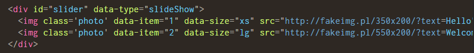
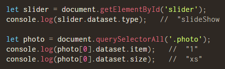
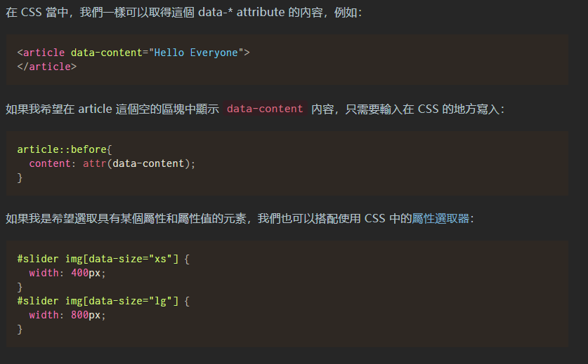

# 100 days of code front end - Day 03

## 前言

昨天主要學習了 List, Table, Comment, Id and Classes, Data Attribute，裡面我最不熟悉的就是 Data Attribute 了，因此今天我會特定花一些時間在搞懂一點。

List 主要有三種，有序清單、無序清單以及描述清單，在有序清單的部分，比較特別的是可以決定清單的起始號碼 "start" 以及裡面項目自行指定號碼 "value"，而後的號碼會隨著此號碼加一延續下去; 無序清單就一般的沒有順序的清單，蠻好理解的，再來是巢狀清單，清單裡面還可以再放置清單，最後是描述清單，我覺得蠻像凸排與縮排，只是清單的符號變成文字，dl > dt > dd

Table 的話 HTML 的表格是以 row 先定義，在定義 column，tr, th, td，然嘔我們可以指定 colspan 以及 rowspan 決定是否有要跨欄或是跨列，值得注意的是如果 colspan 或是 rowspan 的值指定為 0 的話，回直接跨欄或是跨列到最後 (只能是非負整數)。另外 colgroup 就是可以將整個 columns 套用樣式，而不需重複為每一個單元格設定樣式，另外還有一些 table 元素，caption, thead, tbody, tfoot 可以在設計的詳細一點，最後是 Heading Scope，可設定 col, row, colgroup, rowgroup 等屬性值。

Comment 註解就沒什麼好說的了，使用 `<!---->` 的方式進行 HTML 文件的註解

Classes 與 ID，主要的概念就是 classes 可以讓多個元素命名，但是 id 在一份 html 中只能有一個名稱不能重複

最後是 DataAttribute 好像是可以提供暫存的資料在 HTML 元素的屬性中，然後可以透過 JavaScript 進行存取。

昨天嘗試使用目前所會的技能想說寫一個 google 翻譯網頁的畫面，但是我發現我好像目標一開始訂得太大了，
想要在短短的一小時內將網頁做出來，想想也覺得好笑，雖然網頁事沒有做出來，但是過程中，回想一些之前學習的
概念，在今天進行搜尋變得比較能夠理解之前無法看懂的內容，我覺得這還算是不錯的，因此我決定我會持續這個
撰寫的活動下去，並且不會將一開始的目標訂得很大，先從非常簡單的靜態網頁開始 (沒有動畫或其他特效)，先釐清
網頁的版面規劃，然後我有一個另外的想法是，我一開始會在參考 YouTube 上面別人做的範例，跟著影片一起做，
雖然一開始一定會有很多不懂，但我相信這對接下來的學習日子是很有幫助的。

Data Attribute 補充: 之所以會有 data-_ 的出現，是因為在製作網頁的過程中，我們會添加一些自己需要用到的屬性名稱，以便自己理解，但總不能每個人在自己的網頁裡面都定義自己的屬性名稱，於是為了避免大家在 HTML 結構中隨意的添加屬性，在 HTML5 就多了 data-_ 的屬性，其中 \* 就是一個可以自定義的名稱。

JavaScript 可透過 dataset 的物件，就可以取得

也可透過 CSS 取得 data-\*

