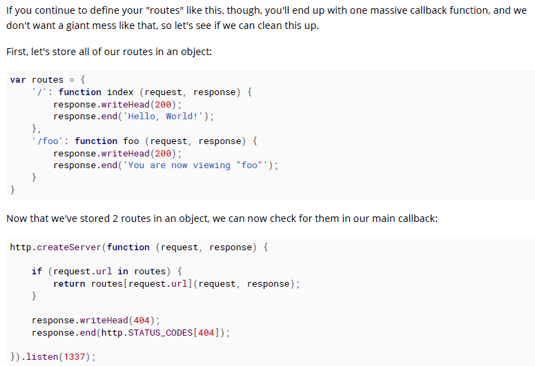

# 100 days of code front end - Day 40
## 前言
Node.js 是一個開源的專案、跨平台 JavaScript 執行環境，讓 JavaScript 可以在瀏覽器以外執行。

Node.js 讓 JavaScript 不僅是 ClientSide 語言，也可以是 ServerSide 語言。

除此之外，Node.js 也可以用於建立命令提示字元小工具。

> 使用命令提示字元時，參數是被儲存在 `process.argv` 陣列中，裡面包含以下參數
> - [0]: Node.js 程式啟動的路徑位置
> - [1]: 該檔案的路徑位置
> - [2-n]: 輸入的參數
> 另外 process.exit(1); Exit the app (success: 0, error: 1)

Express 是一個框架可用來建立 HTTP Server，這個框架對於建立 HTTP APIs 相當的方便

安裝 express -> npm install --save express

Node.js Debugging 工具
> npm install -g node-inspector 

不知道好不好用

當知道怎麼建立 HTTP Server 之後，最重要的是要了解如何根據使用者導覽到的路徑"執行"工作，這種現象稱為"路由"。

簡言之就是根據使用者的輸入在 Server 中我們應該以什麼樣的策略去回應他，幫這個要求路由到指定的處理函式。

大部分的範例會是用 if (request.url === 'some/path/here') 去做檢查，然後呼叫對應的函式

但是如果是用這種判斷方式這樣路由的程式碼就會很多，

因此通常會將各自的回呼函式包含到一個 routes 的物件中，

可以在要運行 Server 的機台在 Node.js Server 中監聽 process.env.PORT 讓他自己去監聽想要的 port
