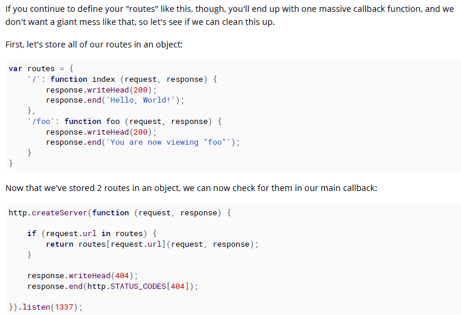

# 100 days of code front end - Day 40
## 前言
Node.js 是一個開源的專案、跨平台 JavaScript 執行環境，讓 JavaScript 可以在瀏覽器以外執行。

Node.js 讓 JavaScript 不僅是 ClientSide 語言，也可以是 ServerSide 語言。

除此之外，Node.js 也可以用於建立命令提示字元小工具。

> 使用命令提示字元時，參數是被儲存在 `process.argv` 陣列中，裡面包含以下參數
> - [0]: Node.js 程式啟動的路徑位置
> - [1]: 該檔案的路徑位置
> - [2-n]: 輸入的參數
> 另外 process.exit(1); Exit the app (success: 0, error: 1)

Express 是一個框架可用來建立 HTTP Server，這個框架對於建立 HTTP APIs 相當的方便

安裝 express -> npm install --save express

Node.js Debugging 工具
> npm install -g node-inspector 

不知道好不好用

## Nodejs 路由 (Routing)

當知道怎麼建立 HTTP Server 之後，最重要的是要了解如何根據使用者導覽到的路徑"執行"工作，這種現象稱為"路由"。

簡言之就是根據使用者的輸入在 Server 中我們應該以什麼樣的策略去回應他，幫這個要求路由到指定的處理函式。

大部分的範例會是用 if (request.url === 'some/path/here') 去做檢查，然後呼叫對應的函式

但是如果是用這種判斷方式這樣路由的程式碼就會很多，

因此通常會將各自的回呼函式包含到一個 routes 的物件中，

## Deploying your application online
可以在要運行 Server 的機台在 Node.js Server 中監聽 process.env.PORT 讓他自己去監聽想要的 port

### Nodejs Core Modules
Node.js 是 JavaScript 的引擎 (Google Chrome 的 Google V8 引擎，由 C++ 寫成) ，其允許 JavaScript 在瀏覽器之外的地方執行。

該引擎也附贈了一些實現基本功能的核心模組。

Nodejs 中共有 34 個 Core Module

[assert, buffer, c/c++_addons, child_process, cluster, console, crypto, deprecated_apis, dns, domain, Events, fs, http, https, module, net, os, path, punycode, querystring, readline, repl, stream, string_decoder, timers, tls_(ssl), tracing, tty, dgram, url, util, v8, vm, zlib]

- assert
  - assert 模組提供了簡單的斷言測試期可以使用於測試是否與期望的結果一致。
- buffer
  - 在ECMAScript 2015（ES6）中引入 TypedArray 之前，JavaScript語言沒有用於讀取或操縱二進制資料流的機制。 Buffer 類別是作為 Node.js API 的一部分，便可以在像是 TCP 流和文件系統操作之類的環境中與八位元流進行交互。
- c/c++_addons
  - Node.js Addons 適用 C 或 C++ 撰寫的動態連結的共享物件，可以使用 require() 函式將其加載到 Node.js 中，就像是他們是普通的 Node.js 模組一樣使用。他們主要用於在 Node.js 中提供一個 JavaScript 與 C/C++ 函式庫溝通的介面
  ex. 有點類似 C# 與 C++ 之間的轉換
- child_process
  - child_process 模組提供了建立子程序的功能
- cluster
  - Node.js 的單個實例是在單一執行緒中運行。為了利用多核心系統，使用者有時會希望啟動 Node.js 程序的群集來處理負載。 cluster 模組讓你可以輕鬆建立所有共享伺服器 port 的子程序。
- console
  - 類似於瀏覽器再用的 console ，用於除錯
- crypto
  - 加密模組提供了加密功能，其中包含用於 OpenSSL 的 hash, HMAC, cipher, decipher, 簽章與驗證的一組包裝器
- deprecated_apis
  - 在以下情況下，Node.js可能會棄用API：（a）使用該API被認為是不安全的；（b）已提供改進的替代API；或者（c）預期在未來的主要版本中對該API進行重大更改Node.js 可能棄用 API 2; 
- dns
  - dns 模組兩種不同類別的功能
  - 1.使用底層操作系統功能執行名稱解析的功能，並且不一定執行任何網絡通信。 該類別僅包含一個函數：dns.lookup（）。
  - 2.連接到實際 DNS 服務器以執行名稱解析，並始終使用網絡執行 DNS 查詢的功能。 此類包含dns模塊中的所有功能，但dns.lookup（）除外。1. 使用作業系統
- domain:
  - 該模組即將棄用。大多數最終用戶應該沒有理由使用此模塊。 絕對必須具有域提供的功能的用戶暫時可能會依賴它，但是應該期望將來必須遷移到其他解決方案。
- Events
  - Node.js核心API的大部分都基於慣用的異步事件驅動的體系結構，在該體系結構中，某些類型的對象（稱為“發射器”）會定期發出已命名的事件，這些事件會導致調用功能對象（“偵聽器”）。
- fs
  - 文件I / O由圍繞標準POSIX函數的簡單包裝程序提供。 要使用此模塊，請執行require（'fs'）。 所有方法都有異步和同步形式。
- http
  - Node.js中的HTTP接口旨在支持該協議的許多功能，這些功能傳統上難以使用。 特別是大的，可能是塊編碼的消息。 該界面非常小心，永遠不要緩衝整個請求或響應-用戶能夠流式傳輸數據。
- https
  - HTTPS是基於TLS / SSL的HTTP協議。 在Node.js中，這是作為一個單獨的模塊實現的。
- net
  - net模塊為您提供了一個異步網絡包裝器。 它包含用於創建服務器和客戶端的功能（稱為流）。 您可以將此模塊包含在require（'net'）;中。
- os
  - os 模組提供了幾個作業系統相關的實用方法
- path
  - path 模組提供用於處理文件和目錄路徑的實用方法。
- querystring
  - querystring 模組提供解析與格式化 URL query string 的功能
- readline
  - readline 模組提供從可讀取串流的介面讀取資料 (例如 process.stdin) 