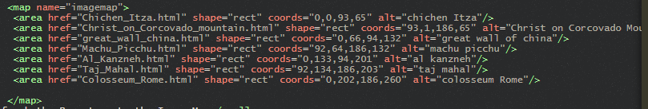
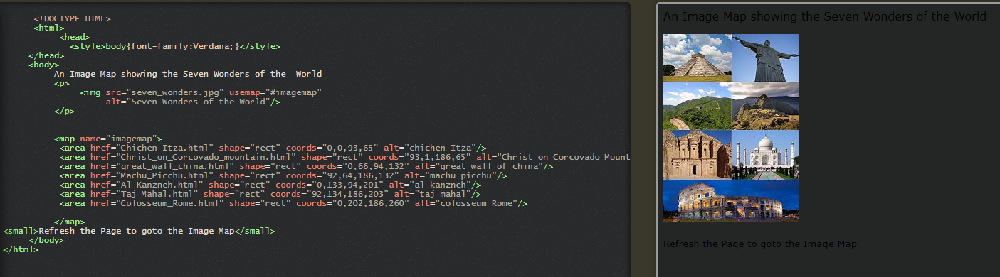
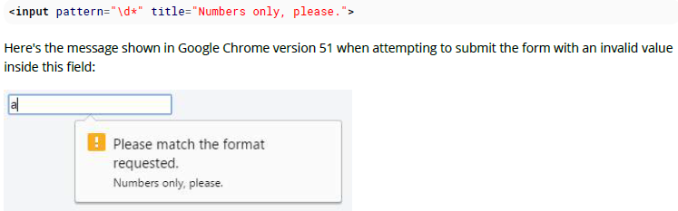
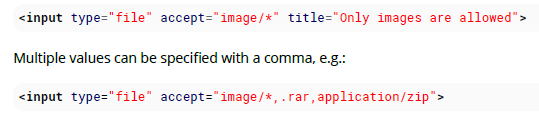
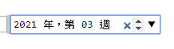

# 100 days of code front end - Day 04

## 前言

昨天主要是學習如何匯入外部的檔案到 HTML 中，包含 css 檔以及 js 檔；通常在匯入 css 檔的時候，習慣上會將 css 檔匯入的 link 標籤放在 html 的 head 當中，因為考量到網頁載入的順序，先讓 css 檔匯入，之後 html 元素進來的時候可以立即的渲染，如果是反過來的話，變成畫面要渲染兩次，反而會降低效能，再來是 js 檔的匯入，通常我們都將 js 檔的匯入放在 body 的尾端，因為應該要先讓網頁載入完成，才能讓網頁具有互動的功能，如果先顛倒過來，不只網頁效能降低，先載入 js 也沒有任何的好處，因為網頁根本還沒載完。

我覺得我昨天的學習成效有點不好，感覺一直在分心，應該是因為昨天上班比較累一點，今天的精神狀態比較好，今天可以好好的衝刺一下；另外，今天我找了一些關於學習方面的資料，因為我一直覺得我學東西很慢然後又一直記不住東西，這情況真的困擾我很久，找了一下相關的文章，大部分都是說要做大量的練習，並且擴充自己的既有知識，並讓知識與知識之間產生關連，這樣學東西才會比較快，而且我發現我看文章，都會重複看很多便，因為一直感覺無法立即記下來就是不好，導致我一直在同一個段落打轉，這種感覺真的是很不好，希望在這 100 天的學習當中，可以找到適合自己的學習方式，不然一直這樣下去對現在與對未來的自己都不適很好，今天第四天，持續的學習下去!!!

## 筆記

### 15. Images

src: 圖片位址
srcset: 根據不同的解析度使用不同的圖片 (響應式圖片)
sizes: image sizes between breakpoints ????

#### 15.1 Creating an image

Image 標籤沒有關閉標籤。有兩個主要的屬性指定給 image 標籤，src 圖片來源以及 alt 圖片的替代文字 (圖片失效時顯示的字串)

```html
// 從檔案路徑


// 從網路上

```

`注意:`從技術上來說，圖片不是插入到 HTML 頁面中的，圖片是被連結到 HTML 頁面。img 標籤為引用的圖像創建一個空間

圖片的嵌入還可以使用 base64 的方式嵌入

```html

```

#### 15.2 Choosing alt text

alt 文字使用在視障用戶和搜尋引擎上面。因此對於圖片的描述是很重要的。

#### 15.3 Responsive image using the srcset attribute

`Using srcset with sizes`

```html

```

sizes 像是媒體查詢，描述圖像佔據 viewport 的空間

- 如果 viewport 大於 1200px, 圖像是 580px
- 如果 viewport 介於 640px 與 1200px 之間，圖像會使用 48% 的 viewport
- 如果 viewport 是其他的尺寸，圖像會使用 98% 的 viewport
  `媒體條件必須省略最後一個項目`

#### 15.4 Responsive image using picture element

在不同的螢幕寬度下顯示不同的圖片，你必須包含所有的圖片使用 source 標籤在 picture 標籤裡面

```html
<picture>
  <source media="(min-width: 600px)" srcset="large_image.jpg" />
  <source media="(min-width: 450px)" srcset="small_image.jpg" />
  
</picture>
```

根據不同的螢幕大小使用不同的圖片

### 16. Image Mapes

#### 16.1 Introduction to Image Maps

image maps 像是 image 具有可點擊的區域，點擊圖片超連結到指定的網頁


http://www.tutorialspark.com/html5/HTML5_Images_Image_Map_Demo.php

### 17. Input Control Element

type: 指定 input 控制項的形式，hidden, text, tel, url, email, password, data, time, number, range ,color, checkbox, radio, file, submit, image, reset and button

name: 指定 input 的名稱

#### 17.1 Text

如果 input 控制項沒有指定型別預設為 text

```html
<input type="text" />
```

```html
<input />
```

此輸入類型為一個單行文字輸入，其中如果有使用換行符號會自動從輸入值移除，其他的輸入值都可以進行輸入

通常 input 會放在 form 裡面搭配使用

text 預設的寬度是 20 字元。可透過指定 size 的方式加大寬度

```html
<input type="text" size="50" />
```

使用 size 屬性明顯與 CSS 寬度設定不同，如果是用 CSS 指定寬度，input 寬度始終為特定值。如果使用 size 則可根據 fontsize 決定大小

使用 size 屬性本質上不會限制輸入字元的數量，因為輸入框多寬就是多寬。如果要限制輸入的長度可以使用 validation

input 通常只允許一行的文字，如果需要多行輸入可以使用 textarea 元素

#### 17.2 Checkbox and RadioButton

最簡單的 radio button 以及 checkbox 如下所示：

```html
<input type="checkbox" />
```

```html
<input type="radio" />
```

單獨使用 checkbox 元素會被當成使用來二元選項，如 yes no question  
checkbox 每一個都是獨立的，意味著使用者可以進行多選，表示在 checkbox 的 group 中，並不會因為選擇了一個 checkbox 就把其他的 checkbox 設為 unchecked。

Radio button 通常放在 group 中使用相同 name 屬性的值指定在群組中使用。radio button 是互斥的，意味著使用者只會在群組中選一個。當其中一個 radio button 選擇了，其他具有相同屬性值 name 的 radio button 會變成未選擇的狀態。

```html
<input type="radio" name="color" id="red" value="#f00" />
<input type="radio" name="color" id="green" value="#0f0" />
<input type="radio" name="color" id="blue" value="#00f" />
```

`value`  
checkbox 與 radiobutton 的 value 是忽略不使用的，比較特別的是在提交時，默認會是 on 而不是發送空白的值

`checked`
加入 checked 的值，代表 checkbox 或是 radio button 被選中

```html
<input type="radio" checked />
```

#### `Accessibility`

`labels`

為按鈕提供上下文並顯示每個按鈕的用途給使用這看，每一個按鈕應該要有一個標籤。可使用 label 標籤裡面包含按鈕，這種做法可以讓 label 也可以點擊，如同你點擊了 button。

```html
<label>
  <input type="radio" name="color" value="#f00" />
  Red
</label>
```

或是使用 for 屬性指定到對應的 input id

```html
<input type="checkbox" name="color" value="#f00" id="red" />
<label for="red">Red</label>
```

`Button Groups`

因為每個 radio button 在同一個 group 中會影響其他的 radio button，通常會提供一個 label 或是 context 給整個 radio button 的群組

為了提供標籤給整個群組，radio button 應該包含在 fieldset 元素中並且搭配一個 legend 元素在裡面

```html
<fieldset>
  <legend>Theme color:</legend>
  <p>
    <input type="radio" name="color" id="red" value="#F00" />
    <label for="red">Red</label>
  </p>
  <p>
    <input type="radio" name="color" id="green" value="#0F0" />
    <label for="green">Green</label>
  </p>
  <p>
    <input type="radio" name="color" id="blue" value="#00F" />
    <label for="blue">Blue</label>
  </p>
</fieldset>
```

#### 17.3 Input Validation

HTML 輸入驗證會由瀏覽器基於 input 元素中特別的屬性自動完成，這樣可部分或完全取代 javascript 輸入驗證。

驗證僅在提交表單時驗證，因此所有受限的輸入必須要在 form 裡面才能進行驗證。特別注意，disabled 與 read-only 的屬性不會觸發驗證功能。

`Required`
使用 required 屬性來表示，欄位必須填寫完整來通過驗證

```html
<input required />
```

`Minimum / Maximum Length`
使用最大最小長度的屬性來限制輸入長度。

大多數的瀏覽器會避免使用者輸出超過最大字元的數量，從而防止他們在嘗試提交之前就使輸入無效

```html
<input minlength="3" />
<input maxlength="15" />
<input minlength="3" maxlenghth="15" />
```

`Specifying a range`
使用 min 與 max 屬性可以限制數字輸入的範圍

`Match a Pattern`
為了獲得更多控制，使用 pattern 屬性可以指定正則表達式，必須要匹配才能通過你也可以指定 title 屬性提醒欄位的相關訊息


`Accept File Type`
input 的 file 類型可以接受指定的檔案格式


#### 17.4 Color

```html
<input type="color" name="favcolor" value="#ff0000" />
```

可以透過指定 value 的方式，讓 color 是預設的顏色(一定要是 hex 編碼)

#### 17.5 Password

```html
<input type="password" name="password" />
```

有一些瀏覽器會將輸入的最後一個字顯示出來，其他都是有遮罩的字

#### 17.6 File

```html
<input type="file" name="fileSubmission" />
```

File Input 允許使用者從本機選擇想要的檔案呈現到網頁上。如果有使用 form 元素則可以將檔案上傳到伺服器端

```html
<form action="upload_file.php" method="post" enctype="multipart/form-data">
  <input type="file" name="fileSubmission" id="fileSubmission" />
  <input type="submit" value="Upload your file" name="submit" />
</form>
```

`Multiple files`  
加入 multiple 的屬性讓使用者可以選擇多個檔案

```html
<input type="file" name="fileSubmission" id="fileSubmission" multiple />
```

`Accept Files`
Accept 屬性指定使用者可選擇的檔案類型

```html
<input
  type="file"
  name="fileSubmission"
  accept="image/x-png,image/gif,image/jpeg"
/>
```

#### 17.7. Button

```html
<input type="button" value="Button Text" />
```

Button 可以觸發動作發生，而不是提交表單。你也可以使用 button 屬性

```html
<button type="button">Button Text</button>
```

#### 17.8 Submit

```html
<input type="submit" value="Submit" />
```

submit input 創建一個按鈕被使用在表單裡面來提交資訊

#### 17.9 Reset

```html
<input type="reset" value="reset" />
```

一樣也是在表單中使用，當按下 reset 的按鈕時，表單內的所有內容將會重製

#### 17.10 Hidden

```html
<input type="hidden" name="inputName" value="inputValue" />
```

hidden input 不會顯示給使用者看，但是當提交 form 表單時，其值將會被送到伺服器端

#### 17.11 Tel

```html
<input type="tel" value="+840000000" />
```

電話

#### 17.12 Email

```html
<input type="email" />
```

#### 17.13 Number

```html
<input type='number' value='0' name=quantity'>
```

輸入的數值只能是數字

#### 17.14 Range

```html
<input type="range" min="" max="" step="" />
```

#### 17.15 Search

```html
<input type="search" name="googlesearch" />
```

#### 17.16 image

```html
<input type="image" src="img.img" alt="image_name" height="50px" width="50px" />
```

#### 17.17 Week

```html
<input type="week" />
```



#### 17.18 Url

```html
<input type="url" />
```

#### 17.19 DateTime-Local

<input type='datetime-local'>

#### 17.20 Month

<input type='month'>

#### 17.21 Time

<input type='time'>

#### 17.22

<fieldset>
   <p><label>Meeting time: <input type='datetime' name='meeting.start'></label>
</fieldset>

#### 17.23 Date

<input type='date'>
