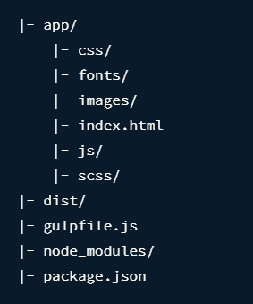

# 100 days of code front end - Day 56
## Gulp 前言
Gulp 是一個工具包，用於自動化開發過程中繁瑣或耗時的任務。

現今的前端開發，你通常發現你自己需要自動化任務像是 bundling, 移動檔案以及在 HTML 檔案中注入參考。Gulp 是一種可以幫助你完成這些事情的工具。

### Gulp
Gulp 是一種可以幫助你完成 Web 開發任務的工具。通常被使用於前端任務像是：
- 啟動網路伺服器
- 當檔案被儲存時，自動重載瀏覽器
- 使用預處理器像是 Sass 或是 LESS
- 優化像是 CSS、JavaScript 和圖像之類的資源

### Why Gulp?
像是 Gulp 這一類的工具通常被稱為 "建構工具"，因為他們是建構網站任務的運行工具。

目前最流行的兩種建構工具是 Gulp 和 Grunt。

主要的不同是你如何使用他們配置工作流程。 與 Grunt 相比 Gulp 配置任務更加簡短與更簡單。 Gulp 同樣執行的更快。

### Gulp install
npm install gulp --save-dev

### Determining Folder Structure
Gulp 足夠靈活，可以處裡任何資料夾結構。在項目進行調整之前，你知需要了解內部工作原理即可。



在此結構中，我們將會使用 app 資料夾進行開發，同時 dist('distribution' 發布) 資料夾包含產品網站的最佳檔案。

當 app 被使用於開發目的，所有我們的程式碼都會放在 app 中。

我們必須記住這個資料夾結構當我們在進行 Gulp 配置時。

### Writing your first gulp task

現在我們可以開始撰寫 gulp 任務。gulp 任務基本語法如下：

```javascript
gulp.task('task-name', function() {
    // Stuff here
});
```

`task-name` 是指任務的名稱，任務名稱會被使用於當你想要在 Gulp 中執行任務時。你也可以執行相同任務在命令行透過 gulp `task-name`

簡單的 gulp 任務建立
```javascript
gulp.task('hello', (done) => {
    console.log('hello world');
    done();
});

// Command Line: gulp hello
```

上面是簡單的 Gulp 範例，真正的 task 比較像是下面這樣
```javascript
gulp.task('task-name', function() {
    return gulp.src('source-files')  // Get source files with gulp.src
    .pipe(aGulpPlugin())  // Sends it through a gulp plugin
    .pipe(gulp.dist('destination'))  // output the file in the destination folder
})
```

如你所見，真正的任務使用兩個額外的 gulp 方法-`gulp.src` 以及 `gulp.dest`。

gulp.src 告知 Gulp 任務甚麼檔案會使用於任務，同時 gulp.dest 告知 Gulp 輸出的檔案要放在哪裡當任務完成時。

### Preprocessing with Gulp
建立一個任務其我們編譯 sass 檔案成為 css 檔案

我們可以在 Gulp 裡編譯 Sass 檔案到 CSS ，透過 gulp-sass 的插件。你可以安裝 gulp-sass 到你的專案中 (npm install gulp-sass --save-dev)。