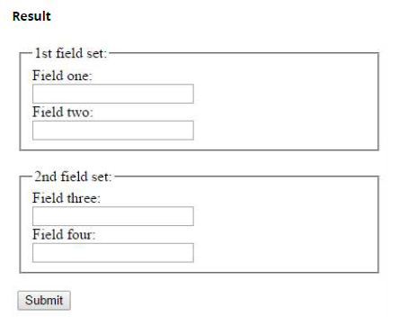
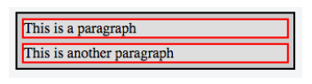
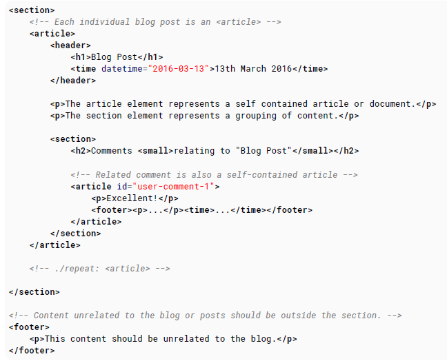
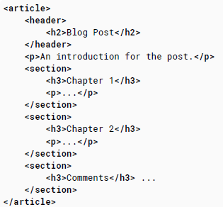

# 100 days of code front end - Day 05

## 前言

昨天主要學習 image, image map 以及 input ，image 的話就很單純的讀檔案進來或是從 url 讀取圖片進來，除了上述兩種方法之外還可以使用內嵌 base64 的編碼格式來呈現圖片，裡面有一句話很重要圖片並不是插入到 HTML 頁面中的，而是 img 標籤會建立一個引用空間，將圖片引用進來 (雖然我不知道這樣的說法與插入圖片有什麼差別)，在圖片中有一個 alt 的屬性，當圖片加載失敗時，會使用替代文字替換 (也可提供給視障以及搜尋引擎查看)，另外 srcset 以及 sizes 的屬性兩個搭配起來就可以讓圖片具有響應式的功能 (sizes 像是媒體查詢)；再來是 image maps 其實就是讓圖片具有超連結的功能，比較有趣的用法是，載入一張圖片，然後在圖片中分出要連結的區塊，類似分割圖片，每個分割的區塊可以進行超連結；最後是 input 裡面就主要是可以設定不同的 type 每一個 type 對應不同的輸入功能，有些 type 還具有驗證功能，方便使用。

昨天再看 input control 那一章的時候，突然有種茅塞頓開的感覺，因為之前在使用 input 的時候，都會以為 checkbox 以及 radio button 其實是不同的 control ，沒想到在 HTML 的世界中只要修改 type 的樣式就可以達到不同的輸入樣式(使用太多 .net 系列產品的後果)，也因為 input 比較多東西，有些後面的小章節也是拿到今天才讀完，總之，持續讀下去，總會讀出一片天的!!

## 筆記

### 18. Forms

為了要群組化 input 元素與要提交的資料，HTML 使用 form 元素來封裝 input 與 submission 元素。

這些表單處理將指定方法中的數據發送到服務器或處理程序處理的頁面。

#### 18.1 Submitting

`Action`  
action 屬性定義提交表單時要執行的操作，通常會導致一個腳本來收集提交的訊息並使用訊信息。

如果你留下空白，他將會傳送到同樣的檔案中???

```html
<form action="action.php"></form>
```

`Method`  
method 屬性被使用來定義 HTTP 的方法是屬於 GET 或 POST

```html
<form action="action.php" method="get">
  <form action='action.php' method='post>
</form>
```

GET 的方法大部分用來取得資料，聚力來說透過 ID 和名稱取得資料或是提交一個搜尋語法。  
GET 的方法會將 form 的資料指定到 action 屬性指定的 URL
`www.example.com/action.php?firstname=Mickey&lastname=Mouse`

POST 的ㄈ法被使用來提交資料到腳本中。POST 方法並沒有將資料添加到 action 屬性的 URL 中，而是透過 request 的 body 傳送。

為了要提交正確的資料，name 屬性的祕許指定

```html
<input type="text" name="lastname" value="Mouse" />
```

#### 18.2 Target attribute in form tag

target 屬性指定名稱或是關鍵字其指示顯示送出表單的回覆要顯示在哪裡。

target 屬性定義瀏覽上下文的名稱或關鍵字
\_blank, \_self, \_parent, \_top, framename

```html
<form target="_blank"></form>
```

#### 18.3 Uploading Files

圖像或是檔案可以被上傳到伺服器透過指定 enctype 屬性指定成 multipart/form-data。  
enctype 指定 form 資料將如何被編碼當提交到伺服器時。

```html
<form method="post" enctype="multipart/form-data" action="upload.php">
  <input type="file" name="pic" />
  <input type="submit" value="upload" />
</form>
```

#### 18.4 Grouping a few input fields

當設計表單時，你可能喜歡群組少數的 input 欄位到 group 以幫助組織 form 的布置。

針對每個 fieldset 你可設定 legend

```html
<form>
  <fieldset>
    <legend>1 st field set:</legend>
    Field one:<br />
    <input type="text" /><br />
    Field two:<br />
    <input type="text" /><br />
  </fieldset>
  <br />
  <fieldset>
    <legend>2 st field set:</legend>
    Field three:<br />
    <input type="text" /><br />
    Field four:<br />
    <input type="text" /><br />
  </fieldset>
  <br />
</form>
```



### 19. Div Element

div 元素在 HTML 中是一個容器屬性主要用來封裝其他的元素以及可以被使用來群組以及接分網頁。  
div 本身並不能代表任何內容，但他是 web 設計中的強大工具

#### 19.1 Basic usage

div 元素通常沒有具體語義，僅僅代表一個區塊，並且通常被使用在 HTML 文件中群組以及封裝其他的元素並且與其他群組內容分離。因此，每個 div 最好以內容作為描述。

```html
<div>
  <p>Hello! This is a paragraph.</p>
</div>
```

div 基本上是 block 等級的元素，意思是他會與其他 block 會分隔，並且通常會以最大寬度充滿網頁。

基本上使用更合適的元素取代 div 元素對於讀者來說將具備更好的可訪問性，並且對於作者來說會更容易維護。

舉例來說，部落格貼文會使用 article 標籤，章節會使用 section 標籤，網頁瀏覽會使用 nav ，群組表單會使用 fieldset

div 元素可用於樣式目的或將一個段落中的多個段落包裝在一起，而所有段落都將以類似方式進行註釋。

#### 19.2 Nesting

實務上通常會將多個 div 元素放在其他 div 中。這通常叫做巢狀元素並且允許更進一步的分開元素到子區塊以及幫助開發人員 CSS 的樣式化

```html
<div class="outer-div">
  <div class="inner-div">
    <p>This is a paragraph</p>
  </div>
  <div class="inner-div">
    <p>This is a paragraph</p>
  </div>
</div>
```



在嵌套元素時，請記住，有 inline 元素和 block 元素。 雖然 block 元素“在後台添加換行符”，這意味著，其他嵌套元素會自動顯示在下一行中，默認情況下，inline 元素可以彼此相鄰放置

`避免過深的 div 巢狀`
嘗試使用盡可能少量的 HTML 元素來增加內容與標籤的比率並減少葉面負載，從玵在搜尋引擎中獲得更好的排名。

div 元素深度不應該超過 6 層

### 20. Sectioning Elements

#### 20.1 Nav Element

\<nav>元素主要用於包含網站主要導航塊的部分，其中可以包括指向網頁其他部分（例如目錄的錨點）或整個其他頁面的鏈接。\<nav> 元素主要用於包含網站主要導航塊的部分，nav 元素主要目的是

`inline items`

```html
<nav>
  <a href="https://google.com">Google</a>
  <a href="https://yahoo.com">Google</a>
  <a href="https://bing.com">Google</a>
</nav>
```

`list items`

```html
<nav role="navigation">
  <ul>
    <li><a href="https://google.com">Google</a></li>
    <li><a href="https://www.yahoo.com">Yahoo!</a></li>
    <li><a href="https://www.bing.com">Bing</a></li>
  </ul>
</nav>
```

`避免不需要的使用`

<footer> 元素可能有連結的列表，使用 footer 就已經足夠不需要再用 nav
```html
<!-- the <nav> is not required in the <footer> -->
<footer>
  <nav>
    <a href="#">...</a>
  </nav>
</footer>
<!-- The footer alone is sufficient -->
<footer>
  <a href="#">...</a>
</footer>
```

#### 20.2 Article Element

article 元素包含獨立的內容，例如，文章、部落格貼文、使用者評論或是交互的小工具，這些內容可以分發到頁面上下文之外。 ex.rss

當 article 元素是巢狀的，內部 article 節點的內容應該與外部 article 元素相關



當主要的網頁內容只是簡單的一個群組。你可以省略 article 使用 main 元素

#### 20.3 Main Element

main 元素包含了網頁主要的內容。這個內容對於個人網頁是獨特的並且不應該顯示在其他的網站。重複的內容像是 header, footer, navigation, logo 這些應該放在外部元素

- main 標籤應該在一個網頁上只有一個
- main 標籤不應該包含在 article, aside, footer, header 或是 nav 元素

```html
<body>
   <header>
     <nav>...</nav>
   </header>

   <main>
      <h1>Individual Blog Post</h1>
      <p>An introduction for the
      post.</p>

      <article>
         <h2>References</h2>
         <p>...</p>
      </article>

      <article>
         <h2>Comments</h2> ...
      </article>
     </main>
    <footer>...</footer>
</body
```

#### 20.4 Header Element

header 元素通常包含一群入門或是導覽列

```html
<header>
  <p>Welcome to...</p>
  <h1>Voidwars!</h1>
</header>
```

#### 20.5 Footer Element

footer 就是網頁的最底端

```html
<footer>
  <p>All rights reserved</p>
</footer>
```

#### 20.6 Section Element

section 元素表示將主題按主題分組的通用部分。

