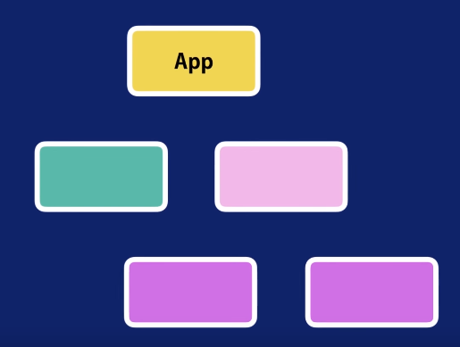
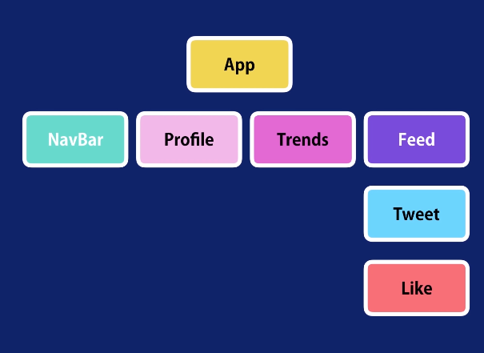
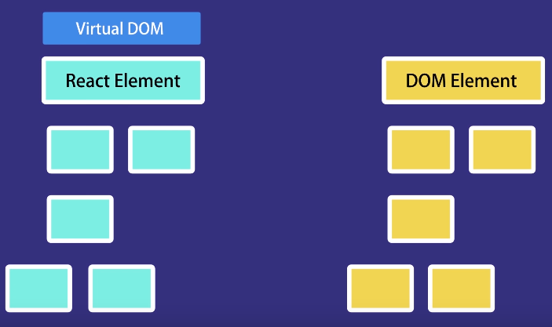

# 100 days of code front end - Day 67
## 前言
### React
- Master React Fundamentals
- Build Reusable Components
- Render Data
- Handle Events
- Debug your React Apps

#### React is a JavaScript library for building user interfaces

The heart of all React applications are components
`Component: A piece of the UI`

When building application with React, we build a bunch of independent isolated and reusable components and then
compose them to build complex user interface.

Every React application has at least one component which we refer to as the root 
component this component represents the internal application and contains other 
child components.



So, every React application is essentially a tree of components

`Component Examples:`
App


Nav Bar


Profile


Trends


Feet




Component is typically implemented as a JavaScript class that has some 
state and render method.

```javascript
class Tweet  {
    state = {}
    render() {

    }
}
```

A render method the state here is the data that we want to display when the component
is rendered and the render method as you call tell is responsible for describing what 
the UI should look like.


React Element si a simple plain JavaScript object that maps to a DOM element
it's not a real DOM it's just a plain JavaScript object that represents that DOM
element in memory.

React keeps a light weight representation of the DOM in memory which were referred 
to as the virtual DOM. (cheap to create).


When we change the state of the component we get a new react element.
React will then compare this element and his children with the previous one 
it figures out what is changed and then it will update a part of the Real DOM
to keep it sync with virtual DOM.

Unlike vanilla JavaScript or jQuery we no longer have to work with the DOM API in 
browsers in other words we no longer have to write code and query and manipulate the 
DOM or attach the event handler to DOM elements, we simply change the state of 
our components and React will automatically update the DOM to match the state.

`That is why call React`

### Angular vs React 
- Both are component base
- Angular is a framework or complete solution
- React is a library it only takes care of rendering the view and making sure
  that the view is in sync with the state.
  


React has a very small API to learn, so when building applications with react
we need to use other libraries for things like routing or calling HTTP services 
and so on.

This is not necessarily a bad things, because you get to choose the libraries that you
prefer as opposed to being fixed with what angular gives you which often breaks
from one version to another.

### Tutorial Video
https://www.youtube.com/watch?v=Ke90Tje7VS0