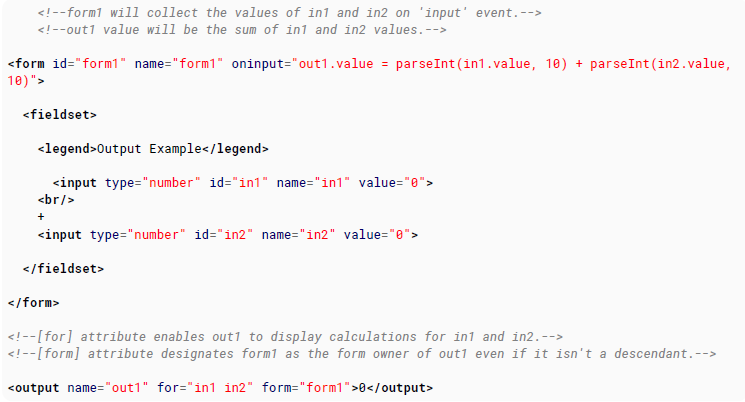

# 100 days of code front end - Day 06

## 前言

昨天學習了操作者資料上傳的表單 Form，畫面區塊元素 div 以及 網站文章內容結構的 Section 元素，裡面的觀念都還蠻簡單的，我就不細說了。

因為距離 HTML 的結束包含今天剩下 3 天，
我看了一下我閱讀的文件，所剩的章節雖然還蠻多的，但其實每一章的內容都還蠻少的，因此，我應該是趁剩下的兩天將文件讀完，最後的一天，我應該是進行 HTML 程式的練習，最一個結束

### 21. Navigation Bars

#### 21.1 Basic Navigation Bar

導覽列本質上是連結的串列，因此使用 ul 與 li 元素可用於封裝導航連結

```html
<ul>
  <li><a href="#">Home</a></li>
  <li><a href="#">About</a></li>
  <li><a href="#">Contact</a></li>
</ul>
```

#### 21.2 HTML5 Navigation Bar

導覽列基本上也可以使用 nav 標籤來包裝導航連結

```html
<nav>
  <li><a href="#">Home</a></li>
  <li><a href="#">About</a></li>
  <li><a href="#">Contact</a></li>
</nav>
```

### 22. Label Element

- for: for 屬性主要是用來參考到目標 id 的元素

#### 22.1 About Label

label 元素使用於參考 form 的作用元素

在使用者介面的泛圍內，它被使用來簡化目標與選擇元素例如 radio 或是 checkbox

它可以包裝想要的作用元素

```html
<label> <input type="checkbox" name="Cats" />I Like Cats! </label>
```

使用 for 屬性你不需要將控制項元素放置在 label 後面，但是 for 值必須匹配到它的 id

```html
<input id="cats" type="checkbox" name="Cats" />
<label for="cats">I like Cats!</label>
```

`Note`: Label 元素中不要放超過一個元素在 label 裡面

#### 22.2 Basic Use

在 form 中使用 label

```html
<form action="/login" method="POST">
  <label for="username">Username:</label>
  <input id="username" type="text" name="username" />

  <label for="pass">Password:</label>
  <input id="pass" type="password" name="pass" />
  <input type="submit" name="submit" />
</form>
```

### 23 Output Element

Global: 此屬性可以讓所有的 HTML5 元素都可使用  
name: 代表輸出名稱的字串。最為 form 元素，output 可以藉由名稱進行參考。此屬性也被使用於蒐集 form 提交的資料值

#### 23.1 Output Element Using For and Form Attribute

output 元素通常要作用都要透過 javascript 的幫助。通常 javascript 被使用在接收使用者輸入的值並進行運算或是判斷，記住，雖然 input 元素指定的 type 是 number，但是取得的值並不是 number 而是文字，因此需要進行轉換成數字的函式。



#### 23.2 Output Element with Attribute

```html
<output name="out1" form="form1" for="inp1 inp2"></output>
```

### 24. Void Element

並非所有的 HTML 標籤都有相同的結構。大部分的元素需要開放標籤與結束標籤以及內容，而有一些元素是不需要的如空元素

空元素只需要開放標籤，而且他們是不能夠放其他元素在裡面的

#### 24.1 Void elements

- area: 可點擊的元素，通常使用在 image
- base: 指定基本的 url 是所有連結的 base
- br: 換行
- hr: 水平線
- img: image
- input: 使用者資料輸入
- link: 連結外部資料到文件中
- meta: 提供文件額外的資料
- param: 定義插入的參數
- source: 指定媒體資源給 picture, audio, video 元素

```html

<br />
<hr />
<input type="number" placeholder="Enter your favorite number" />
```

### 25 Media Elements

\<source>: 定義聲音或影片的來源  
track: 定義媒體元素的文字來源  
controls: 顯示控制向  
autoplay: 自動撥放媒體  
loop: 循環撥放媒體
muted: 讓撥放的媒體沒有聲音
poster: 安插一張圖片直到影片載入完成

#### 25.1 Audio

透過 audio 元素可在網頁中內嵌聲音檔

```html
<audio controls>
  <source src="file.mp3" type="audio/mpeg" />
  Your browser does not support the audio element.
</audio>
```

#### 25.2 Video

可透過 video 元素內嵌影片

```html
<video width="500" height="700" controls>
  <source src="video.mp4" type="video/mp4" />
  Your browser does not support the video tag.
</video>
```

#### 25.3 Using \<video> and \<audio> element to display audio/video content

視頻/音頻元素包含一個或多個視頻/音頻源。 要指定源，請使用 src 屬性或<source>元素。 瀏覽器將選擇最合適的瀏覽器。

```html
<!-- Simple video example -->
<video src="videofile.webm" autoplay poster="posterimage.jpg">
  Sorry, your browser doesn't support embedded videos, but don't worry, you can
  <a href="videofile.webm">download it</a>
  and watch it with your favorite video player!
</video>

<!-- Video with subtitles -->
<video src="foo.webm">
  <track kind="subtitles" src="foo.en.vtt" srclang="en" label="English" />
  <track kind="subtitles" src="foo.sv.vtt" srclang="sv" label="Svenska" />
</video>
<!-- Simple video example -->
<video
  width="480"
  controls
  poster="https://archive.org/download/WebmVp8Vorbis/webmvp8.gif"
>
  <source
    src="https://archive.org/download/WebmVp8Vorbis/webmvp8.webm"
    type="video/webm"
  />
  <source
    src="https://archive.org/download/WebmVp8Vorbis/webmvp8_512kb.mp4"
    type="video/mp4"
  />
  <source
    src="https://archive.org/download/WebmVp8Vorbis/webmvp8.ogv"
    type="video/ogg"
  />
  Your browser doesn't support HTML5 video tag.
</video>

<!-- Simple audio playback -->
<audio
  src="http://developer.mozilla.org/@api/deki/files/2926/=AudioTest_(1).ogg"
  autoplay
>
  Your browser does not support the <code>audio</code> element.
</audio>
<!-- Audio playback with captions -->
<audio src="foo.ogg">
  <track kind="captions" src="foo.en.vtt" srclang="en" label="English" />
  <track kind="captions" src="foo.sv.vtt" srclang="sv" label="Svenska" />
</audio>
```

#### 25.4 Void header or background

添加將自動循環播放且沒有控件或聲音的視頻。 非常適合視頻標題或背景。

```html
<video
  width="1280"
  height="720"
  autoplay
  muted
  loop
  poster="video.jpg"
  id="videobg"
>
  <source src="video.mp4" type="video/mp4" />
  <source src="video.webm" type="video/webm" />
  <source src="video.ogg" type="video/ogg" />
</video>
```

### 26. Progress Element

max: 進度條的最大值
value: 當前的進度
position: 當前 progress 元素的位置
labels: 回傳 progress 元素列表標籤

#### 26.1 Progress

progress 元素屬於新的 HTML5 元素可用來呈現工作的進度

```html
<progress value="22" max="100"></progress>
```

<progress value='22' max='100'></progress>

#### 26.2 Changing the color of a progress bar

進度條可以使用 progress[value]選擇器進行樣式調整。

```html
porgress[value] { width: 250px; height: 20px; background-color: 'green' }
```

注意每個瀏覽器的 progress bar 屬性都不太一樣這點要特別注意一下

#### 26.3 HTML Fallback

對於不支援 progress 元素的瀏覽器，可用以下方法作為解決方案

```html
<progress max="100" value="20">
  <div class="progress-bar">
    <span style="width: 20%">Progress: 20%</span>
  </div>
</progress>
```

<progress max='100' value='20'>
   <div class='progress-bar'>
       <span style='width: 20%'>Progress: 20%</span>
   </div>
</progress>

瀏覽器有支援 progress 標籤會忽略 div 內部的元素。舊的瀏覽器無法識別 progress 標籤將會顯示 div。

### 27. Selection Menu Controls

#### 27.1 Select Menu

select 元素會產生一個 drop down menu 讓使用者可以選擇你面的選項。

```html
<select name="">
  <option value="1">One</option>
  <option value="2">Two</option>
  <option value="3">Three</option>
  <option value="4">Four</option>
</select>
```

<select name="" size="0" >
   <option value="1">One</option>
   <option value="2">Two</option>
   <option value="3">Three</option>
   <option value="4">Four</option>
</select>

`Changing the Size`  
你可透過 select 元素的 size 屬性改變選擇表單的大小。

size 0 與 1 會顯示標準的 down-down 樣式 menu。  
當 size 大於 1 時，將會將單行的 drop-down 變成多行。

```html
<select name="" size="4"</select>
```

`Multi-option selection menus`  
預設使用者只可選擇一個選項，但是加入 multiple 屬性之後，將允許使用者可以一次選擇多個選項並且透過 form 提交多個選項。

使用 multiple 屬性自動轉換成一個框，就好像有設定 size 屬性一樣。預設的 size 取決於你使用的瀏覽器。

```html
<select name="" multiple></select>
```

使用 multiple 屬性時， size 使用 0 與 1 是有區別的，使用 0 將會導致瀏覽器以編碼的方式執行。使用 1 的話會將其變成 1 列的選項

#### 27.2 Options

在 selection 裡面的選項就是要讓使用者可以選擇的。

```html
<option>Some option </option>
```

但是，需要注意的是在 option 元素裡面的 text 並不總是拿來使用，而是實際上當沒有設定屬性時，會變成會使用預設值。

控制選項的實際外觀和功能的屬性是值和標籤。 label 代表文字將會顯示在 drop-down menu。value 代表將會被送到表單的值。如果忽略這些值中的任何一個，它將使用元素內的文本作為值。

```html
<option label="Some option" value="Some option"></option>
```

請注意，實際上並不需要內部文字以及結束標籤，省略了內部文本和結束標籤。 如果包含它們，則內部文本將被忽略，因為已經指定了兩個屬性，並且不需要該文本。 但是，您可能不會看到很多人以這種方式編寫它們。 寫入的最常見方式是將一個值發送到服務器，以及最終成為標籤屬性的內部文本，如下所示：

```html
<option value="option1">Some Option</option>
```

`Selecting an option by default`  
你可以指定特定的選項預設是被選擇的透過加入 selected 屬性。預設來說，如果沒有任何一個 option 有指定 selected 屬性，第一個 option 會當作是選擇的。如果有很多 option 都有加上 selected 屬性，則會使用最後一個 option 當作預設選項。

```html
<option value="option1" selected>Some option</option>
```

如果你是將 selected 用在 multiple 的 select 元素裡的 option 時，option 有標註 selected 的元素都會被選擇。

#### 27.3 Option Groups

你可以在 selection 菜單中使用 optgroup 元素，以便在比較長的列表中提供更好的布置結構。

使用方法很簡單，使用 label 屬性指定 group 的 title 並且包含多個 option 在這個 optgroup 元素中

```html
<select name="">
  <option value="milk">Milk</option>
  <optgroup label="Fruits">
    <option value="banana">Bananas</option>
    <option value="strawberry">Strawberries</option>
  </optgroup>
  <optgroup label="Vegetables" disabled>
    <option value="carrot">Carrots</option>
    <option value="zucchini">Zucchini</option>
  </optgroup>
</select>
```

<select name="">
  <option value="milk">Milk</option>
  <optgroup label="Fruits">
     <option value="banana">Bananas</option>
     <option value="strawberry">Strawberries</option>
  </optgroup>
  <optgroup label="Vegetables" disabled>
    <option value="carrot">Carrots</option>
    <option value="zucchini">Zucchini</option>
  </optgroup>
</select>

可透過 disabled 將 optgroup 底下的 option 禁用。

#### 27.4 Datalist

datalist 標籤為 input 元素指定預先定義選擇的列表，他在 input 元素上提供"autocomplete" 的功能。使用者在在寫時，將會看到一個下拉選單

```html
<input list="Languages" />
<datalist id="Languages">
  <option value="PHP"> </option>
  <option value="Perl"> </option>
  <option value="Python"> </option>
  <option value="Ruby"> </option>
  <option value="C+"> </option>
</datalist>
```

<input list="Languages">
<datalist id="Languages">
  <option value="PHP">
  <option value="Perl">
  <option value="Python">
  <option value="Ruby">
  <option value="C+">
</datalist>

### 28. Embed

#### 28.1 Basic usage

embed 標籤是 HTML5 新增的。此元素提供外部程式或是交互內容提供一個整合

```html
<embed src="myflash.swf" />
```

#### 28.2 Defining the MIME type

MIME 類型必須使用 type 屬性定義

```html
<embed type="video/mp4" src="video.mp4" width="640" height="480" />
```
