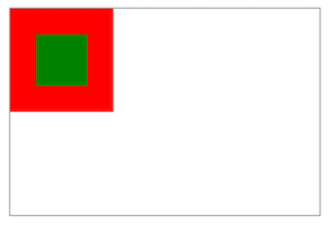

# 100 days of code front end - Day 07

## 前言

昨天主要學習 nav, label, output, void element, media, progress, select, option, embed, iframe, content language，項目非常多。

- nav: 主要用來將 a 元素包裝起來，讓他們變成一個導覽列
- label: 對應到 input 元素，點擊 label 也與 input 元素一樣具有相同的效果，label 的 for 元素要與 input 元素的 id 匹配才可以
- output: 我覺得這一個比較特別，他可以記錄表單中的多個 input 元素，然後搭配 javascript 進行函式的運算或操作
- void: 空元素，不具備關閉標籤，裡面也不能放其他內容或元素
- media: 可以放置影片與音樂檔，並且可以選擇是否要重複撥放，或是載入自動撥放等功能
- progress: 用來呈現工作進度，可設定最大值與當前進度
- select: 可將 option 元素放在裡面變成一個下拉式選單
- option: 放在 select 元素裡面的選項
- embed: 讓 html 可以內嵌外部檔案
- iframe: 讓網頁裡面可以放置不同的網頁
- content language: 表示 html 使用的語言

今天會將所剩下的 11 個章節全部讀完，剩下的都是一些比較簡單的內容，趁今天一天把他們讀完，然後就進行總複習的動作。

## 筆記

### 31. SVG

SVG 是可擴展向量圖形。SVG 被使用於定義 web 圖形。

HTML 的 svg 是一個容器用來包裝 SVG 圖形。

SVG 有許多方法來畫路徑、box、圓形、文字以及圖片

#### 31.1 Inline SVG

SVG 可以直接寫在 html 文件中。 inline svg 可以透過操作 CSS 以及 javascript 來進行樣式調整。


#### 31.2 Embedding external SVG files in HTML

你可以使用 img 或是 object 元素來內嵌外部的 SVG 元素。

`Using the image element`

```html

```

使用 img 並不允許你使用 css 與 javascript 調整 svg 的樣式

`Using the object element`

```html
<object
  type="image/svg+xml"
  data="attention.svg"
  width="50"
  height="50"
></object>
```

不像 img 標籤，object 標籤載入 svg 到檔案中但是他還是可以透過 javascript 與 css 進行操作。

#### 31.3 Embedding SVG using CSS

你可透過 CSS 的 background-img 屬性加入外部的 SVG 檔案，如同處裡其他圖檔一樣。

```html
<div class="attention"></div>

// css .attention { background-image: url(attention.svg); background-size: 100%
100%; width: 50px; height: 50px; }
```

你也可以直接內嵌圖檔到 css 檔案中使用 data url


### 32. Canvas

#### 32.1 Basic Example

canvas 元素用於繪製圖形，一種畫布的概念

```html
<canvas id="myCanvas">
  Cannot display graphic. Canvas is not supported by your browser(IE<9)
</canvas>
```

你可以使用 canvas 元素繪製一些圖形，圖片或操作圖片與製作遊戲引擎等等透過 javascript

畫布的 2D 可繪製圖層表面對象稱為 CanvasRenderingContext2D；或使用 .getContext('2d') 方法從 HTML CanvasElement 中取得。

```html
var cts = document.getElementById('myCanvas').getContext('2d') // now we can
refer to the canvas's 2D layer context using ctx ctx.fillStyle = "#f00";
ctx.fillRect(0, 0, ctx.canvas.width, ctx.canvas.height); // x, y, width, height
ctx.fillStyle = "#000"; ctx.fillText("My red canvas with some black text", 24,
32); // text, x, y
```

#### 32.2 Drawing two rectangle on a \<canvas>

```html
<!DOCTYPE html>
<html lang="en">
  <head>
    <meta charset="utf-8" />
    <title>Draw two rectangles on the canvas</title>
    <style>
      canvas {
        border: 1px solid gray;
      }
    </style>
    <script async>
      window.onload = init; // call init() once the window is completely loaded
      function init() {
        // #1 - get reference to <canvas> element
        var canvas = document.querySelector('canvas');

        // #2 - get reference to the drawing context and drawing API
        var ctx = canvas.getContext('2d');

        // #3 - all fill operations are now in red
        ctx.fillStyle = 'red';

        // #4 - fill a 100x100 rectangle at x=0,y=0
        ctx.fillRect(0, 0, 100, 100);

        // #5 - all fill operations are now in green
        ctx.fillStyle = 'green';

        // #6 - fill a 50x50 rectangle at x=25,y=25
        ctx.fillRect(25, 25, 50, 50);
      }
    </script>
  </head>
  <body>
    <canvas width="300" height="200"
      >Your browser does not support canvas.</canvas
    >
  </body>
</html>
```



### 33. Meta Information

Meta 標籤在 HTML 檔案中提供檔案相關資訊包含描述、關鍵字、作者、修改紀錄與大約 90 個的參數。

#### 33.1 Page information

`application-name`  
提供網頁代表的 Web 應用程式的名稱

```html
<meta name='application-name' content='OpenStreetMap>
```

如果不是 web 應用程式，application-name 的 meta 標籤不應該使用

`author`  
設定網頁的作者

```html
<meta name="author" content="Your Name" />
```

只能給定一個名稱

`description`  
網頁描述的設定

```html
<meta name="description" content="Page Description" />
```

meta 的 description 可以被各種搜尋引擎使用，當他們在進行搜尋時，提供索引。通常，description 包含的描述是簡端摘要，顯示在搜索引擎結果中頁面/網站的主要標題下。Google 通常使用你的前 20-25 個字描述。

`generator`

```html
<meta name="generator" content="HTML Generator 1.42" />
```

標籤用於生成文檔的套件之一。僅用於自動生成標記的頁面

`keywords`  
設定 keyword 給搜尋引擎搜尋 (用逗號分隔)

<meta name='keywords' content='Keyword1, Keyword2'>

keyword 的 meta 標籤有時被用來搜尋引擎讓搜尋字串對應到你的網頁。

根據經驗，最好不要加入過多的關鍵字，與大多數使用 meta 標籤進行索引的搜尋引擎一樣，指搜尋前 20 個關鍵字，因此確保最重要的關鍵字要放在最前面。

#### 33.2 Character Encoding

charset 屬性指定 HTML 檔字元的編碼並切需要使用有效的字元編碼。

```html
<meta charset="UTF-8" /> <meta charset="ISO-8859-1" />
```

所有的瀏覽器都會識別 \<meta charset> 格式，但是如果出於某種原因你需要葉面為有效的 HTML 4.01 你可以使用下列取代

```html
<meta http-equiv="content-type" content="text/html; charset=UTF-8" />
<meta http-equiv="content-type" content="text/html; charset=ISO-8859-1" />
```

#### 33.3 Robots

rotobts 屬性，許多主要的瀏覽器都有支援。控制 engine spiders 是否允許檢索網頁並且他們是否應該遵循網頁上的連結。

```html
<meta name="robots" content="noindex" />
```

#### 33.4 Social Media

Open Graph 是元數據的標準，用在網站的 head 標記中包含一般資訊。這讓網站例如 Facebook 之類的網站能夠以結構化格式式顯示有關該網站更身與更豐富的資訊。當使用者在 Facebook 上共享包含 OG 元數據的網站連結時，該訊息將自動顯示。

`Facebook/Open Graph`

```html
<meta property="fb:app_id" content="123456789" />
<meta property="og:url" content="https://example.com/page.html" />
<meta property="og:type" content="website" />
<meta property="og:title" content="Content Title" />
<meta property="og:image" content="https://example.com/image.jpg" />
<meta property="og:description" content="Description Here" />
<meta property="og:site_name" content="Site Name" />
<meta property="og:locale" content="en_US" />
<meta property="article:author" content="" />
<!-- Facebook: https://developers.facebook.com/docs/sharing/webmasters#markup -->
```

#### 33.5 Mobile Layout Control

通常手機最佳化網站使用 \<meta name='viewport'> 標籤

```html
<meta name="viewport" content="width=device-width, initial-scale=1" />
```

viewport 元素為瀏覽器提供了有關如何根據所使用的設備控制頁面尺寸和縮放比例的說明。

在上面的範例中，content='width=device-width' 代表瀏覽器將會根據我們的螢幕寬度呈現網頁寬度。假設螢幕式 480px 寬度，瀏覽器視窗將會是 480px 的寬度。initial-scale=1 表示出使縮放 (1，表示不縮放)

- initial-scale: 當頁面被載入時，初始縮放，1 代表部縮放
- minimum-scale: 最小量的縮放
- max-scale: 最大量的縮放
- user-scalable: 允許裝置放大與縮小，參數為 yes/no

#### 33.6 Automatic Refresh

```html
<meta http-equiv="refresh" content="5" />
```

每五秒鐘更新網頁

#### 33.7 Phone Number Recognition

手機平台像是 iOS 自動識別電話號碼並且將他們轉成 tel:

```html
<meta name="format-detection" content="telephone=no" />
```

#### 33.8 Automatic redirect

有時你的網頁需要自動導向

```html
<meta http-equiv="refresh" content="5;url=https://www.example.com/" />
```

這個將會在五秒之後傳送到指定的網頁

#### 33.9 Web App

你可以設置你的 web app 或網站有應用程式的快捷圖片加到裝置的首頁，

```html
<meta name="mobile-web-app-capable" content="yes" />

<meta name="apple-mobile-web-app-capable" content="yes" />
```

### 34. Marking up computer code

#### 34.1 Block with \<pre> and \<code>

如果程式碼的格式（空格，換行，縮進）很重要，請結合使用 pre 元素和 code 元素：

<pre>
   <code>
   x = 42
   if x == 42:
      print "x is … … 42"
   </code>
</pre>

你同樣可以加入跳脫字元

<pre>
  <code>
    &lt;p>This is a paragraph.&lt;/p>
  </code>
</pre>

#### 34.2 Inline with \<code>

如果句子中包含 computer code 可將他們包含在句子中

<p>The <code>a</code> element creates a hyperlink.</p>

### 35. Marking-up Quotes

#### 35.1 Inline with \<q>

q 元素可以被使用在句子中的引用

```html
<p>She wrote <q>The answer is 42.</q> and everyone agreed.</p>
```

<p>She wrote <q>The answer is 42.</q> and everyone agreed.</p>

`Source URL (cite attribute)`  
cite 屬性可用於參考 quote 來源的 url

```html
<p>
  She wrote
  <q cite="http://example.com/blog/hello-world">The answer is 42.</q> and
  everyone agreed.
</p>
```

#### 35.2 Block with <blockquote>

blockquote 元素可使用 (block-level) quote

```html
<blockquote>
  <p>The answer is 42.</p>
</blockquote>
```

cite 屬性可以被使用來 URL 的參考

```html
<blockquote cite="http://example.com/blog/hello-world">
  <p>The answer is 42.</p>
</blockquote>
```

### 36. Tabindex

#### 36.1 Add an element to the tabbing order

```html
<div tabindex="0">Some button</div>
```

#### 36.2 Remove an element from the tabbing order

```html
<button tabindex="-1">This button will not be reachable by tab</button>
```

該元素將從列表中移除但還是可以 focus

#### 36.3 Define a custom tabbing order (not recommended)

```html
<div tabindex="2">Second</div>
<div tabindex="1">First</div>
```

不建議使用正值，因為它們會破壞製表符的預期行為，並且可能會使依賴屏幕閱讀器的人們感到困惑。 嘗試通過重新排列 DOM 結構來創建自然順序。

### 37. Global Attribute

- draggable: 元素是否可以被拖曳
- hidden: 元素是否要顯示
- spellcheck: 決定元素是否要進行語法檢查

#### 37.1 Contenteditable Attribute

點擊段落，段落的內文可以進行編輯

<p contenteditable>This is an editable paragraph.</p>


### 38. HTML 5 Cache

#### 38.1 Basic Example of HTML5 cache

index.html

```html
<!DOCTYPE html>
<html manifest="index.appcache">
  <body>
    <p>Content</p>
  </body>
</html>
```

我們將使用以下程式碼建立 index.appcache 文件

CACHE MANIFEST
index.html

編寫要緩存的文件，加載 index.html，然後進入離線模式並重新加載選項卡

### 39. HTML Event Attribute

#### 39.1 HTML Form Event

事件處發在於 HTML form

- onblur: 當元素 lost focus 時
- onchange: 當元素的值改變了
- oncontextmenu: 觸發腳本執行當 context menu 被觸發
- onfocus: 元素被 focus 時
- oninput: 執行腳本當使用者在輸入 input
- onrest: 當 Reset button 在 form 中被點擊
- onsearch: 當使用者在 search type 進行搜尋時 (\<input='search'>)
- onselect: 當文本被選擇時
- onsubmit: 當 form 被提交時

#### 39.2 Keyboard Events

- onkeydown: 當使用者按下 keydown 時
- onkeypress: 當使用者持續壓著 key 時
- onkeyup: 當使用者放開 key 時

### 40. Character Entities

#### 40.1 Character Entities in HTML

使用 html 開發網頁時，需要許多符號和特殊字符，但是眾所周知，有時直接使用字符可能會干擾實際的 html 代碼，這些代碼保留了某些字符，並且某些字符在鍵盤上不可用。 因此，為了避免衝突，同時為了能夠在我們的代碼中使用不同的符號，w3 org 為我們提供了“字符實體”。

字符實體是使用“實體名稱”-＆entity_name;預定義的。 和“實體編號”-＆entity_number; 因此，我們需要使用這兩個符號中的任一個來在頁面上呈現所需的符號。

```html
<input type="text" placeholder=" &#128269; Search" />
```

<input type="text" placeholder=" &#128269; Search"/>

#### 40.2 Common Special Characters


### 41. ARIA

#### 41.1 role='presentation'

具有隱式天性腳色語意將不會被匹配到可訪問性 api

```html
<div style="float:left;">Some content on the left.</div>
<div style="float:right;">Some content on the right</div>
<div role="presentation" style="clear:both;"></div>
<!-- Only used to clear floats -->
```

#### 41.2 role='alert'

重要的訊息通常是對時間敏感的資訊

```html
<div role="alert" aria-live="assertive">
  Your session will expire in 60 seconds.
</div>
```

#### 41.3 role='alertdialog

包含警報消息的對話框的一種類型，其初始焦
點移至對話框中的元素。

```html
<div role="alertdialog">
  <h1>Warning</h1>
  <div role="alert">Your session will expire in 60 seconds.</div>
</div>
```

#### 41.4 role='application'

此範圍宣告為 web 應用程式，與 web 文件相反。
此範例中，應用程式只是一個簡單的計算機用來計算兩個數值的相加

```html
<div role="application">
  <h1>Calculator</h1>
  <input id="num1" type="text" /> + <input id="num2" type="text" /> =
  <span id="result"></span>
</div>
```

#### 41.5 role='article

網頁的一部分，由組合組成其 form 式文檔、網頁與網站的獨立部分

```html
<article>
  <h1>My first article</h1>
  <p>Lorem ipsum...</p>
</article>
```

你可以使用 role=article 在無語意化的元素上 (不推薦)

```html
<div role='article'>
   <h1>My first article</ht>
   <p>Lorem ipsum...</p>
</div>
```

#### 41.6 role='banner'

此範圍包含大部分網站導向的內容而不是網頁特定內容

```html
<div role="banner">
  <h1>My Site</h1>

  <ul>
    <li><a href="/">Home</a></li>
    <li><a href="/about">About</a></li>
    <li><a href="/contact">Contact</a></li>
  </ul>
</div>
```

#### 41.7 role='button'

一種輸入，允許使用者觸發行動當點擊或按下

```html
<button role="button">Add</button>
```

#### 41.8 role='cell'

表格容器中的單元格

```html
<table>
  <thead></thead>
  <tbody>
    <td role="cell">95</td>
    <td role="cell">13</td>
    <td role="cell">25</td>
  </tbody>
</table>
```

#### 41.9 role='checkbox'

可選擇的 input 其包含三種可能值: true, false 或 mixed

```html
<p>
  <input type="checkbox" role="checkbox" aria-checked="false" />
  I agree to the terms
</p>
```

#### 41.10 role='columnheader'

column 中的 cell 包含 header 的資訊

```html
<table role="grid">
  <thead>
    <tr>
      <th role="columnheader">Day 1</th>
      <th role="columnheader">Day 2</th>
      <th role="columnheader">Day 3</th>
    </tr>
  </thead>
  <tbody>
    <!-- etc -->
  </tbody>
  <table></table>
</table>
```

#### 41.11 role='combobox'

選項呈現; 通常與 textbox 相似當使用者可以輸入內容以選擇選性，也可以已鍵入任意文本駔為列表中的新選項

```html
<input type="text" role="combobox" aira-expanded="false" />
```

#### 41.12 role='complementary'

文檔的輔助部分，目的在於與 DOM 層次結構中的相似級別的主要內容互補，但是與主要內容分開時仍有意義。

```html
<div role="complementary">
  <h2>More Articles</h2>

  <ul></ul>
</div>
```

#### 41.13 role='contentinfo

較大的可感知區域，其中包含有關父文檔的信息。

```html
<p role="contentinfo">
  Author: Albert Einstein<br />
  Published: August 15, 1940
</p>
```

#### 41.14 role='definition'

術語或概念的定義

```html
<span role="term" aria-labelledby="def1">Love</span>
```

#### 41.15 role='dialog'

dialog 是應用視窗被設計用於中斷當前程式的運行，為了要可以提醒使用者輸入一些訊息或是要求一些回應。

```html
<div role="dialog">
  <p>Are you sure?</p>
  <button role="button">Yes</button>
  <button role="button">No</button>
</div>
```

#### 41.16 rol='directory'

群組中一系列的成員參考，例如靜態表單中的內容

```html
<ul role="directory">
  <li><a href="/chapter-1">Chapter 1</a></li>
  <li><a href="/chapter-2">Chapter 2</a></li>
  <li><a href="/chapter-3">Chapter 3</a></li>
</ul>
```

#### 41.17 role='document'

範圍中包含對應的資訊其宣告作為文檔的內容，與 web 應用程式相反

```html
<div role="document">
  <h1>The Life of Albert Einstein</h1>
  <p>Lorem ipsum...</p>
</div>
```

#### 41.18 role='form'

具有地標性的區域，包含總體上組合在一起構成表單的項目和對象的集合。

```html
<form action="">
  <fieldset>
    <legend>Login form</legend>
    <div>
      <label for="username">Your username</label>
      <input
        type="text"
        id="username"
        aria-describedby="username-tip"
        required
      />
      <div role="tooltip" id="username-tip">
        Your username is your email address
      </div>
    </div>
    <div>
      <label for="password">Your password</label>
      <input
        type="text"
        id="password"
        aria-describedby="password-tip"
        required
      />
      <div role="tooltip" id="password-tip">
        Was emailed to you when you signed up
      </div>
    </div>
  </fieldset>
</form>
```

還有很多其他的項目，我想之後有使用到在進行查詢
