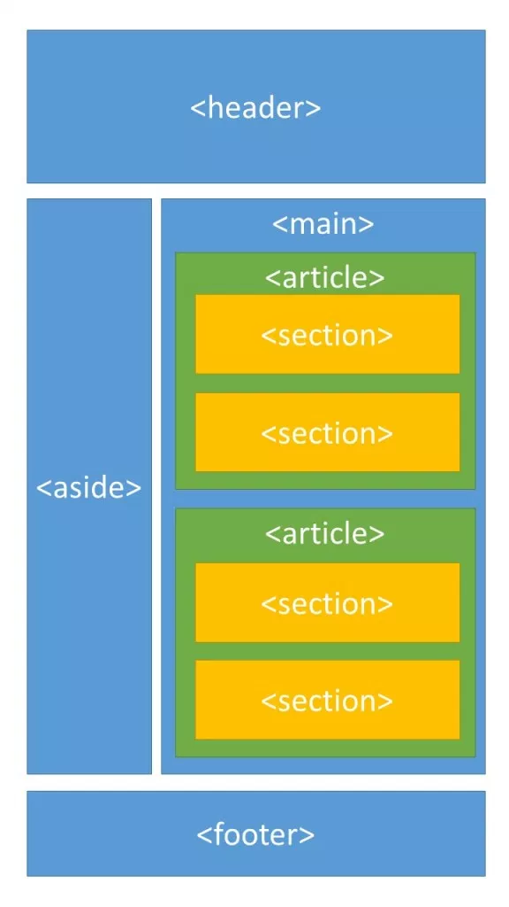
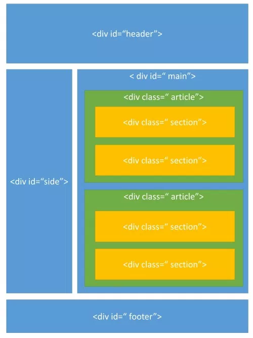
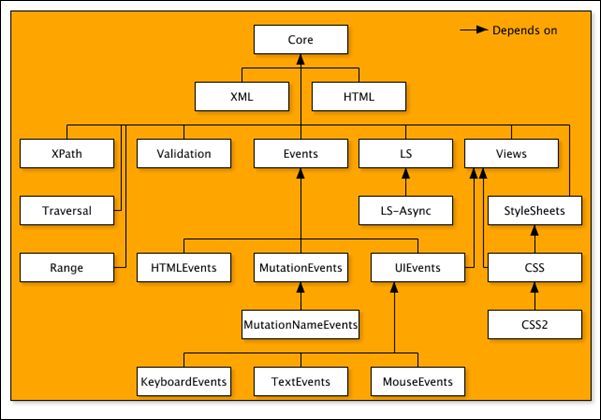
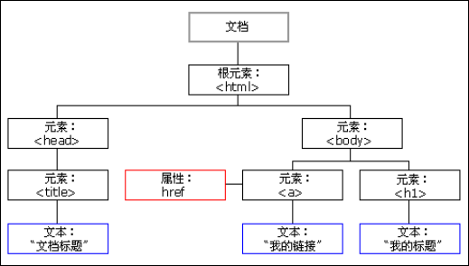

# 100 days of code front end - Day 08

## 前言
目前我有想到 HTML 的練習應該是網頁切版之類的觀念要清楚，因此今天是最後一天 HTML 的學習，我應該是上網找相關的練習，然後進行學習
再來我對網頁區塊的命名也不是說很清楚，但今天再查詢網站時，其實有找到相關的命名規則，之後可以朝這個方向了解，因此，我今天的規畫應該是，
找尋 HTML 的練習網站，然後是切版的練習或是觀看教學影片，最後再整理一下，切版的命名規則，我在想 HTML 目前應該就是這些了。

昨天終於把 HTML 的 pdf 整個看完了，有些東西我沒有說看得很熟，但至少我覺得如果碰到問題時，我應該要朝哪個方向去查詢；另外，我說一下
目前的心得，昨天學完之後，我有去查了一下關於前端工程師與後端工程師的差異，我本來是覺得我應該是先學三年前端工程師，學三年後端工程師，
但我覺得好像應該要固定下來才對，所以還在猶豫到底是要比較偏向前端工程師還是後端工程師，但是想一想，其實如果能將一件事情做到好，不管是
前端還是後端工程師其實都是一樣的，但這只是我目前的想法，目前我還在尋找這兩個職業之間的答案，但目前最重要的應該是先將 100 天的這個挑戰
完成，至少完成之後會對前端有更深入的了解，之後的想法可能就不一樣了，今天第八天，持續打拼!!!

## 筆記

### HTML 5 框架結構
HTML 一般網頁會分成幾個部分
- 頁首: 通常放置 logo 與選單
- 主體: 網頁內容主體
- 側欄: 通常放第二層選單或補充訊息
- 頁尾: 通常放版權或是聯絡訊息



```html
<header>頁首</header>
<aside>側欄</aside>
<main>主體
    <article>主體
        <section>段落區塊</section>
        <section>段落區塊</section>
    </article>
</main>
<footer>頁尾 (頁腳)</footer>
```

header, aside, main, article, section, footer 這些標籤都是 HTML5 才有的，所以在 HTML5 之前也有另一種只用 div (區塊標籤) 搭配 CSS 的 DI 選取器的方法。


```html
<div id='header'></div>
<div id='aside'></div>
<div id='main'>
    <div class='article'>
        <div class='section'></div>
        <div class='section'></div>
    </div>
</div>
<div id='footer'></div>
```

### DOM
由於寫網頁經常需要操控 DOM 物件，且 DOM 物件為 Web UI 的基礎概念


透過 DOM 的操作，可以重構整個 HTML 檔案，可任意添加、移除、改變其項目，上方那張橘色的圖即為 DOM 之完整架構圖，最上方的是 Core (DOM Level 1)，再下來是 XML、HTML (DOM Level 2)，甚至以下有許多的 Event (DOM Level 3)，最下方是使用者端的 Event，主要分為以下三種：
1. Keyboard Events: 鍵盤事件
2. TextEvent: 文字事件
3. MouseEvents: 滑鼠事件

由於 DOM 是由節點組成的，故一個 DOM 的物件 (ex.html 檔) 可能可以看成以下架構，即所有的 Node 組成了一個檔案樹，HTML 裡面的每個元素、屬性、內容等都代表著其中一個節點，並不斷延伸:


`DOM 操作基本語法`
操作基本語法最常用以下幾項:
1. getElementById() 可取出 HTML 檔中具有 id 名稱的元素 
2. getElementsByTagName() 可取出 HTML 檔中所有指定標籤的元素

### 切版
切版就是一個動作將視覺設計好的 PSD 切成 HTML + CSS 然後工後端的工程師上程式。

網頁切法不重要，重要的是切的想法與看法
